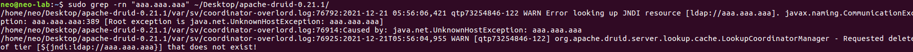

### Rce via Log4shell

根据公开的payload


定位source

```
sodu -rn "aaa.aaa.aaa" ~/Desktop/apache-druid-0.21.1/
```




找到

- org.apache.druid.server.lookup.cache.LookupCoordinatorManager

IDEA全局


最后成功定位到source

- org.apache.druid.server.lookup.cache.LookupCoordinatorManager#deleteTier


