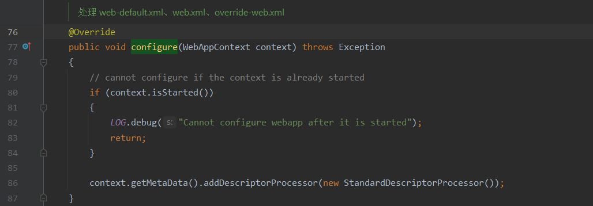
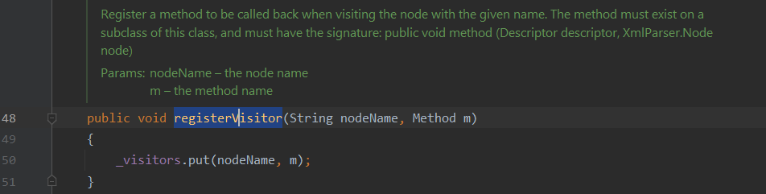
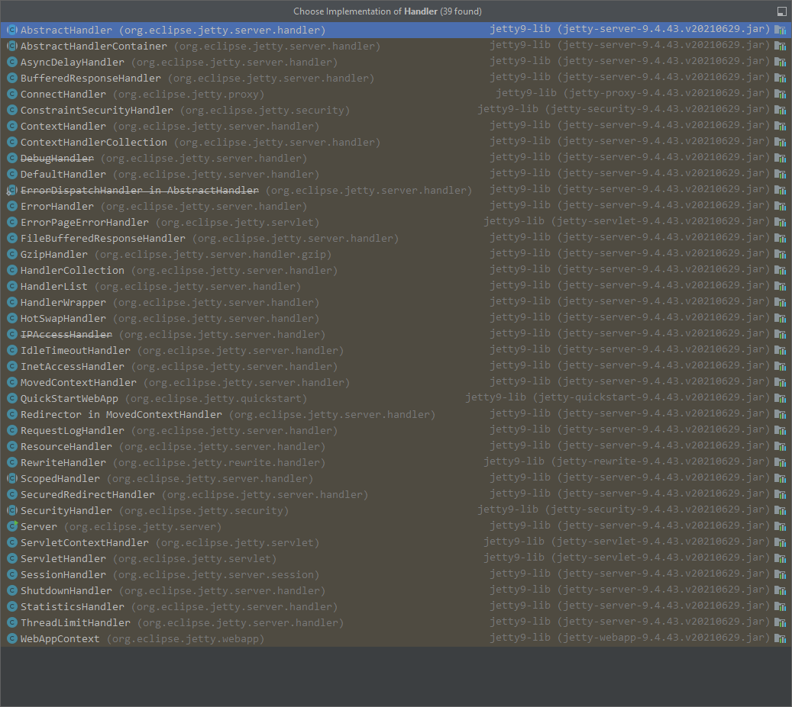
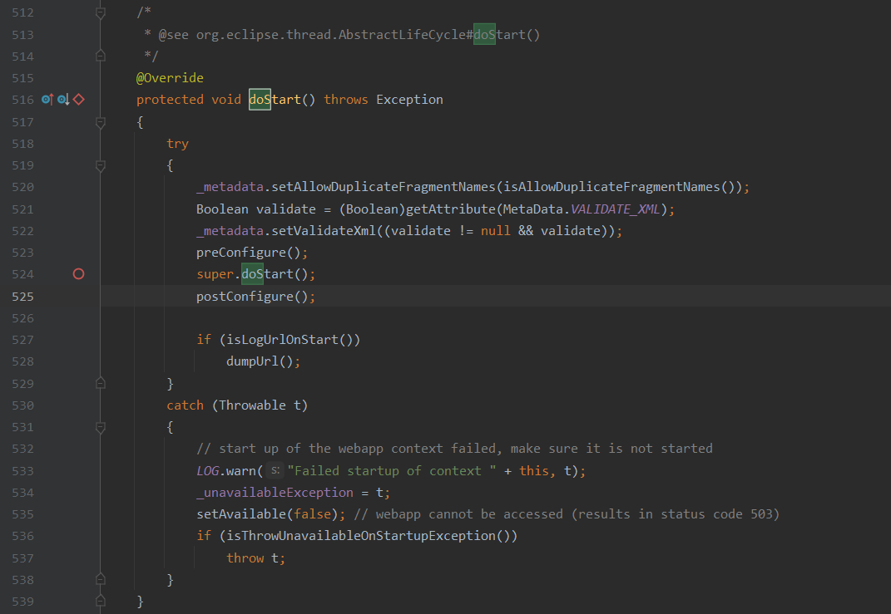

测试版本：9.4.43.v20210629

# 架构分析

均来自以下参考，纯当个人看一遍代码混个眼熟

- https://mp.weixin.qq.com/s/OQ24UmRHjoQObs_gpjJ7Ww
- https://xz.aliyun.com/t/9247
- https://blog.csdn.net/acm_lkl/article/details/78837539 Jetty服务器启动过程分析
- https://www.ph0ly.com/

## 配置文件

### web.xml

`分析一下Jetty 加载web.xml的流程`

- org.eclipse.jetty.webapp.WebXmlConfiguration#findWebXml

断点，获取调用栈，再逐一分析

> 调用context.getWebInf()

跟进

- org.eclipse.jetty.webapp.WebAppContext#getWebInf

> 调用getBaseResource()，然后再拼接"WEB-INF"目录

跟进

- org.eclipse.jetty.server.handler.ContextHandler#getBaseResource

回溯调用栈

- org.eclipse.jetty.webapp.WebXmlConfiguration#preConfigure
  - org.eclipse.jetty.webapp.WebAppContext#preConfigure
    - org.eclipse.jetty.webapp.WebAppContext#doStart

断点，跟进

- org.eclipse.jetty.webapp.WebAppContext#doStart

> 调用preConfigure()

跟进

- org.eclipse.jetty.webapp.WebAppContext#preConfigure

跟进

- org.eclipse.jetty.webapp.WebAppContext#loadConfigurations

进行预加载

跳过无关紧要的部分，跟进到

> 遍历所有Configuration，然后调用其preConfigure方法进行预加载，在WebAppContext#preConfigure执行结束后，调用super.doStart()

跟进

- org.eclipse.jetty.servlet.ServletContextHandler#doStart

  - org.eclipse.jetty.server.handler.ContextHandler#doStart

    

    - org.eclipse.jetty.server.handler.ContextHandler#startContext

      - org.eclipse.jetty.webapp.WebAppContext#startContext

        

跟进

- org.eclipse.jetty.webapp.WebAppContext#configure

> 遍历所有Configuration，然后调用其configure方法

跟进

- org.eclipse.jetty.webapp.WebXmlConfiguration#configure

> 给WebAppContext的MetaData添加了一个DescriptorProcessor

跟进

- org.eclipse.jetty.webapp.StandardDescriptorProcessor#StandardDescriptorProcessor

> bio,与web.xml的标签对应上了，调用registerVisitor注册了web.xml中的元素中的方法，后续会用反射机制来调用这些方法。比如filter元素用visitFilter处理。

跟进

- org.eclipse.jetty.webapp.IterativeDescriptorProcessor#registerVisitor

> ？？？

configuration.configure遍历结束后，调用_metadata.resolve

跟进

- org.eclipse.jetty.webapp.MetaData#resolve

关键代码

> 调用p.process

跟进

- org.eclipse.jetty.webapp.IterativeDescriptorProcessor#process

> 调用了visit()

跟进

- org.eclipse.jetty.webapp.IterativeDescriptorProcessor#visit

> 当解析到web.xml的某个tag时，反射调用WebXmlConfiguration#configure注册的相应方法

`此处省略部分分析，当metadata被resolve完后，会调用super.startContext(),也就是它的父类ServletContextHandler的startContext方法`

跟进

- org.eclipse.jetty.servlet.ServletContextHandler#startContext

> 调用super.startContext，执行结束后，调用initialize方法

跟进

- org.eclipse.jetty.server.handler.ContextHandler#startContext

> 回到initialize方法

跟进

- org.eclipse.jetty.servlet.ServletHandler#initialize
  - 初始化

## 源码剖析

### 接口 Handler 

实现类

#### 类 ContextHandler 

Is subclassed by

#####  类 ServletContextHandler

#####  类 WebAppContext 

- 继承自ServletContextHandler，同时实现了WebAppClassLoader.Context接口，完成系统类判断和控制类加载顺序

###### 构造方法 WebAppContext

- 创建WebAppContext

###### 成员方法 doStart() 

- 启动 WebAppContext

> 调用preConfigure进行预加载

会判断是否设置过类加载器，没有则自动创建一个WebAppClassLoader

###### 类加载器 WebAppClassLoader

- 继承至URLClassLoader

**成员方法 loadClass**

- [详见《血泪的 Jetty ClassLoader》](https://toutiao.io/posts/xy5ng7/preview)

###### 成员方法 startContext

- 启动上下文

#### 类 ServletHandler 

- 很多熟悉的面孔！！！
- ServletHandler是一个用于管理Filter、FilterMapping、Servlet、ServletMapping的容器

部分成员方法（以下以filter相关的方法为例）

- 获取到ServletHandler，即可调用add*系列API动态添加filter、listener、servlet内存马
- 依赖FilterHolder、ServletHolder、ServletMapping、FilterMapping四大组件

##### 成员方法 addFilter

##### 成员方法 setFilters

> 将当前ServletHandler容器中的所有FilterHolder设置上关联的ServletHandler，并将这些filters放到容器托管生命周期，同时更新_filters。

##### 成员方法 addListener 

##### 成员方法 addFilterWithMapping

> 获取到当前容器中的Filters，然后复制一份数组对象（浅拷贝），加锁去重判断是否存在，并设置这个FilterHolder到_filters数组，创建FilterMapping，传入必要的参数，调用addFilterMapping

##### 成员方法 addFilterMapping

> 获取mapping对应的FilterHolder的source并进行判断，根据不同的条件插到不同位置

##### 成员方法 prependFilterMapping

> 将新的FilterMapping添加到数组前

