# java.lang 

## Class

类加载

- 加载
  - 由类加载器执行的，用白话来描述就是查找这个类的字节码，然后构建一个Class对象。
- 链接
  - 在这个阶段会先校验类的字节码，并且为类对象的静态域分配好内存空间。
- 初始化
  - 首先会先初始化类的超类（前提是有超类），以及执行静态初始化器和静态初始化块。


1、Class 类

> Class 也是一个 Java 类，保存的是与之对应 Java 类的 meta信息（元信息），用来描述这个类的结构，比如描述一个类有哪些成员，有哪些方法等，一般在反射中使用。
>
> Java 源程序（.java 文件）在经过 Java 编译器编译之后就被转换成 Java 字节代码（.class 文件）。类加载器负责读取 Java 字节代码，并转换成 java.lang.Class类的一个实例（Class 对象）。也就是说，在 Java 中，每个 java 类都有一个相应的 Class 对象，用于表示这个 java 类的类型信息。

2、类加载

> 当使用一个类的时候（比如 new 一个类的实例），会检查此类是否被加载到内存，如果没有，则会执行加载操作。
>
> 读取类对应的 class 文件数据，解析此数据，构造一个此类对应的 Class 类的实例。此时JVM就可以使用该类了，比如实例化此类，或者调用此类的静态方法。
>
> Java 也提供了手动加载类的接口，class.forName()方法就是其中之一。（说来说去，其实就是生成这个类的 Class）

3、类加载器

> 顾名思义，类加载器（class loader）用来加载 Java 类到 Java 虚拟机中。一般来说，Java 虚拟机使用 Java 类的方式如下：Java 源程序（.java 文件）在经过 Java 编译器编译之后就被转换成 Java 字节代码（.class 文件）。类加载器负责读取 Java 字节代码，并转换成 java.lang.Class 类的一个实例。每个这样的实例用来表示一个 Java 类。通过此实例的 newInstance() 方法就可以创建出该类的一个对象。 基本上所有的类加载器都是 java.lang.ClassLoader 类的一个实例。

4、类初始化

> 类被加载之后，jvm 已经获得了一个描述类结构的 Class 实例。但是还需要进行类初始化操作之后才能正常使用此类，类初始化操作就是执行一遍类的静态语句，包括静态变量的声明还有静态代码块。


**获得一个Class类对象**

- Class    forName() 方法
- Object  getClass() 方法
- 类字面常量  形如：Class.class


1、Class forName()


> Class.forName取得类的引用,并进行初始化
>
> > 


2、Object  getClass()

> 


3、类字面常量

> 当使用.class来创建Class对象的引用时，不会自动地初始化该Class对象
>
> > 


通过四种方法可以获取class对象

- 若已知具体的类，通过类的class属性获取，该方法最为安全可靠，程序性能最高：

  ```
  Class<Person> clazz = Person.class
  ```

- 已知某个类的实例，调用该实例的getClass()方法获取Class对象；

  ```
  Person person = new Person();
  Class clazz = person.getClass();
  ```

- 已知一个类的全类名，且该类在类路径下，可通过Class类的静态方法forName()获取，可能会抛出异常ClassNotFoundException

  ```
  try {
      class1 = Class.forName("xxx.Person");
  } catch (ClassNotFoundException e) {
      e.printStackTrace();
  }
  ```

- 通过类加载器来获取

  ```
  ClassLoader clazz = this.getClass().getClassLoader();
  Class clazz = clazz.loadClass(“类的全类名”);
  ```

- 

## ClassLoader *

类加载器是负责加载类的对象。 ClassLoader 类是一个抽象类。 给定类的二进制名称，类加载器应该尝试定位或生成构成类定义的数据。 典型的策略是将名称转换为文件名，然后从文件系统中读取该名称的“类文件”。
每个Class对象都包含reference定义它的ClassLoader的reference 。

数组类的类对象不是由类加载器创建的，而是根据 Java 运行时的要求自动创建的。 Class.getClassLoader()返回的数组类的类加载器与其元素类型的类加载器相同； 如果元素类型是原始类型，则数组类没有类加载器。
应用程序实现ClassLoader 的子类，以扩展 Java 虚拟机动态加载类的方式。
安全管理器通常可以使用类加载器来指示安全域。

ClassLoader类使用委托模型来搜索类和资源。 ClassLoader 的每个实例都有一个关联的父类加载器。 当请求查找类或资源时， ClassLoader实例会将类或资源的搜索委托给其父类加载器，然后再尝试查找类或资源本身。 虚拟机的内置类加载器，称为“引导类加载器”，它本身没有父级，但可以作为ClassLoader实例的父级。
支持并发加载类的类加载器被称为具有并行能力的类加载器，并且需要在类初始化时通过调用ClassLoader.registerAsParallelCapable方法来注册自己。 请注意， ClassLoader类默认注册为具有并行能力。 但是，如果它们具有并行能力，它的子类仍然需要注册自己。 在委托模型不是严格分层的环境中，类加载器需要具有并行能力，否则类加载会导致死锁，因为加载器锁在类加载过程中一直保持着（参见loadClass方法）。
通常，Java 虚拟机以平台相关的方式从本地文件系统加载类。 例如，在 UNIX 系统上，虚拟机从CLASSPATH环境变量定义的目录中加载类。
但是，有些类可能不是来自文件； 它们可能来自其他来源，例如网络，或者它们可以由应用程序构建。 方法defineClass将一个字节数组转换为Class 类的一个实例。 可以使用Class.newInstance创建这个新定义的类的实例。
类加载器创建的对象的方法和构造函数可以引用其他类。 为了确定所引用的类，Java 虚拟机调用最初创建类的类加载器的loadClass方法。
例如，应用程序可以创建一个网络类加载器来从服务器下载类文件。 示例代码可能如下所示：

```java
ClassLoader loader = new NetworkClassLoader(host, port);
     Object main = loader.loadClass("Main", true).newInstance();
          . . .
```


网络类加载器子类必须定义findClass和loadClassData方法以从网络加载类。 一旦它下载了组成类的字节，它应该使用方法defineClass来创建一个类实例。 一个示例实现是：


```java
       class NetworkClassLoader extends ClassLoader {
           String host;
           int port;
  
           public Class findClass(String name) {
               byte[] b = loadClassData(name);
               return defineClass(name, b, 0, b.length);
           }
  
           private byte[] loadClassData(String name) {
               // load the class data from the connection
                . . .
           }
       }
```

二进制名称
作为String参数提供给ClassLoader 中的方法的任何类名称必须是Java™ 语言规范定义的二进制名称。

有效类名的示例包括：

```
     "java.lang.String"
     "javax.swing.JSpinner$DefaultEditor"
     "java.security.KeyStore$Builder$FileBuilder$1"
     "java.net.URLClassLoader$3$1"
```

### 类加载器

#### JVM默认

**引导类加载器(BootstrapClassLoader)**，底层原生代码是C++语言编写，属于jvm一部分，不继承java.lang.ClassLoader类，也没有父加载器，主要负责加载核心java库(即JVM本身)，存储在/jre/lib/rt.jar目录当中。(同时处于安全考虑，BootstrapClassLoader只加载包名为java、javax、sun等开头的类)。

**扩展类加载器(ExtensionsClassLoader)**，由sun.misc.Launcher$ExtClassLoader类实现，用来在/jre/lib/ext或者java.ext.dirs中指明的目录加载java的扩展库。Java虚拟机会提供一个扩展库目录，此加载器在目录里面查找并加载java类。

**App类加载器/系统类加载器（AppClassLoader）**，由sun.misc.Launcher$AppClassLoader实现，一般通过通过(java.class.path或者Classpath环境变量)来加载Java类，也就是我们常说的classpath路径。通常我们是使用这个加载类来加载Java应用类，可以使用ClassLoader.getSystemClassLoader()来获取它。

#### 自定义

**自定义类加载器(UserDefineClassLoader)**，除了上述java自带提供的类加载器，我们还可以通过继承java.lang.ClassLoader类的方式实现自己的类加载器。

### 双亲委派机制

通常情况下，我们就可以使用JVM默认三种类加载器进行相互配合使用，且是按需加载方式，就是我们需要使用该类的时候，才会将生成的class文件加载到内存当中生成class对象进行使用，且加载过程使用的是双亲委派模式，及把需要加载的类交由父加载器进行处理。

类加载器委派关系


如上图类加载器层次关系，我们可以将其称为类加载器的双亲委派模型。但注意的是，他们之间并不是"继承"体系，而是委派体系。当上述特定的类加载器接到加载类的请求时，首先会先将任务委托给父类加载器，接着请求父类加载这个类，当父类加载器无法加载时（其目录搜素范围没有找到所需要的类时），子类加载器才会进行加载使用。这样可以避免有些类被重复加载。

**优点**

1、能够实现有些类避免重复加载使用，直接先给父加载器加载，不用子加载器再次重复加载。

2、保证java核心库的类型安全。比如网络上传输了一个java.lang.Object类，通过双亲模式传递到启动类当中，然后发现其Object类早已被加载过，所以就不会加载这个网络传输过来的java.lang.Object类，保证的java核心API库不被篡改，出现类似用户自定义java.lang.Object类的情况。

### 常用方法

#### loadClass()

在loadClass方法中，它先使用了findLoadedClass(String)方法来检查这个类是否被加载过。

接着使用父加载器调用loadClass（String）方法，如果父加载器为null，类加载器加载jvm内置的加载器。

之后就调用findClass(String) 方法装载类。

最后通过上述步骤我们找到了对应的类，并且接收到的resolve参数的值为true,那么就会调用resolveClass(Class)方法来处理类。

#### findClass()

- 查找指定的Java类

#### findLoadedClass()

- 查找JVM已经加载过的类

#### defineClass()

- 定义一个Java类，将字节码解析成虚拟机识别的Class对象。往往和findClass()方法配合使用。

#### resolveClass()


- 链接指定Java类

## Object

Object类是Java中其他所有类的祖先，没有Object类Java面向对象无从谈起。


### 常用方法

#### equals()

equals() 方法用于比较两个对象是否相等。

equals() 方法比较两个对象，是判断两个对象引用指向的是同一个对象，即比较 2 个对象的内存地址是否相等。

```
注意：如果子类重写了 equals() 方法，就需要重写 hashCode() 方法，比如 String 类就重写了 equals() 方法，同时也重写了 hashCode() 方法。
```


#### hashcode()

- 返回对象的哈希值（散列码），不是实际地址值，不过可以理解为地址值。

- 返回一个int型整数，用于确定该对象在哈希表中的索引位置


#### getClass()

- 获取对象的运行时对象的类。


#### toString()

用于返回对象的字符串表示形式

- 默认返回格式
  - 对象的 class 名称 + @ + hashCode 的十六进制字符串。


## String

String类表示字符串。 Java 程序中的所有字符串文字，例如"abc" ，都是作为此类的实例实现的。
字符串是常量； 它们的值在创建后无法更改。 字符串缓冲区支持可变字符串。 因为 String 对象是不可变的，所以它们可以共享。


### 实例化

- 直接赋值
  - String str = "Hello World"

- 构造方法
  - String str = new String("Hello World")


### 字符串的比较

所有字符串的比较都不用"=="去比较，均使用 equals() 完成。

```
equals()方法比较字符串对象中的字符
==运算符比较两个对象是否引用同一实例
```


### 常用方法

1、charAt() 返回指定索引对应的字符信息

2、toCharArray() 将字符串以字符数组的形式返回

3、 getBytes() 将字符串变为字节数组

4、contains() 判断指定的内容是否存在


5、indexOf() 从前向后查找指定字符串的位置，找不到返回-1

6、lastIndexOf() 从后向前查找指定字符串的位置，找不到返回-1

7、startsWith() 判断是否以指定的字符串开头

8、replaceAll() 用新的内容代替旧的内容

9、replaceFirst() 替换首个满足条件的内容


10、substring()  根据给定的起始索引（包括）和 结束索引（不包括）返回子字符串，索引从 0 开始

11、split()   根据匹配给定的正则表达式来拆分字符串

12、concat() 字符串拼接


13、trim() 去掉字符串中左右两边的空格，中间空格保留

14、length() 返回字符串长度

15、isEmpty() 判断字符串是否为空


## StringBuffer

当对字符串进行修改的时候，需要使用StringBuffer类。

和String类不同的是，StringBuffer和StringBuilder类的对象能够被多次的修改，并且不产生新的未用对象。

```
// 定义一个字符串缓冲区
StringBuffer sb = new StringBuffer(); 
```


### 常用方法

1、append( )  将指定的字符串追加到此字符序列。
2、reverse()  字符序列反转
3、delete()  移除此序列的子字符串中的字符。
4、insert(int offset, int i)  将 int 参数的字符串表示形式插入此序列中。
5、replace(int start, int end, String str)  使用给定 String 中的字符替换此序列的子字符串中的字符


## StringBuilder

与 String 相似，StringBuilder 也是一个与字符串相关的类，Java 官方文档给 StringBuilder 的定义是：可变的字符序列。

字符串具有不可变性，当频繁操作字符串时候，会在常量池中产生很多无用的数据。而 StringBuilder 与 String 不同，它具有可变性。相较 String 类不会产生大量无用数据，性能上会大大提高。因此对于需要频繁操作字符串的场景，建议使用 Stringbuilder 类来代替 String 类。

StringBuffer 是 StringBuilder 的前身，在早期的 Java 版本中应用非常广泛，它是 StringBuilder 的线程安全版本，但实现线程安全的代价是执行效率的下降。它们的接口基本上完全一致。

### 常用方法

1、append( )  将指定的字符串追加到此字符序列。
2、reverse()  字符序列反转
3、delete()  移除此序列的子字符串中的字符。
4、insert(int offset, int i)  将 int 参数的字符串表示形式插入此序列中。
5、replace(int start, int end, String str)  使用给定 String 中的字符替换此序列的子字符串中的字符


## System


### 常用方法


#### getProperty()	

- 获取指定键描述的系统属性


#### getProperties()	

- 取得当前的系统属性


## Runtime

每个java程序在运行时相当于启动了一个JVM进程，每个JVM进程都对应一个RunTime实例。此实例是JVM负责实例化的，所以我们不能实例化一个RunTime对象，只能通过getRuntime() 获取当前运行的Runtime对象的引用。一旦得到了一个当前的Runtime对象的引用，就可以调用Runtime对象的方法去查看Java虚拟机的状态以及控制虚拟机的行为。


### 常用方法

1、getRuntime()  获取Runtime 类的实例

2、gc() 进行垃圾收集，释放空间

3、native 方法


#### exec()

- 执行本地程序，比如在windows平台下执行exe程序。


2021.11.26(补充：反射调用)

```java
import java.io.IOException;
import java.lang.reflect.InvocationTargetException;

public class runTime {
    public static void main(String[] args) throws ClassNotFoundException, InvocationTargetException, InstantiationException, IllegalAccessException, IOException, NoSuchMethodException {
        Class clazz = Class.forName("java.lang.Runtime");
        java.lang.reflect.Constructor[] constructors = clazz.getDeclaredConstructors();
        // constructors[0] -> 构造方法 Runtime()
        java.lang.reflect.Constructor constructor = constructors[0];
        constructor.setAccessible(true);
        clazz.getMethod("exec",String.class).invoke(constructor.newInstance(),"calc");
    }
}
```


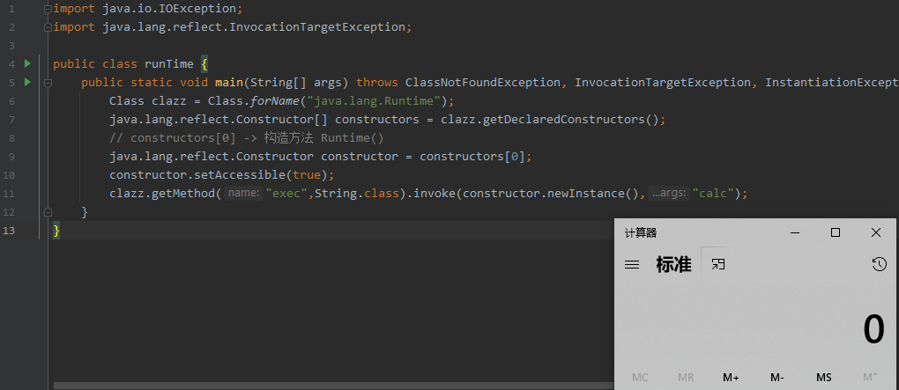


#### load()

- 加载动态链接库，如linux下的so文件，windows下的dll文件。

msf恶意dll生成（弹计算器）

> ```bash
> msfvenom -p windows/x64/exec --platform win -a x64 CMD=calc.exe EXITFUNC=thread -f dll> calc.dll
> ```


#### getRuntime()

来一杯计算器？

```java
import java.io.IOException;

public class runTime {
    public static void main(String[] args) throws IOException {
        Runtime.getRuntime().exec("calc");
    }
}
```

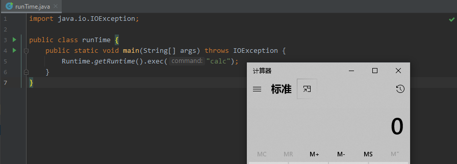

为什么要通过`getRuntime()`来调用exec，而不是直接实例化Runtime呢？

> Runtime构造方法是私有的所以不能直接实例化，而是通过`getRuntime()`来进行构造，刚好又是静态方法，所以可以直接调用。


除了getRuntime()，还有其他姿势吗？再来一杯？

#### Runtime() 

- 构造方法 Runtime()


- 反射

  - Constructor提供有关类的单个构造方法的信息和对其的访问。

  - Class runTime can not access a member of class java.lang.Runtime with modifiers "private"（类runTime不能访问带有修饰符"private"的类java.lang.Runtime的成员）

  - setAccessible()

    

```java
import java.io.IOException;
import java.lang.reflect.InvocationTargetException;
import java.lang.reflect.Modifier;

public class runTime {
    public static void main(String[] args) throws ClassNotFoundException, InvocationTargetException, InstantiationException, IllegalAccessException, IOException {
        Class clazz = Class.forName("java.lang.Runtime");
        java.lang.reflect.Constructor[] constructors = clazz.getDeclaredConstructors();
        java.lang.reflect.Constructor constructor = constructors[0];
        // 获取该构造方法accessible标志
        System.out.println(constructor.isAccessible());
        // 获取该构造方法的修饰符
        System.out.println(Modifier.toString(constructor.getModifiers()));
        constructor.setAccessible(true);
        Runtime runTime = (Runtime)constructor.newInstance();
        runTime.exec("calc");
    }
}
```


反射调用getRunTime方法呢?

```java
import java.io.IOException;
import java.lang.reflect.InvocationTargetException;

public class runTime {
    public static void main(String[] args) throws ClassNotFoundException, InvocationTargetException, InstantiationException, IllegalAccessException, IOException, NoSuchMethodException {
        Class clazz = Class.forName("java.lang.Runtime");
        java.lang.reflect.Method getRuntimeM = clazz.getMethod("getRuntime");
        Object getRuntime = getRuntimeM.invoke(clazz);
        java.lang.reflect.Method exec = clazz.getMethod("exec", String.class);
        exec.invoke(getRuntime,"calc");
    }
}
```


## Process

Process类是一个抽象类（所有的方法均是抽象的），封装了一个进程（即一个执行程序）。 Process 类提供了执行从进程输入、执行输出到进程、等待进程完成、检查进程的退出状态以及销毁（杀掉）进程的方法。 ProcessBuilder.start() 和 Runtime.exec 方法创建一个本机进程，并返回 Process 子类的一个实例，该实例可用来控制进程并获取相关信息。


## ProcessBuilder


### 常用方法

#### command()

-  用于将待执行命令及参数传递给它


#### start() 

- 执行命令并返回一个Process对象，用于获取对执行程序的输入和输出；


## ProcessImpl


### start()

```java
    static Process start(String cmdarray[],
                         java.util.Map<String,String> environment,
                         String dir,
                         ProcessBuilder.Redirect[] redirects,
                         boolean redirectErrorStream)
```

ProcessImpl类需要值得注意的就是它没有共有构造方法，所以不能直接实例化ProcessImpl类的，虽然不能直接new一个ProcessImpl，但是可以利用反射去调用其方法。


# java.io

## Serializable 接口

类的可序列化由实现 java.io.Serializable 接口的类启用。 未实现此接口的类将不会对其任何状态进行序列化或反序列化。 可序列化类的所有子类型本身都是可序列化的。 序列化接口没有方法或字段，仅用于标识可序列化的语义。
为了允许不可序列化类的子类型被序列化，子类型可能负责保存和恢复超类型的公共、受保护和（如果可访问）包字段的状态。 仅当它扩展的类具有可访问的无参数构造函数来初始化类的状态时，子类型才可能承担此责任。 如果不是这种情况，则声明类 Serializable 是错误的。 该错误将在运行时检测到。
在反序列化期间，不可序列化类的字段将使用类的公共或受保护的无参数构造函数进行初始化。 可序列化的子类必须可以访问无参数构造函数。 可序列化子类的字段将从流中恢复。
遍历图时，可能会遇到不支持Serializable接口的对象。 在这种情况下，将抛出 NotSerializableException 并标识不可序列化对象的类。
在序列化和反序列化过程中需要特殊处理的类必须实现具有以下确切签名的特殊方法：

```
   private void writeObject(java.io.ObjectOutputStream out)
       throws IOException
   private void readObject(java.io.ObjectInputStream in)
       throws IOException, ClassNotFoundException;
   private void readObjectNoData()
       throws ObjectStreamException;
```


writeObject 方法负责为其特定类写入对象的状态，以便相应的 readObject 方法可以恢复它。 保存对象字段的默认机制可以通过调用 out.defaultWriteObject 来调用。 该方法不需要关心属于它的超类或子类的状态。 通过使用 writeObject 方法或使用 DataOutput 支持的原始数据类型的方法将各个字段写入 ObjectOutputStream 来保存状态。
readObject 方法负责从流中读取并恢复类字段。 它可以调用 in.defaultReadObject 来调用默认机制来恢复对象的非静态和非瞬态字段。 defaultReadObject 方法使用流中的信息将保存在流中的对象的字段分配给当前对象中相应命名的字段。 这可以处理类已经演变为添加新字段的情况。 该方法不需要关心属于它的超类或子类的状态。 通过使用 writeObject 方法或使用 DataOutput 支持的原始数据类型的方法将各个字段写入 ObjectOutputStream 来保存状态。
readObjectNoData 方法负责在序列化流未将给定类列为被反序列化对象的超类的情况下为其特定类初始化对象的状态。 在接收方使用与发送方不同版本的反序列化实例类的情况下，可能会发生这种情况，并且接收方的版本扩展了发送方版本未扩展的类。 如果序列化流被篡改，也可能发生这种情况； 因此，尽管存在“敌对”或不完整的源流，但 readObjectNoData 可用于正确初始化反序列化对象。

在将对象写入流时需要指定要使用的替代对象的可序列化类应使用确切的签名实现此特殊方法：

```
ANY-ACCESS-MODIFIER Object writeReplace() throws ObjectStreamException;
```

如果该方法存在并且可以从被序列化的对象的类中定义的方法访问，则该 writeReplace 方法由序列化调用。 因此，该方法可以具有私有、受保护和包私有访问。 对该方法的子类访问遵循 java 可访问性规则。
当从流中读取它的实例时需要指定替换的类应该用确切的签名实现这个特殊的方法。

```
ANY-ACCESS-MODIFIER Object readResolve() throws ObjectStreamException;
```

此 readResolve 方法遵循与 writeReplace 相同的调用规则和可访问性规则。
序列化运行时将每个可序列化类与一个称为 serialVersionUID 的版本号相关联，在反序列化期间使用它来验证序列化对象的发送方和接收方是否已为该对象加载了与序列化兼容的类。 如果接收方为对象加载了一个与相应发送方的类具有不同 serialVersionUID 的类，则反序列化将导致InvalidClassException 。 一个可序列化的类可以通过声明一个名为"serialVersionUID"的字段来显式声明它自己的 serialVersionUID，该字段必须是 static、final 和long类型：

   ANY-ACCESS-MODIFIER static final long serialVersionUID = 42L;

如果可序列化类未显式声明 serialVersionUID，则序列化运行时将根据该类的各个方面计算该类的默认 serialVersionUID 值，如 Java(TM) 对象序列化规范中所述。 但是，强烈建议所有可序列化类显式声明 serialVersionUID 值，因为默认的 serialVersionUID 计算对可能因编译器实现而异的类详细信息高度敏感，因此可能会在反序列化期间导致意外的InvalidClassException 。 因此，为了保证在不同的 Java 编译器实现中具有一致的 serialVersionUID 值，可序列化类必须声明一个显式的 serialVersionUID 值。 还强烈建议显式 serialVersionUID 声明尽可能使用private修饰符，因为此类声明仅适用于立即声明的类——serialVersionUID 字段作为继承成员没有用。 数组类无法声明显式的 serialVersionUID，因此它们始终具有默认的计算值，但数组类放弃了匹配 serialVersionUID 值的要求。

## Externalizable 接口


## DataInput 接口


## ObjectOutput 接口

### ObjectInputStream 类


ObjectInputStream 反序列化之前使用 ObjectOutputStream 编写的原始数据和对象。
当分别与 FileOutputStream 和 FileInputStream 一起使用时，ObjectOutputStream 和 ObjectInputStream 可以为应用程序提供对象图的持久存储。 ObjectInputStream 用于恢复先前序列化的那些对象。 其他用途包括使用套接字流在主机之间传递对象，或用于在远程通信系统中编组和解组参数和参数。
ObjectInputStream 确保从流创建的图中所有对象的类型与 Java 虚拟机中存在的类相匹配。 使用标准机制根据需要加载类。
只能从流中读取支持 java.io.Serializable 或 java.io.Externalizable 接口的对象。
readObject方法用于从流中读取对象。 应该使用 Java 的安全转换来获得所需的类型。 在 Java 中，字符串和数组是对象，在序列化过程中被视为对象。 读取时，它们需要转换为预期的类型。
可以使用 DataInput 上的适当方法从流中读取原始数据类型。
对象的默认反序列化机制将每个字段的内容恢复为写入时的值和类型。 反序列化过程会忽略声明为瞬态或静态的字段。 对其他对象的引用会导致根据需要从流中读取这些对象。 使用引用共享机制正确恢复对象图。 反序列化时总是分配新对象，这样可以防止现有对象被覆盖。
读取一个对象类似于运行一个新对象的构造函数。 为对象分配内存并初始化为零 (NULL)。 为不可序列化的类调用无参数构造函数，然后从流中恢复可序列化类的字段，从最接近 java.lang.object 的可序列化类开始，并以对象的最具体的类结束。

例如，从 ObjectOutputStream 中的示例写入的流中读取： 

        FileInputStream fis = new FileInputStream("t.tmp");
        ObjectInputStream ois = new ObjectInputStream(fis);
        int i = ois.readInt();
        String today = (String) ois.readObject();
        Date date = (Date) ois.readObject();
      
        ois.close();

类通过实现 java.io.Serializable 或 java.io.Externalizable 接口来控制它们的序列化方式。
实现 Serializable 接口允许对象序列化保存和恢复对象的整个状态，并允许类在写入流的时间和读取流的时间之间演变。 它会自动遍历对象之间的引用，保存和恢复整个图形。
在序列化和反序列化过程中需要特殊处理的可序列化类应该实现以下方法：

```
private void writeObject(java.io.ObjectOutputStream stream) throws IOException;
private void readObject(java.io.ObjectInputStream stream) throws IOException, ClassNotFoundException;
private void readObjectNoData() throws ObjectStreamException;
```

readObject 方法负责使用由相应的 writeObject 方法写入流的数据读取和恢复其特定类的对象状态。 该方法不需要关心属于它的超类或子类的状态。 通过从 ObjectInputStream 中读取各个字段的数据并分配给对象的适当字段来恢复状态。 DataInput 支持读取原始数据类型。
任何读取超出由相应 writeObject 方法写入的自定义数据边界的对象数据的尝试都将导致抛出 OptionalDataException，eof 字段值为 true。 超出分配数据末尾的非对象读取将以与指示流结束相同的方式反映数据的结束：逐字节读取将返回 -1 作为读取的字节或读取的字节数，以及原始数据读取将抛出 EOFExceptions。 如果没有对应的 writeObject 方法，则默认序列化数据的结束标志着分配数据的结束。
从 readExternal 方法中发出的原始和对象读取调用的行为方式相同——如果流已经位于相应 writeExternal 方法写入的数据的末尾，则对象读取将抛出 OptionalDataExceptions 并将 eof 设置为 true，按字节读取将返回 -1，原始读取将抛出 EOFExceptions。 请注意，此行为不适用于使用旧的ObjectStreamConstants.PROTOCOL_VERSION_1协议写入的流，在该协议中， writeExternal 方法写入的数据的结尾没有被划分，因此无法检测到。
readObjectNoData 方法负责在序列化流未将给定类列为被反序列化对象的超类的情况下为其特定类初始化对象的状态。 在接收方使用与发送方不同版本的反序列化实例类的情况下，可能会发生这种情况，并且接收方的版本扩展了发送方版本未扩展的类。 如果序列化流被篡改，也可能发生这种情况； 因此，尽管存在“敌对”或不完整的源流，但 readObjectNoData 可用于正确初始化反序列化对象。
序列化不会读取或分配值给未实现 java.io.Serializable 接口的任何对象的字段。 不可序列化的对象的子类可以是可序列化的。 在这种情况下，不可序列化的类必须有一个无参数构造函数以允许初始化其字段。 在这种情况下，子类负责保存和恢复不可序列化类的状态。 通常情况下，该类的字段是可访问的（公共的、包的或受保护的），或者存在可用于恢复状态的 get 和 set 方法。
反序列化对象时发生的任何异常都将被 ObjectInputStream 捕获并中止读取过程。
实现 Externalizable 接口允许对象完全控制对象序列化形式的内容和格式。 调用 Externalizable 接口的方法 writeExternal 和 readExternal 来保存和恢复对象状态。 当由类实现时，它们可以使用 ObjectOutput 和 ObjectInput 的所有方法写入和读取自己的状态。 对象负责处理发生的任何版本控制。
枚举常量的反序列化与普通的可序列化或外部化对象不同。 枚举常量的序列化形式仅由其名称组成； 不传输常量的字段值。 为了反序列化一个枚举常量，ObjectInputStream 从流中读取常量名； 然后通过使用枚举常量的基类型和接收到的常量名称作为参数调用静态方法Enum.valueOf(Class, String)来获得反序列化的常量。 与其他可序列化或可外部化的对象一样，枚举常量可以作为随后出现在序列化流中的反向引用的目标。 枚举常量的反序列化过程无法自定义：在反序列化过程中，将忽略枚举类型定义的任何特定于类的 readObject、readObjectNoData 和 readResolve 方法。 类似地，任何serialPersistentFields 或serialVersionUID 字段声明也将被忽略——所有枚举类型都有一个固定的0L 的serialVersionUID。

**成员方法 readObject()**

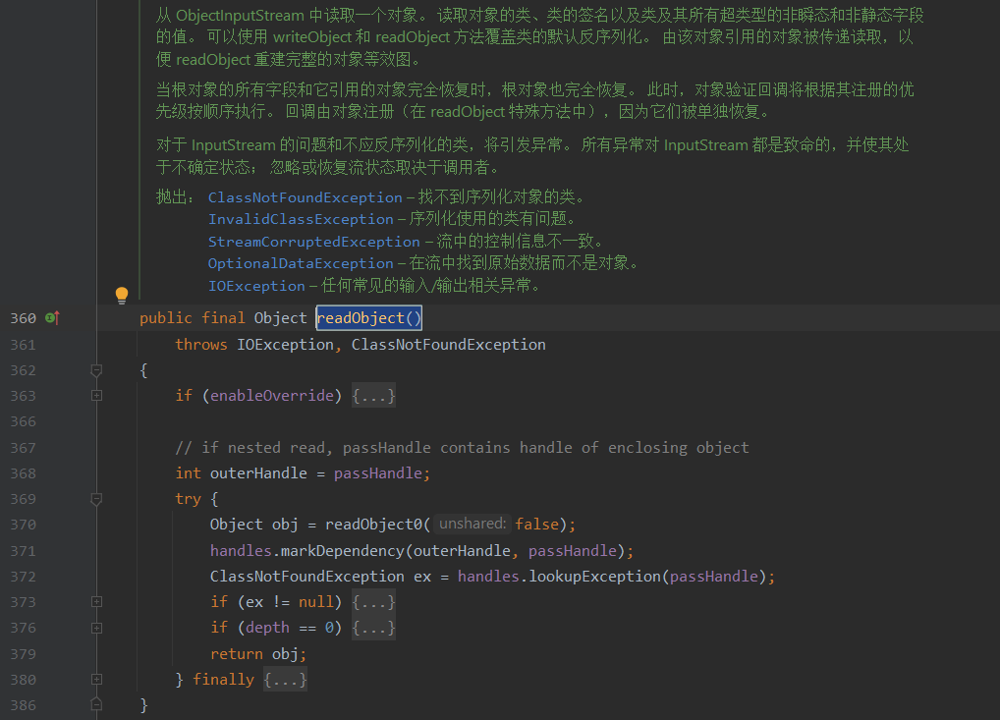


**成员方法 readObject0()**


### ObjectOutputStream 类


ObjectOutputStream 将 Java 对象的原始数据类型和图形写入 OutputStream。 可以使用 ObjectInputStream 读取（重构）对象。 对象的持久存储可以通过对流使用文件来实现。 如果流是网络套接字流，则可以在另一个主机或另一个进程中重构对象。
只有支持 java.io.Serializable 接口的对象才能写入流。 每个可序列化对象的类都被编码，包括类的类名和签名、对象的字段和数组的值，以及从初始对象引用的任何其他对象的闭包。
writeObject 方法用于将对象写入流。 任何对象，包括字符串和数组，都是用 writeObject 编写的。 可以将多个对象或基元写入流。 对象必须从相应的 ObjectInputstream 中以相同的类型和相同的顺序被读回。
还可以使用 DataOutput 中的适当方法将原始数据类型写入流。 也可以使用 writeUTF 方法编写字符串。
对象的默认序列化机制写入对象的类、类签名以及所有非瞬态和非静态字段的值。 对其他对象的引用（瞬态或静态字段除外）会导致这些对象也被写入。 对单个对象的多个引用使用引用共享机制进行编码，以便对象的图形可以恢复到与原始对象相同的形状。
例如编写一个可以被 ObjectInputStream 中的例子读取的对象：

```
        FileOutputStream fos = new FileOutputStream("t.tmp");
        ObjectOutputStream oos = new ObjectOutputStream(fos);
  
        oos.writeInt(12345);
        oos.writeObject("Today");
        oos.writeObject(new Date());
  
        oos.close();
```

在序列化和反序列化过程中需要特殊处理的类必须实现具有以下确切签名的特殊方法： 

```
   private void readObject(java.io.ObjectInputStream stream)
       throws IOException, ClassNotFoundException;
   private void writeObject(java.io.ObjectOutputStream stream)
       throws IOException
   private void readObjectNoData()
       throws ObjectStreamException;
```

writeObject 方法负责为其特定类写入对象的状态，以便相应的 readObject 方法可以恢复它。 该方法不需要关心属于对象的超类或子类的状态。 通过使用 writeObject 方法或使用 DataOutput 支持的原始数据类型的方法将各个字段写入 ObjectOutputStream 来保存状态。
序列化不会写出任何未实现 java.io.Serializable 接口的对象的字段。 不可序列化的对象的子类可以是可序列化的。 在这种情况下，不可序列化的类必须有一个无参数构造函数以允许初始化其字段。 在这种情况下，子类负责保存和恢复不可序列化类的状态。 通常情况下，该类的字段是可访问的（公共的、包的或受保护的），或者存在可用于恢复状态的 get 和 set 方法。
可以通过实现抛出 NotSerializableException 的 writeObject 和 readObject 方法来防止对象的序列化。 异常将被 ObjectOutputStream 捕获并中止序列化过程。
实现 Externalizable 接口允许对象完全控制对象序列化形式的内容和格式。 调用 Externalizable 接口的方法 writeExternal 和 readExternal 来保存和恢复对象状态。 当由类实现时，它们可以使用 ObjectOutput 和 ObjectInput 的所有方法写入和读取自己的状态。 对象负责处理发生的任何版本控制。
枚举常量的序列化方式与普通的可序列化或外部化对象不同。 枚举常量的序列化形式仅由其名称组成； 不传输常量的字段值。 为了序列化一个枚举常量，ObjectOutputStream 写入由常量的 name 方法返回的字符串。 与其他可序列化或可外部化的对象一样，枚举常量可以作为随后出现在序列化流中的反向引用的目标。 枚举常量序列化的过程无法自定义； 在序列化期间，将忽略枚举类型定义的任何特定于类的 writeObject 和 writeReplace 方法。 类似地，任何serialPersistentFields 或serialVersionUID 字段声明也将被忽略——所有枚举类型都有一个固定的0L 的serialVersionUID。
原始数据（不包括可序列化字段和可外部化数据）被写入块数据记录中的 ObjectOutputStream。 块数据记录由头和数据组成。 块数据头由一个标记和跟在头后面的字节数组成。 连续的原始数据写入合并为一个块数据记录。 用于块数据记录的分块因子将为 1024 字节。 每个块数据记录最多可填充 1024 个字节，或者在块数据模式终止时写入。 对 ObjectOutputStream 方法 writeObject、defaultWriteObject 和 writeFields 的调用最初会终止任何现有的块数据记录。

**成员方法 writeObject()**

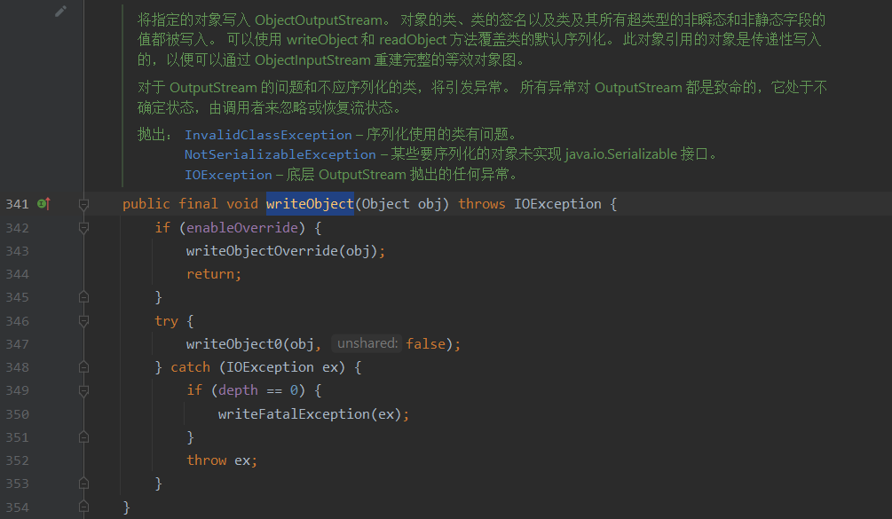


# java.util

## Map 接口


Map 是将键映射到值的对象。map 不能包含重复的键：每个键最多可以映射一个值。

它模拟数学函数抽象。所述 Map 接口包括用于基本操作的方法（例如 put，get，remove， containsKey，containsValue，size，和 empty）， 批量操作（例如 putAll 和 clear），和集合视图（例如 keySet，entrySet 和 values）。

Java为数据结构中的映射定义了一个接口java.util.Map，此接口主要有四个常用的实现类，分别是HashMap、Hashtable、LinkedHashMap和TreeMap，类继承关系如下图所示：


下面针对各个实现类的特点做一些说明：

**(1) HashMap**：它根据键的hashCode值存储数据，大多数情况下可以直接定位到它的值，因而具有很快的访问速度，但遍历顺序却是不确定的。 HashMap最多只允许一条记录的键为null，允许多条记录的值为null。HashMap非线程安全，即任一时刻可以有多个线程同时写HashMap，可能会导致数据的不一致。如果需要满足线程安全，可以用 Collections的synchronizedMap方法使HashMap具有线程安全的能力，或者使用ConcurrentHashMap。

**(3) LinkedHashMap**：LinkedHashMap是HashMap的一个子类，保存了记录的插入顺序，在用Iterator遍历LinkedHashMap时，先得到的记录肯定是先插入的，也可以在构造时带参数，按照访问次序排序。

**(4) TreeMap**：TreeMap实现SortedMap接口，能够把它保存的记录根据键排序，默认是按键值的升序排序，也可以指定排序的比较器，当用Iterator遍历TreeMap时，得到的记录是排过序的。如果使用排序的映射，建议使用TreeMap。在使用TreeMap时，key必须实现Comparable接口或者在构造TreeMap传入自定义的Comparator，否则会在运行时抛出java.lang.ClassCastException类型的异常。

### HashMap 类

https://tech.meituan.com/2016/06/24/java-hashmap.html


### LinkedHashMap 类


### TreeMap 类


### Hashtable 类


#### 成员方法 readObject()

- 调用 reconstitutionPut()

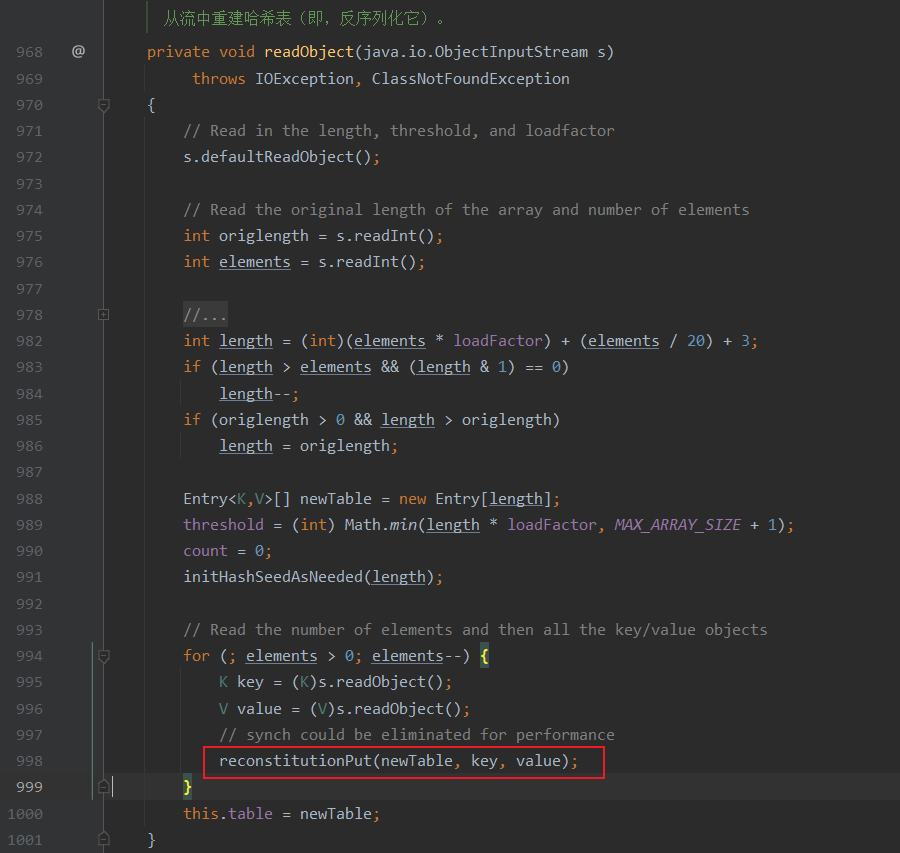

#### 成员方法 reconstitutionPut()


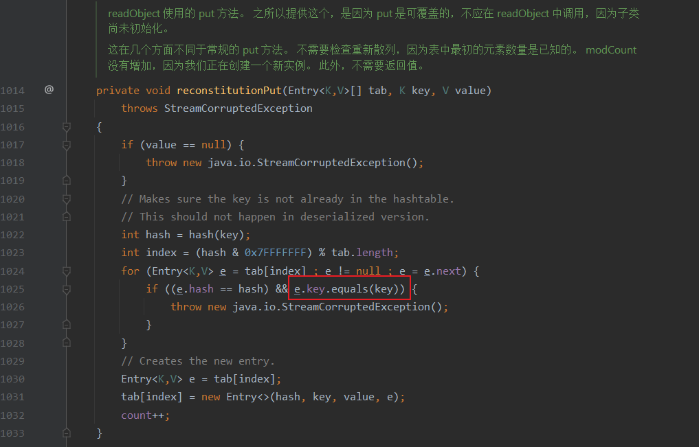


成员方法 hash()

成员方法 hashcode()


## Queue 接口


### AbstractQueue 抽象类


### PriorityQueue 类


**成员方法 readObject()**


**成员方法 heapify()**


**成员方法 siftDown()**


**成员方法 siftDownUsingComparator()**

- 触发TransformingComparator#compare()


## Set 接口

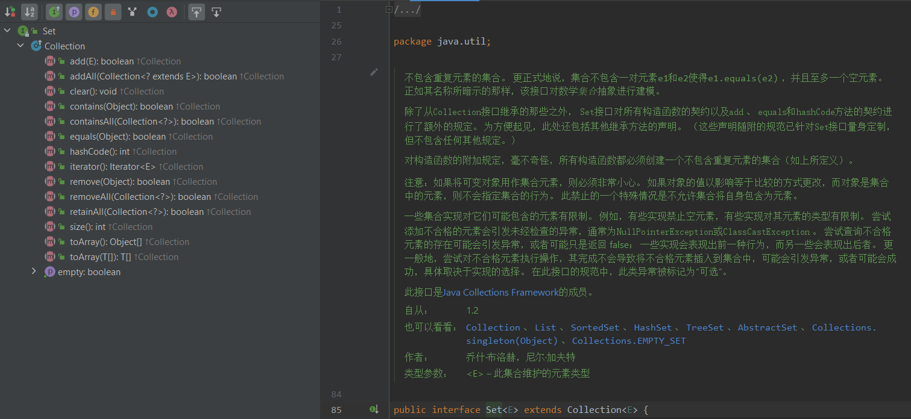


### HashSet 类


**成员方法 readObjetc()**

- 触发HashMap#put()

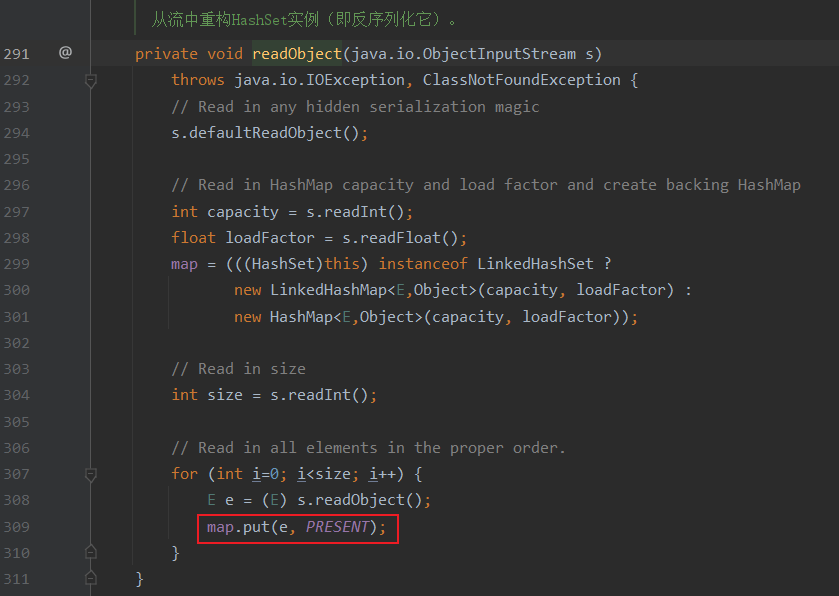


# com.sun.org.apache.xalan.internal.xsltc.trax

## Templates 接口

### TemplatesImpl 类

#### 成员方法 newTransformer()


#### 成员方法 getTransletInstance()

- 调用了defineTransletClasses

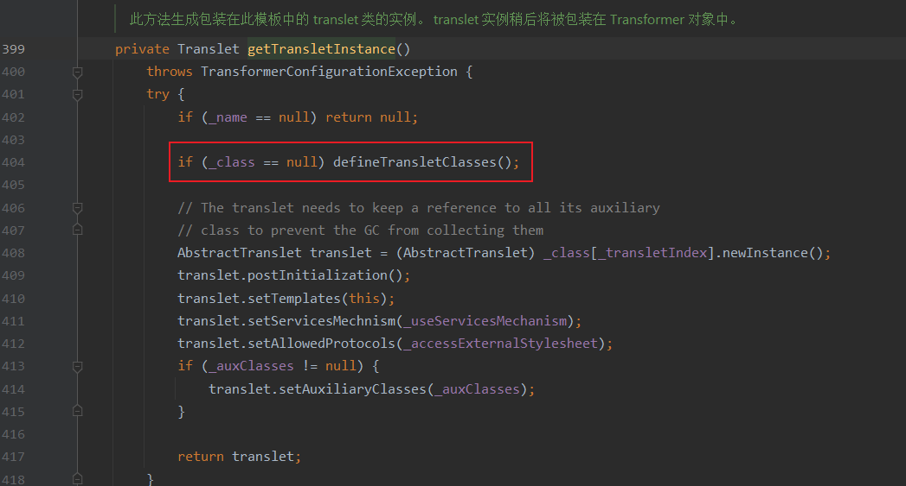

#### 成员方法 defineTransletClasses()

- 调用了内部类 TransletClassLoader#defineClass()


#### 成员方法 getOutputProperties()


### TransletClassLoader 内部类 


#### 成员方法 defineClass()


重写了 defineClass，并且这里没有显式地声明其定义域。Java中默认情况下，如果一个方法没有显式声明作用域，其作用域为default。所以也就是说这里的 defineClass 由其父类的 protected 类型变成了一个 default 类型的方法，可以被类外部调用，执行恶意类的static语句块


## TrAXFilter 类


**构造方法 TrAXFilter()**

- 调用getConstructor()时就会调用TrAXFilter的构造方法


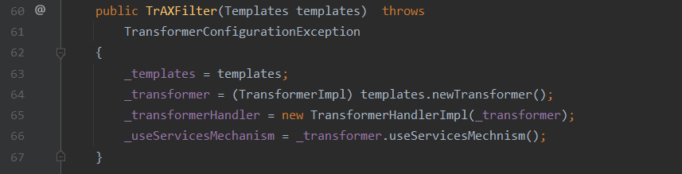


# java.net

## URL 类


**成员方法  hashCode()** 

当hashCode字段等于-1时会进行handler.hashCode(this)计算，handler是定义的URLStreamHandler字段


> ```java
> public class Demo {
>     public static void main(String[] args) throws Exception {
>         URL url=new URL("http://npsljo.dnslog.cn");
>         System.out.println(url.hashCode());
>     }
> }
> ```
>
> > 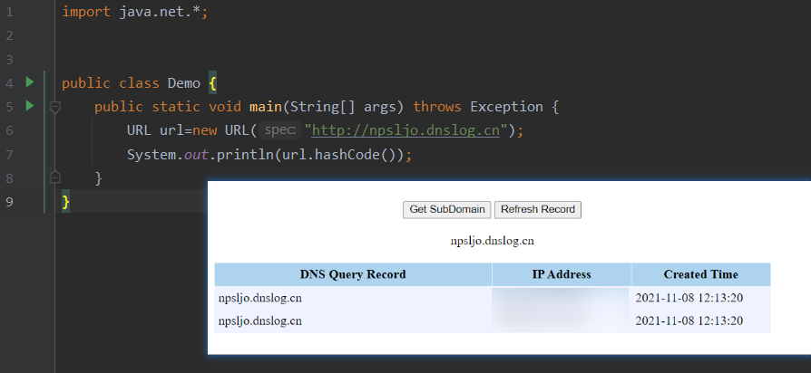

## URLStreamHandler 类

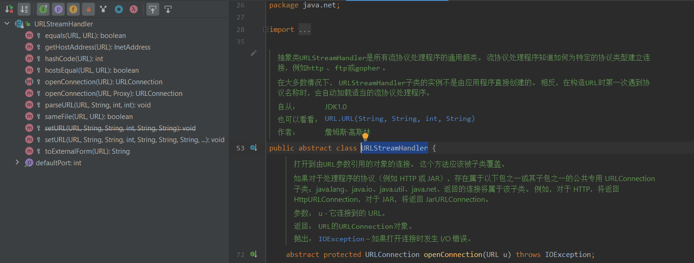


**成员方法 hashCode()**


**成员方法 getHostAddress()**

- 进行dns查询


## InetAddress 类

获取InetAddress实例
InetAddress类没有public的构造器，想要获取它的实例，需要通过它的一些静态工厂方法。

```
InetAddress address;
address = InetAddress.getByName(host);
```


**成员方法 getByName()**

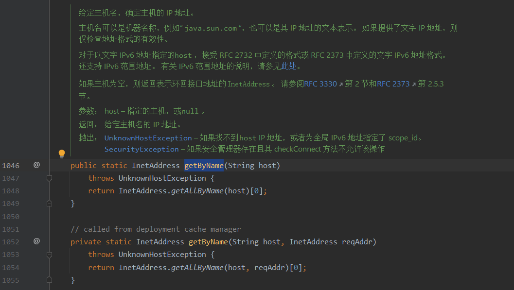


> ```java
> public class Demo {
>     public static void main(String[] args) throws Exception {
>         String host = "jtrxip.dnslog.cn";
>         InetAddress address;
>         address = InetAddress.getByName(host);
>         System.out.println(address);
>     }
> }
> ```
>
> > 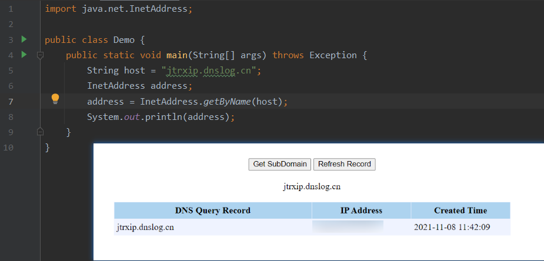


# sun.reflect.annotation

## AnnotationInvocationHandler 类

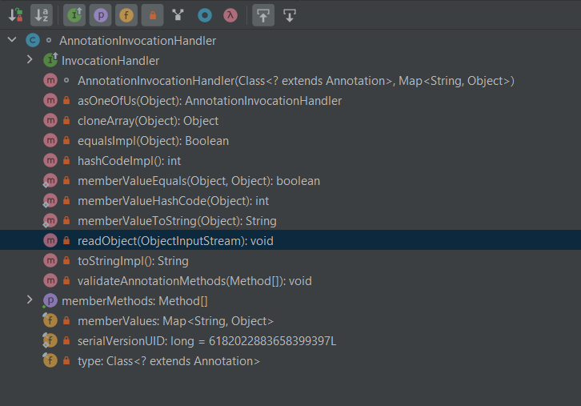


**成员方法 readObject()**

调用readObject时，this.memberValues是之前构造好的proxy_map，由于这是一个代理对象，所以调用其方法时，会去调用其创建代理时设置的handler的invoke方法

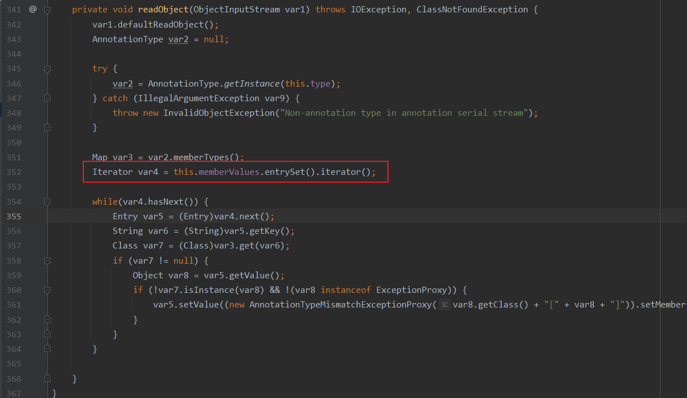


**成员方法 invoke()**

invoke方法会触发LazyMap#get方法

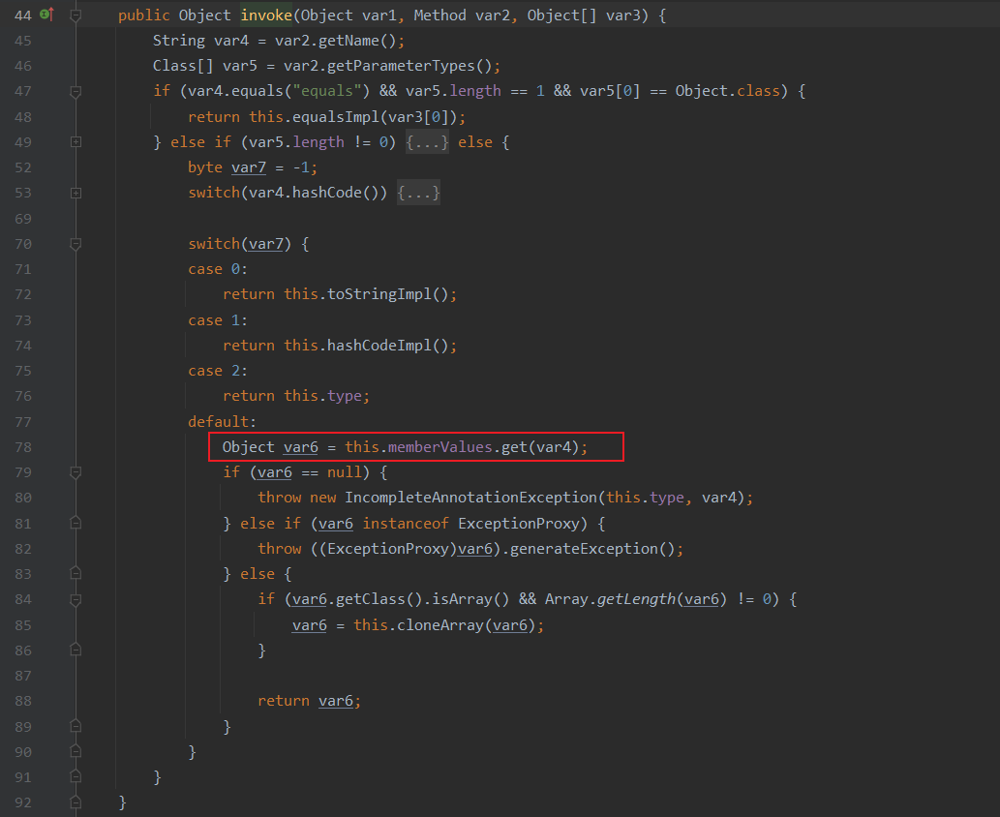


# com.sun.rowset

## JdbcRowSetImpl 类

`JdbcRowSetImpl`继承自`javax.sql.rowset.JdbcRowSet`，`JdbcRowSet`是一个连接的行集，也就是说，它使用支持JDBC技术的驱动程序不断维护与数据库的连接。

在`JdbcRowSetImpl`连接数据库时，会调用`InitialContext.lookup`方法来处理远程对象。lookup方法的参数通过`this.getDataSourceName()`获取，我们可以通过`setDataSourceName`设置这个参数

```java
private Connection connect() throws SQLException {
    if (this.conn != null) {
        return this.conn;
    } else if (this.getDataSourceName() != null) {
        try {
            InitialContext var1 = new InitialContext();
            // 调用InitialContext.lookup
            DataSource var2 = (DataSource)var1.lookup(this.getDataSourceName());
            return this.getUsername() != null && !this.getUsername().equals("") ? var2.getConnection(this.getUsername(), this.getPassword()) : var2.getConnection();
        } catch (NamingException var3) {
            throw new SQLException(this.resBundle.handleGetObject("jdbcrowsetimpl.connect").toString());
        }
    } else {
        return this.getUrl() != null ? DriverManager.getConnection(this.getUrl(), this.getUsername(), this.getPassword()) : null;
    }
}
```

在三个地方调用了connect方法


因此我们可以通过这三个方法来间接调用到`InitialContext.lookup`，当lookup参数设置成上面的rmi或ldap地址，或许我们就可以进行利用。


# java.lang.invoke


## MethodHandle 抽象类

[java.lang.invoke.MethodHandle](https://r17a-17.github.io/2020/06/13/MethodHandle/)

# java.lang.reflect

## Constructor

反射构造类时还有一个内部类的东西，这里就还是先把反射构造类讲完吧，需要注意的是私有内部类应该怎么构造，可以发现还是通过反射来构造，forName时里面是通过`$`来进行分隔的，还有就是newInstance时第一个参数得是这个类的实例化对象（如果不是私有内部类，这里第一个就是内部类对应构造方法的参数）。


## Field

**反射来修改类的私有属性值**

People.java

```
package reflect;

public class People {
    private String secret = "这是我的秘密";
    public void getSecret(){
        System.out.println(this.secret);
    }
}
```

Test.java

```
package reflect;

public class Test {
    public static void main(String[] args) throws IllegalAccessException, ClassNotFoundException, NoSuchFieldException {
        People people = new People();
        people.getSecret();
        Class clazz = Class.forName("reflect.People");
        java.lang.reflect.Field secretF = clazz.getDeclaredField("secret");
        secretF.setAccessible(true);
        secretF.set(people,"haha, 我已经知道你的秘密并已经修改了！！！");
        people.getSecret();
    }
}
```

### 常用方法

#### set()

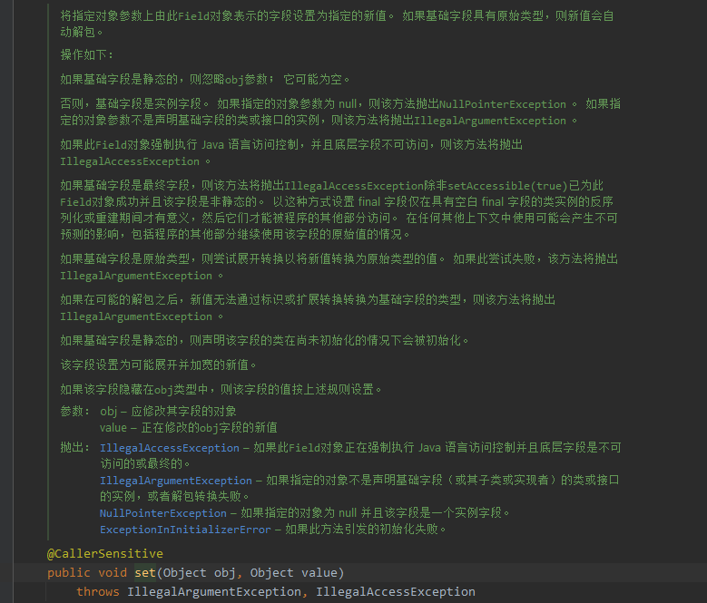


## InvocationHandler


## Method

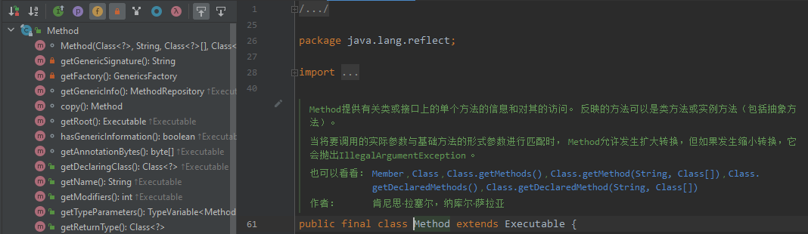


### 常用方法

#### getMethod


#### invoke

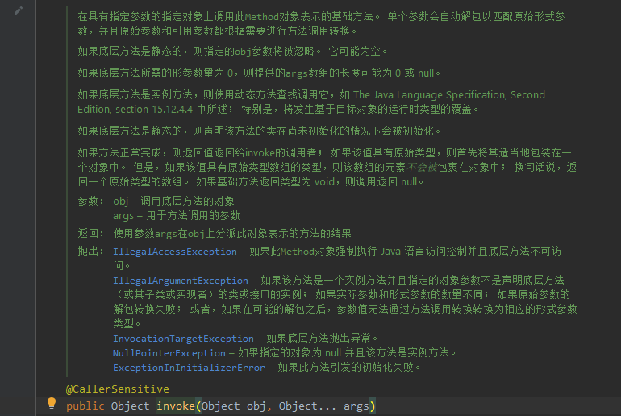


## Modifier

https://blog.csdn.net/xiao__gui/article/details/8141216


## Proxy


**是否可以不编写实现类，在运行时创建该interface的实例呢？**

- 可以
- 动态代理：JDK提供的动态创建接口对象的方式，就叫动态代理。
  - java.lang.reflect.Proxy
    - Proxy.newProxyInstance()
  - java.lang.reflect.InvocationHandler


A.java

```java
package reflect;

public interface A {
    void demoFunc(String str);
}
```

Test.java

```java
package reflect;

import java.lang.reflect.InvocationHandler;
import java.lang.reflect.Method;
import java.lang.reflect.Proxy;

public class Test {
    public static void main(String[] args) {
        InvocationHandler invocationHandler = new InvocationHandler() {
            @Override
            public Object invoke(Object proxy, Method method, Object[] args) {
                System.out.println(method);
                if (method.getName().equals("demoFunc")) {
                    System.out.println("动态代理测试, " + args[0]);
                }
                return null;
            }
        };
        A a = (A) Proxy.newProxyInstance(A.class.getClassLoader(), new Class[] { A.class }, invocationHandler);
        a.demoFunc("Java YYDS !!!");
    }
}
```


动态代理具体步骤：

1. 通过实现 InvocationHandler 接口创建自己的调用处理器；
2. 通过为 Proxy 类指定 ClassLoader 对象和一组 interface 来创建动态代理类；
3. 通过反射机制获得动态代理类的构造函数，其唯一参数类型是调用处理器接口类型；
4. 通过构造函数创建动态代理类实例，构造时调用处理器对象作为参数被传入。

### 常用方法

#### newProxyInstance()

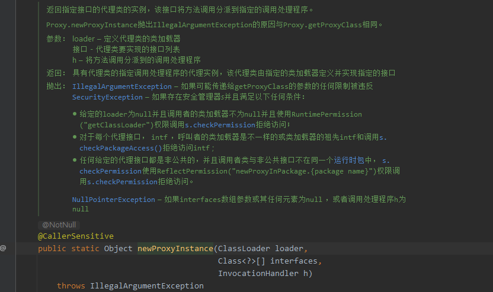

