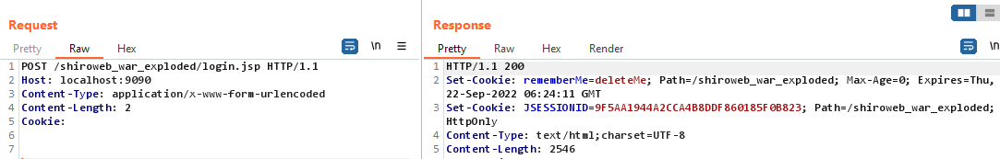
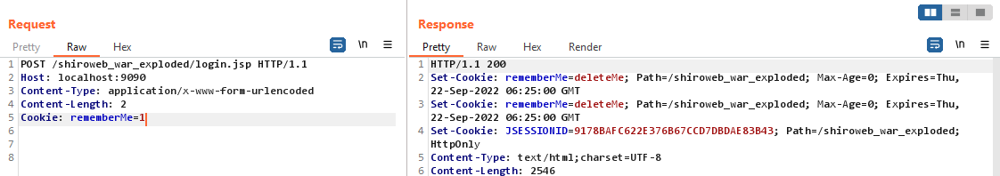
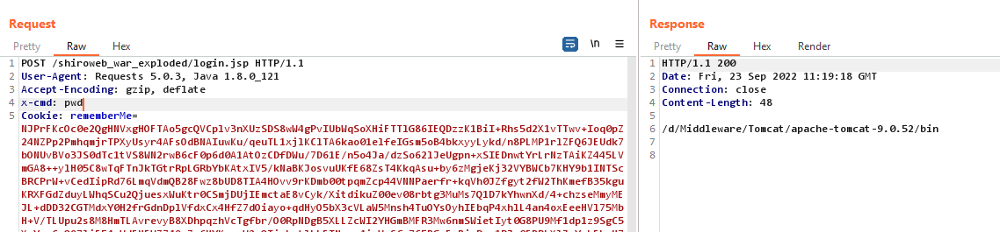
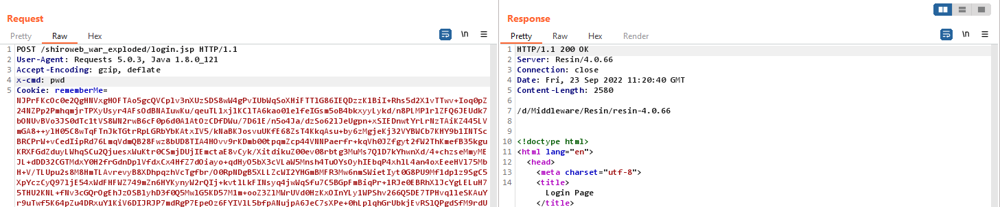

指纹识别
---

- Request 的 Cookie 不携带 `rememberMe=1` , 此时 Response 的 Set-Cookie 返回 1 个 `rememberMe=deleteMe`

```http request
POST /shiroweb_war_exploded/login.jsp HTTP/1.1
Host: localhost:9090
Content-Type: application/x-www-form-urlencoded
Content-Length: 2
Cookie:
```



- Request 的 Cookie 不携带 `rememberMe=1` , 此时 Response 的 Set-Cookie 返回 2 个 `rememberMe=deleteMe`

```http request
POST /shiroweb_war_exploded/login.jsp HTTP/1.1
Host: localhost:9090
Content-Type: application/x-www-form-urlencoded
Content-Length: 2
Cookie: rememberMe=1
```


漏洞利用
---
#### 回显

- [Java中间件通用回显方法的问题及处理 by fnmsd](https://blog.csdn.net/fnmsd/article/details/106890242)

抄一遍, 然后塞到 CommonsBeanutils gadget 里

已测试中间件
- tomcat v9
- resin v4.0.66

测试效果：





#### 内存马/代理


#### 修改 Key

- [通过代码执行修改Shiro密钥](http://www.yulegeyu.com/2021/11/19/%E9%80%9A%E8%BF%87%E4%BB%A3%E7%A0%81%E6%89%A7%E8%A1%8C%E4%BF%AE%E6%94%B9Shiro%E5%AF%86%E9%92%A5/)


实战问题
---

### Request header is too large

解决方法：
- 修改 tomcat 的 maxHeaderSize
- 分离 payload, 字节码动态加载
- 通过线程持久化存储 payload, 然后再触发
  - [浅谈Shiro550受Tomcat-Header长度限制影响突破](https://y4tacker.github.io/2022/04/14/year/2022/4/%E6%B5%85%E8%B0%88Shiro550%E5%8F%97Tomcat-Header%E9%95%BF%E5%BA%A6%E9%99%90%E5%88%B6%E5%BD%B1%E5%93%8D%E7%AA%81%E7%A0%B4/#0x02-%E6%B5%85%E8%B0%88%E6%96%B0%E6%80%9D%E8%B7%AF)


### SUID

解决方法：
- 替换本地依赖包版本去生成 payload
- 修改字节码
  - [Modify ysoserial jar serialVersionUID](http://www.yulegeyu.com/2019/03/09/Modify-Ysoseriali-jar-serialVersionUID/)
- 自定义ClassLoader
  - [使用自定义ClassLoader解决反序列化serialVesionUID不一致问题](https://gv7.me/articles/2020/deserialization-of-serialvesionuid-conflicts-using-a-custom-classloader/)

### Unable to deserialze argument byte array

无法利用 Commons-Collections 3.x 版本包含 Transform 数组的 gadget

解决方法：
- 修改 Commons-Collections 3.x 系列 gadget 通过 TemplatesImpl 加载字节码
  - [Java反序列化利用链分析之Shiro反序列化](https://www.anquanke.com/post/id/192619)
- 使用 CommonsBeanutils 系列 gadget
  - [CommonsBeanutils与无commons-collections的Shiro反序列化利用](https://www.leavesongs.com/PENETRATION/commons-beanutils-without-commons-collections.html)

WAF 对抗
---

> 相关案例
- [01 shiro反序列化绕WAF之未知HTTP请求方法](https://gv7.me/articles/2021/shiro-deserialization-bypasses-waf-through-unknown-http-method/)
- [02 渗透遇shiro，看我巧绕waf](https://mp.weixin.qq.com/s/GKbE44VclJKj2PZ4Cpr_Sw)
