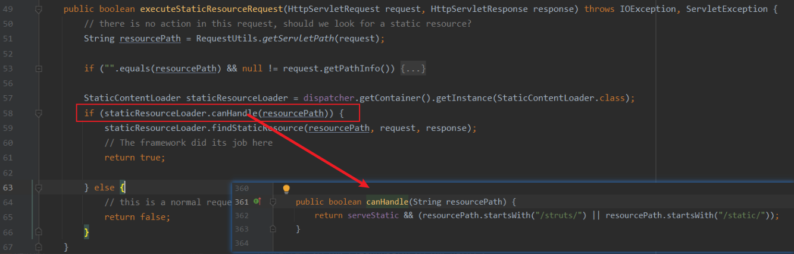

## Apache Struts2 RCE via Log4j2 CVE-2021-44228

### 环境搭建
首先搭建环境
- 下载源码：https://dlcdn.apache.org/struts/2.5.27/struts-2.5.27-all.zip，解压
- 复制struts-2.5.27\src\apps\showcase文件夹到自己的测试目录，右键用IDEA打开
- 配置tomcat，启动即可


注：确认是否使用log4j2组件


### 漏洞分析

根据流传的payload中携带的HTTP头字段`If-Modified-Since`找到对应的源码位置，下断点


- org.apache.struts2.dispatcher.DefaultStaticContentLoader#process


整个调用栈
> ```java
> warn:2774, AbstractLogger (org.apache.logging.log4j.spi)
> process:241, DefaultStaticContentLoader (org.apache.struts2.dispatcher)
> findStaticResource:215, DefaultStaticContentLoader (org.apache.struts2.dispatcher)
> executeStaticResourceRequest:59, ExecuteOperations (org.apache.struts2.dispatcher)
> doFilter:81, StrutsExecuteFilter (org.apache.struts2.dispatcher.filter)
> internalDoFilter:193, ApplicationFilterChain (org.apache.catalina.core)
> doFilter:166, ApplicationFilterChain (org.apache.catalina.core)
> doFilter:65, SiteMeshFilter (com.opensymphony.sitemesh.webapp)
> internalDoFilter:193, ApplicationFilterChain (org.apache.catalina.core)
> doFilter:166, ApplicationFilterChain (org.apache.catalina.core)
> doFilter:92, StrutsPrepareFilter (org.apache.struts2.dispatcher.filter)
> internalDoFilter:193, ApplicationFilterChain (org.apache.catalina.core)
> doFilter:166, ApplicationFilterChain (org.apache.catalina.core)
> invoke:196, StandardWrapperValve (org.apache.catalina.core)
> invoke:97, StandardContextValve (org.apache.catalina.core)
> invoke:544, AuthenticatorBase (org.apache.catalina.authenticator)
> invoke:135, StandardHostValve (org.apache.catalina.core)
> invoke:81, ErrorReportValve (org.apache.catalina.valves)
> invoke:698, AbstractAccessLogValve (org.apache.catalina.valves)
> invoke:78, StandardEngineValve (org.apache.catalina.core)
> service:364, CoyoteAdapter (org.apache.catalina.connector)
> service:624, Http11Processor (org.apache.coyote.http11)
> process:65, AbstractProcessorLight (org.apache.coyote)
> process:831, AbstractProtocol$ConnectionHandler (org.apache.coyote)
> doRun:1650, NioEndpoint$SocketProcessor (org.apache.tomcat.util.net)
> run:49, SocketProcessorBase (org.apache.tomcat.util.net)
> runWorker:1191, ThreadPoolExecutor (org.apache.tomcat.util.threads)
> run:659, ThreadPoolExecutor$Worker (org.apache.tomcat.util.threads)
> run:61, TaskThread$WrappingRunnable (org.apache.tomcat.util.threads)
> run:745, Thread (java.lang)
> ```

根据调用栈中的调用情况，分析为什么请求会执行到这里
- ALT + F7


捋一捋其请求的执行流程
- 1、请求A 首先被StrutsExecuteFilter进行处理
  - execute.executeStaticResourceRequest  `处理对静态资源的请求`
    

- 2、需要满足条件（请求的静态资源路径以“/struts”或“/static”开头）
  - 

- 3、条件满足后，执行到org.apache.struts2.dispatcher.DefaultStaticContentLoader#findStaticResource
  - 需要满足条件：请求的静态资源需要存在，否则直接返回404
  - 可以通过右键查看源码查找需要的路径
    

- 4、条件满足后，执行到org.apache.struts2.dispatcher.DefaultStaticContentLoader#process
  - 构造恶意的If-Modified-Since即可触发log4j2的RCE
  
  

至此，分析完毕。

### 漏洞复现


参考：

https://twitter.com/payloadartist/status/1469987703429103622
