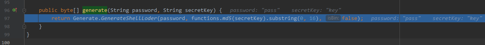
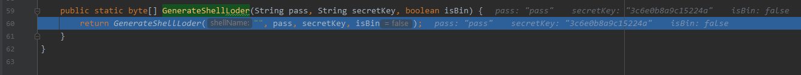
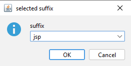
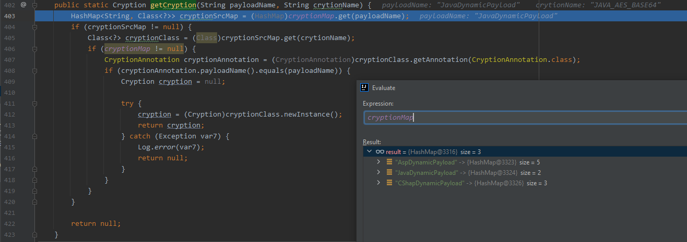
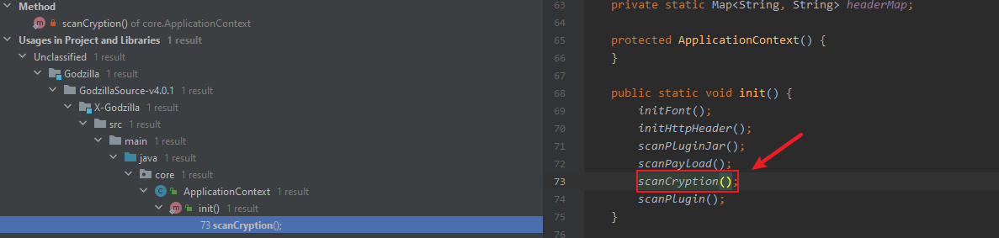
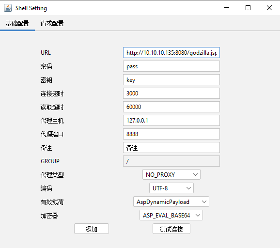

## 源码分析

项目地址
- https://github.com/BeichenDream/Godzilla

API文档

- https://beichendream.github.io/godzillaApi/

### 0x01 后门生成流程

见图

对应

- core.ui.component.dialog.GenerateShellLoder#GenerateShellLoder

- core.ui.component.dialog.GenerateShellLoder#generateButtonClick

该成员方法调用ApplicationContext.getCryption()，根据选择的不同加密器和payload动态获得对应的Cryption实例

获取到实例JavaAesBase64，然后将pass & key 传入

- shells.cryptions.JavaAes.JavaAesBase64#generate

执行到

- shells.cryptions.JavaAes.Generate#GenerateShellLoder
  - pass : pass
  - secretKey : 3c6e0b8a9c15224a

跟进到

- shells.cryptions.JavaAes.Generate#GenerateShellLoder()

  - 从资源目录读取通用代码和shell代码

    

  - 替换密码部分，用模板拼接在一起

然后生成最终的后门文件。

分析一下是如何做到动态选择加密实例的？

跟进

- core.ApplicationContext#getCryption

- 先通过cryptionMap.get(payloadName)获取cryptionSrcMap
- 然后通过cryptionSrcMap.get(crytionName)获取cryptionClass
  - 
- 最后通过cryptionClass.newInstance()创建实例并返回

其中并没有cryptionMap的生成过程，跟进其被赋值的过程，发现了

- core.ApplicationContext#scanCryption

查看该方法在哪被调用了

- ALT + F7

程序启动时通过scanCryption()扫描/shells/cryptions/目录下的.class文件，最后调用core.ApplicationContext#scanClassX实现动态加载。

最终的调用栈为

### 0x02 后门连接流程

见图

对应

- core.ui.component.dialog.ShellSetting
- core.ui.component.frame.ShellSetting#ShellSetting

**“测试连接”**

- core.ui.component.frame.ShellSetting#testButtonClick
  - core.shell.ShellEntity#initShellOpertion

1、获取payload指令控制器，比如JavaDynamicPayload在`shells/payloads/java/JavaShell.java`，在这个对象中包含给webshell运行的动态payload `shells/payloads/java/assets/payload.class`

2、获取加密器实例，比如JAVA_AES_RAW在`shells/cryptions/JavaAes/JavaAesRaw.java`

3、初始化加密器，传入后门URL，密码等上下文，给shell发送`payload.class`

4、初始化payload指令控制器，传入上下文数据

5、下发一个test指令，将参数`methodName=test`加密后发送请求，

shell加载的`payload.class`代码中实现一个test方法，

执行后返回“ok”即为后门连接成功

