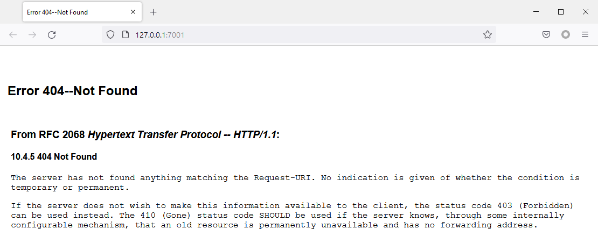
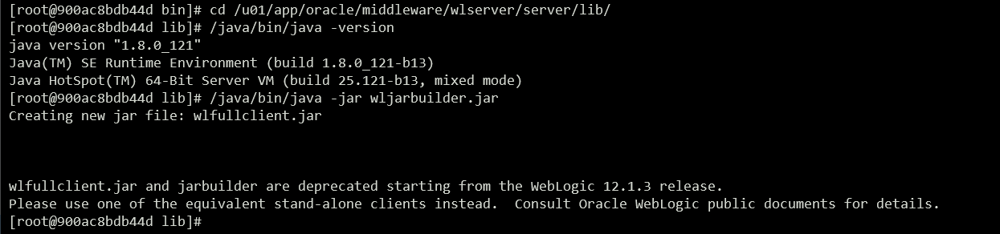
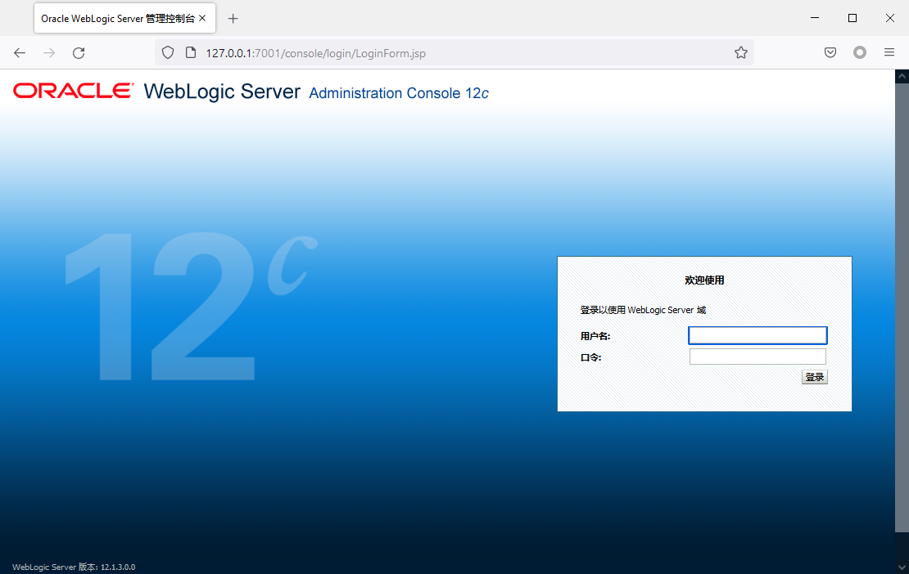
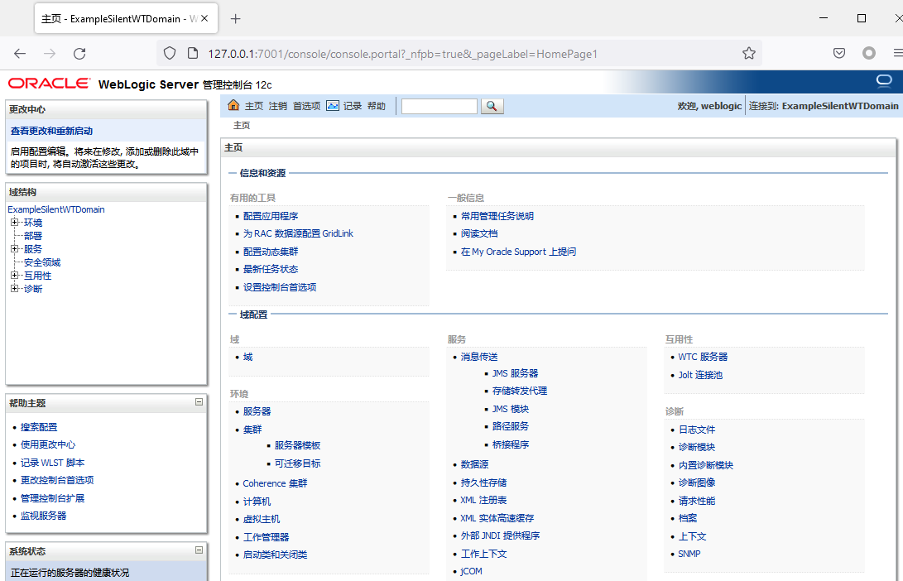
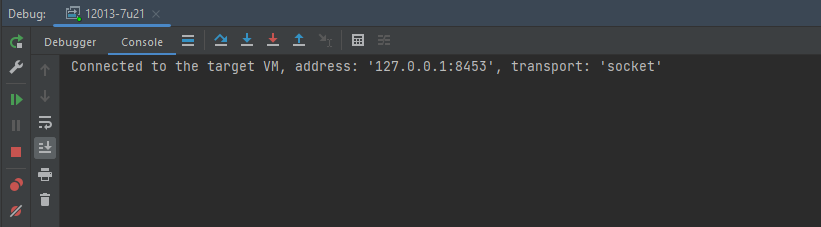
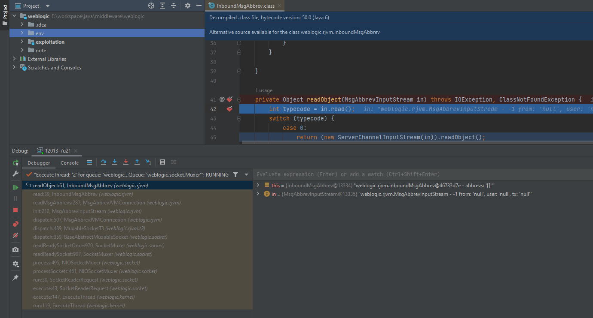
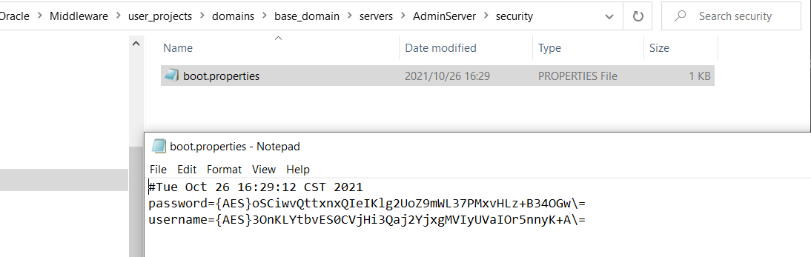
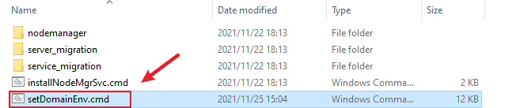
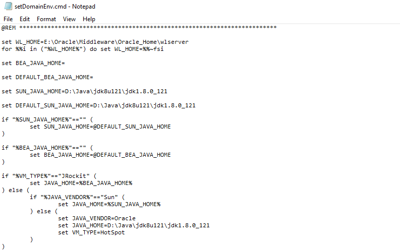

感谢前人栽的树

- https://github.com/QAX-A-Team/WeblogicEnvironment


环境搭建
---

### <center>1、基础环境搭建</center>

#### <center> 1.1、Docker </center>

**以WebLogic v12.1.3.0.0 + JDK7u21为例**

- 构建镜像：

```shell
docker build --build-arg JDK_PKG=jdk-7u21-linux-x64.tar.gz --build-arg WEBLOGIC_JAR=fmw_12.1.3.0.0_wls.jar  -t weblogic12013jdk7u21 .
```

- 启动运行

```shell
docker run -d -p 7001:7001 -p 8453:8453 -p 5556:5556 --name weblogic12013jdk7u21 weblogic12013jdk7u21
```

其他版本的构建指令

```shell
# 10.3.6.0
docker build --build-arg JDK_PKG=jdk-6u45-linux-x64.bin --build-arg WEBLOGIC_JAR=wls1036_generic.jar  -t weblogic1036jdk6u45 .
docker run -d -p 7001:7001 -p 8453:8453 -p 5556:5556 --name weblogic1036jdk6u45 weblogic1036jdk6u45


# 12.2.1.4.0
docker build --build-arg JDK_PKG=jdk-8u121-linux-x64.tar.gz --build-arg WEBLOGIC_JAR=fmw_12.2.1.4.0_wls_lite_generic.jar -t weblogic122140jdk8u121 .
docker run -d -p 7001:7001 -p 8453:8453 -p 5556:5556 --name weblogic122140jdk8u121 weblogic122140jdk8u121

# 14.1.1.0.0
docker build --build-arg JDK_PKG=jdk-8u121-linux-x64.tar.gz --build-arg WEBLOGIC_JAR=fmw_14.1.1.0.0_wls.jar -t weblogic141100jdk8u121 .
docker run -d -p 7001:7001 -p 8453:8453 -p 5556:5556 --name weblogic141100jdk8u121 weblogic141100jdk8u121
```



创建 wlfullclient.jar

```shell
cd /u01/app/oracle/middleware/wlserver/server/lib/
/java/bin/java -jar wlfullclient.jar

# copy 到 宿主机
docker cp 900ac8bdb44d:/u01/app/oracle/middleware/wlserver/server/lib/wlfullclient.jar .\code\weblogic-exploit-beta\lib\12.2.1.4.0\wlfullclient.jar
```



- 管理控控制台
    - URL地址
      ```
      http://127.0.0.1:7001/console/login/LoginForm.jsp
      ```
      

    - 默认用户名&密码
      ```shell
      weblogic/qaxateam01
      ```
      

#### <center> 1.2、Windows  </center>

安装

- https://blog.csdn.net/qq_35029061/article/details/100062470


- 模板全选

- 开发模式

- 可选配置-全选

### <center>2、调试环境搭建</center>

#### <center> 2.1、远程调试 - IDEA + Docker </center>

**以上面的环境(WebLogic v12.1.3.0.0 + JDK7u21)为例**

- step1：将lib 和 jar包拷贝至宿主机

```shell
# 以  Administrator 权限执行, 否则 copy 的 jar 包不全
docker cp weblogic12013jdk7u21:/u01/app/oracle/middleware/wlserver/ ./middleware/
docker cp weblogic12013jdk7u21:/u01/app/oracle/middleware/wlserver/server/ ./middleware/server/ 
docker cp weblogic12013jdk7u21:/u01/app/oracle/middleware/coherence/lib ./middleware/
```

- step2：遍历依赖包所在目录并把jar包放到同一文件夹

```
# windows 下
for /f "delims==" %a in ('dir /b /s F:\workspace\java\middleware\weblogic\debug\middleware\*.jar')do copy /y "%a" F:\workspace\java\middleware\weblogic\debug\12013\jars
```

- step3：idea导入
    - 注意：jdk版本尽量保持一致

```shell
# 配置"Project Structure"
将依赖jar包所在的目录导入到Libraries里
# 配置"Configuration"
添加"Remote", 配置好远程主机地址和端口(8543) 
# 开始Debug
若出现"Connected to the target VM"即成功
```



- step4：下断点并测试是否可以触发
    - weblogic.rjvm.InboundMsgAbbrev.readObject




疑难备忘
---

**环境搭建过程中出现的一些问题 & 解决方法**


#### 01 IDEA 调试Weblogic时免密码启动

新建文件


> C:\Oracle\Middleware\user_projects\domains\base_domain\servers\AdminServer\security\boot.properties


内容为：

```

username=weblogic

password=weblogic1

```

运行时会被加密，如图



#### 02 修改jdk版本

修改weblogic中默认的JDK版本：

文件位置

> Oracle/Middleware/Oracle_Home/user_projects/domains/base_domain/bin/setDomainEnv.cmd



修改如下




#### 03 报错： A required privilege is not held by the client.
  - 解决方法：
  ```
  Windows 下以 Administrator 权限执行
  ```


#### 04 报错： Failed to download metadata for repo 'appstream':
- Error: Failed to download metadata for repo 'appstream': Cannot prepare internal mirrorlist: No URLs in mirrorlist
- 解决方法：修改Dockerfile, 添加下列配置即可

```shell
# 如果该步骤卡住、可能是墙的原因、挂个代理就行
RUN cd /etc/yum.repos.d/
RUN sed -i 's/mirrorlist/#mirrorlist/g' /etc/yum.repos.d/CentOS-*
RUN sed -i 's|#baseurl=http://mirror.centos.org|baseurl=http://vault.centos.org|g' /etc/yum.repos.d/CentOS-*
```


