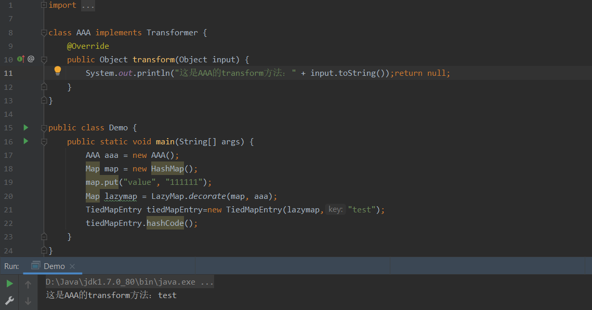
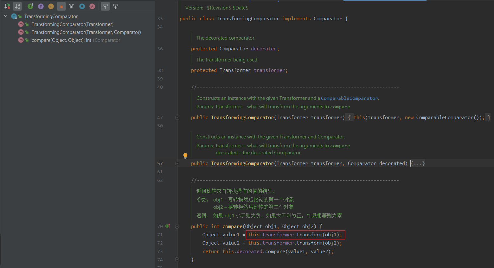

包 org.apache.commons.collections

# v3.1

## Transformer 接口

### ConstantTransformer 类


#### 构造方法ConstantTransformer()

该构造方法可传入一个对象，并在transform方法将传入对象返回

> ```java
> import org.apache.commons.collections.functors.ConstantTransformer;
> 
> 
> public class Demo {
>  public static void main(String[] args) {
>      // 传入一个Runtime.getRuntime，最后返回这个一个对象
>      ConstantTransformer constantTransformer = new ConstantTransformer(Runtime.getRuntime());
>      Object transform = constantTransformer.transform(new Object());
>      System.out.println(transform.getClass().getName());
>  }
> }
> ```
>
> > 


ConstantTransformer是实现了Transformer、Serializable接口的一个类，它的过程就是在构造函数的时候传入一个对象，并在transform方法将这个对象再返回；

### InvokerTransformer 类


#### 构造方法 InvokerTransformer()

- 第1个参数  待执⾏的⽅法名
- 第2个参数  这个函数的参数列表的参数类型
- 第3个参数  传给这个函数的参数列表

#### 成员方法 tranform()

InvokerTransformer通过构造函数对相应值进行赋值，然后通过transform函数实现反射调用


> ```java
> public class InvokerTransformer_Demo {
>  public static void main(String[] args) {
>      InvokerTransformer transformer = new InvokerTransformer("exec",
>              new Class[]{String.class},
>              new Object[]{"calc"});
>      System.out.println(transformer.transform(Runtime.getRuntime()));
>  }
> }
> ```
>
> > 


### ChainedTransformer 类


#### 构造方法 ChainedTransformer()

通过构造函数获取数组transformers，然后调用transform函数，该函数会循环获取数组transformers中的值，通过调用transform来实现真正的反射调用。

#### 成员方法 transform()

该成员方法实现了Transformer的链式调用


链式调用+反射=命令执行

> ```java
> public class Demo {
>  public static void main(String[] args) {
>      Transformer[] transformers = new Transformer[]{
>              new ConstantTransformer(Runtime.class),
>              new InvokerTransformer("getMethod", new Class[]{String.class, Class[].class}, new Object[]{"getRuntime", new Class[0]}),
>              new InvokerTransformer("invoke", new Class[]{Object.class, Object[].class}, new Object[]{null, new Object[0]}),
>              new InvokerTransformer("exec", new Class[]{String.class}, new Object[]{"calc"})
>      };
>      Transformer transformedChain = new ChainedTransformer(transformers); 
>      transformedChain.transform(null); 
>  }
> }
> 
> ```
>
> > 


## Map 接口

### AbstractMapDecorator 类


### AbstractInputCheckedMapDecorator 类


### LazyMap 类


#### 成员方法 get()

当在get()找不到值的时候，它会调用factory.transform方法去获取一个值


> ```java
> class AAA implements Transformer {
>  @Override
>  public Object transform(Object input) {
>      System.out.println("这是AAA的transform方法：" + input.toString());return null;
>  }
> }
> 
> public class Demo {
>  public static void main(String[] args) {
>      AAA aaa = new AAA();
>      Map map = new HashMap();
>      map.put("value", "111111");
>      Map lazymap = LazyMap.decorate(map, aaa);
>      lazymap.get("222222");
>  }
> }
> ```
>
> > 


### TransformedMap 类


**成员方法 decorate()**

用来修饰map的 ，当被修饰的map被添加新元素时会分别触发这两个对象的transform 的方法（也就是回调）

**构造方法 TransformedMap()**


> ```java
> class AAA implements Transformer {
>  @Override
>  public Object transform(Object input) {
>      System.out.println("这是AAA的transform方法：" + input.toString());return null;
>  }
> }
> class BBB implements Transformer {
>  @Override
>  public Object transform(Object input) {
>      System.out.println("这是BBB的transform方法：" + input.toString());return null;
>  }
> }
> public class Demo {
>  public static void main(String[] args) {
>      HashMap hashMap = new HashMap();
>      Map map = TransformedMap.decorate(hashMap,new AAA(),new BBB());
>      map.put("111111","222222");
>      System.out.println(map);
>  }
> }
> ```
>
> > 


### TiedMapEntry 类


#### 成员方法 getValue()


#### 成员方法 setValue()


#### 成员方法 hashCode()  


很明显，这些成员方法都可以直接或间接触发LazyMap 的get() 方法or TransformedMap的map.put()方法。

LazyMap 示例

> ```java
> class AAA implements Transformer {
>  @Override
>  public Object transform(Object input) {
>      System.out.println("这是AAA的transform方法：" + input.toString());return null;
>  }
> }
> 
> public class Demo {
>  public static void main(String[] args) {
>      AAA aaa = new AAA();
>      Map map = new HashMap();
>      map.put("value", "111111");
>      Map lazymap = LazyMap.decorate(map, aaa);
>      TiedMapEntry tiedMapEntry=new TiedMapEntry(lazymap,"test");
>      tiedMapEntry.hashCode();
>  }
> }
> ```
>
> > 
> >
> > 调用栈为
> >
> > TiedMapEntry.hashCode()  —> TiedMapEntry.getValue() —> LazyMap.get()
> >
> > 


#### 成员方法 equals()


#### 成员方法 toString()


## Comparator 接口

### TransformingComparator 类




**成员方法 compare()**

- 调用了transform()


> ```java
> class AAA implements Transformer {
>  @Override
>  public Object transform(Object input) {
>      System.out.println("这是AAA的transform方法：" + input.toString());return null;
>  }
> }
> class BBB implements Transformer {
>  @Override
>  public Object transform(Object input) {
>      System.out.println("这是BBB的transform方法：" + input.toString());return null;
>  }
> }
> public class Demo {
>  public static void main(String[] args) {
>      AAA aaa = new AAA();
>      BBB bbb = new BBB();
>      TransformingComparator tc = new TransformingComparator(aaa);
>      System.out.println(tc.compare(aaa, bbb));
>  }
> }
> ```
>
> > 


# v3.2.1

## Map 接口

### DefaultedMap 类


#### 成员方法 get()

当在get()找不到值的时候，它会调用Transformer#transform()的方法


> ```java
> class AAA implements Transformer {
>  @Override
>  public Object transform(Object input) {
>      System.out.println("这是AAA的transform方法：" + input.toString());return null;
>  }
> }
> 
> public class Demo {
>  public static void main(String[] args) {
>      AAA aaa = new AAA();
>      DefaultedMap map = new DefaultedMap("null");
>      Map defaultedMap = DefaultedMap.decorate(map, aaa);
>      defaultedMap.get("222222");
>  }
> }
> ```
>
> > 


# v4.0

