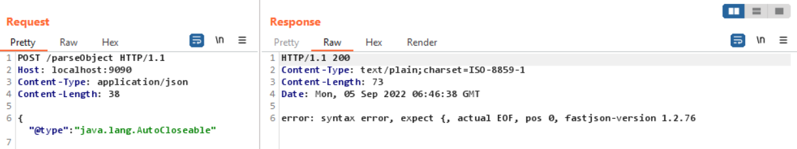

漏洞探测
---

### 探测 Fastjson
```text
无害判断后端的 json 处理组件是否为 fastjson
```
#### DNSLog

- [通过dnslog探测fastjson的几种方法](https://gv7.me/articles/2020/several-ways-to-detect-fastjson-through-dnslog/)
- [发现最新版本1.2.67依然可以通过dnslog判断后端是否使用fastjson](https://github.com/alibaba/fastjson/issues/3077) `讨论区很精彩`

### 版本识别

#### 触发异常回显
- 适用于会返回异常的场景，出不出网都可

特殊业务场景,抛出异常信息
- 为什么说`特殊`,因为很多场景不一定会回显

```java
 @ResponseBody
 public  String parseObjectHandler(@RequestBody String dataStr) {
    try {
       JSONObject data = JSON.parseObject(dataStr);
       return dataStr;
    } catch (Exception e) {
       return "error: " + e.getMessage();
    }
 }
```

- 已测试
  - v1.2.23 
  - v1.2.47（default）
  - v1.2.68（default）
  - v1.2.76（default）
  - v1.2.80（default）-> v1.2.76（代码就是这样写的 !）
  - v1.2.83

```text
// https://b1ue.cn/archives/402.html
{"@type":"java.lang.AutoCloseable"
```





v1.2.80 -> v1.2.76 ??? `果然眼见也不一定为实`

- com.alibaba.fastjson.parser.deserializer.JavaBeanDeserializer


#### DNSLog + 黑名单

- 适用于出网无回显的场景

思路：
根据每个版本所内置的黑名单不同，去加载相关的类来判断
- 加载成功 -> 不报错
- 加载失败 -> 报错


参考：
https://github.com/LeadroyaL/fastjson-blacklist

#### 延时 

##### JNDI -> SSRF

##### DoS


### 判断 autoType 是否开启

判断autoType是否开启，选择利用链。

```
[{"@type":"java.net.CookiePolicy"},{"@type":"java.net.Inet4Address","val":"ydk3cz.dnslog.cn"}]
```

- DNSLog有解析记录 -> autoType 开启 / fastjson < v1.2.24
- DNSLog没有解析记录 -> autoType 未开启


### 探测 Gadget
思路：
通过加载相关Gadget的类是否成功来判断该利用链是否存在。


漏洞利用
---

### HTTP

#### c3p0 - URLClassLoader

- https://tttang.com/archive/1411/#toc_urlclassloader

### JNDI

- 利用条件限制
  - [Bypass](https://paper.seebug.org/942/#4-jdk-8u191)

```
RMI利用的JDK版本≤ JDK 6u132、7u122、8u113
LADP利用JDK版本≤ 6u211 、7u201、8u191
```

#### rt - JdbcRowSetImpl


#### c3p0

- https://tttang.com/archive/1411/#toc_jndi

#### ibatis / mybatis - JndiDataSourceFactory

- org.apache.ibatis.datasource.jndi.JndiDataSourceFactory.setProperties
  - initCtx.lookup("可控")


```text
public void setProperties(Properties properties) {
    try {
        Properties env = getEnvProperties(properties);
        InitialContext initCtx;
        if (env == null) {
            initCtx = new InitialContext();
        } else {
            initCtx = new InitialContext(env);
        }

        if (properties.containsKey("initial_context") && properties.containsKey("data_source")) {
            Context ctx = (Context)initCtx.lookup(properties.getProperty("initial_context"));
            this.dataSource = (DataSource)ctx.lookup(properties.getProperty("data_source"));
        } else if (properties.containsKey("data_source")) {
            this.dataSource = (DataSource)initCtx.lookup(properties.getProperty("data_source"));
        }
```

#### xbean-reflect - JndiConverter


### 不出网

- [FastJson RCE不出网利用研究](https://mp.weixin.qq.com/s/nKPsoNkHtNdOj-_v53Bc9w)

#### tomcat-dbcp/commons-dbcp - BasicDataSource + BCEL

- https://github.com/depycode/fastjson-local-echo


#### c3p0

- https://github.com/depycode/fastjson-c3p0

- [JAVA反序列化之C3P0不出网利用](http://www.yulegeyu.com/2021/10/10/JAVA%E5%8F%8D%E5%BA%8F%E5%88%97%E5%8C%96%E4%B9%8BC3P0%E4%B8%8D%E5%87%BA%E7%BD%91%E5%88%A9%E7%94%A8/)

#### rt - TemplatesImpl - 鸡肋

利用条件：

Feature.SupportNonPublicField 需要开启，因为_bytecodes 和 _outputProperties 两个关键属性是私有的

#### commons-io 文件操作

- [fastjson 读文件 gadget 的利用场景扩展](https://b1ue.cn/archives/506.html)
- [Fastjson 1.2.68 反序列化漏洞 Commons IO 2.x 写文件利用链挖掘分析](https://mp.weixin.qq.com/s/6fHJ7s6Xo4GEdEGpKFLOyg)


#### rt - MarshalOutputStream 文件操作

- [fastjson v1.2.68 RCE利用链复现](https://mp.weixin.qq.com/s?__biz=MzI4OTQ5Njc2Mw==&mid=2247484334&idx=1&sn=825221db6e7d0ba3b7b4713ac3bf68fa&chksm=ec2f087adb58816c3b4aab28d2d53f2a22617233bd91ad8e4887a1724dc1747ab9ffc03c5c93&scene=126&&sessionid=1663752244#rd)


#### ibatis/mybatis - UnpooledDataSource + BCEL


代码审计
---

```
.parseObject()
.parse()
```


